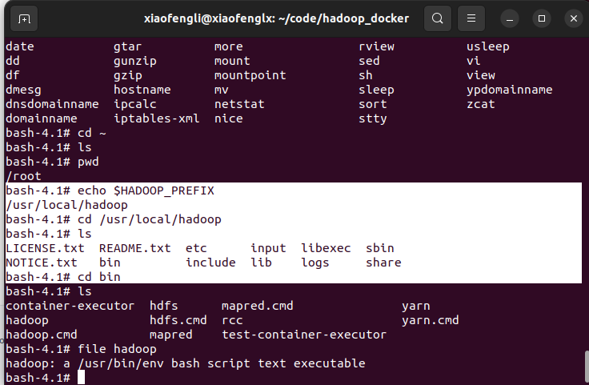
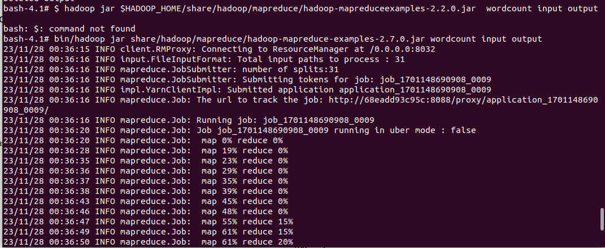
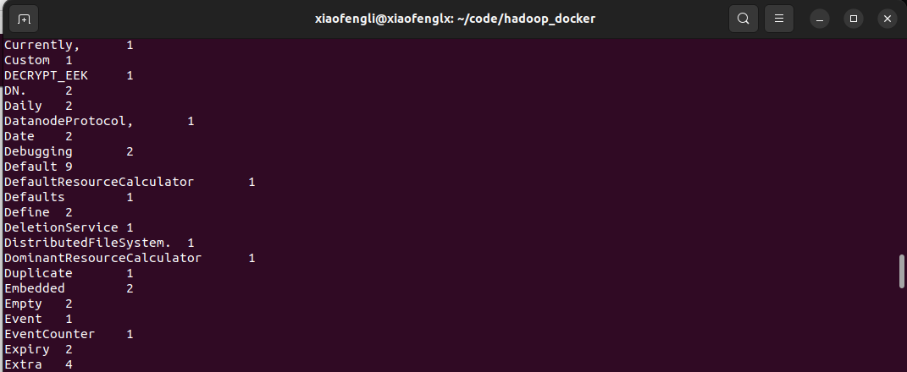
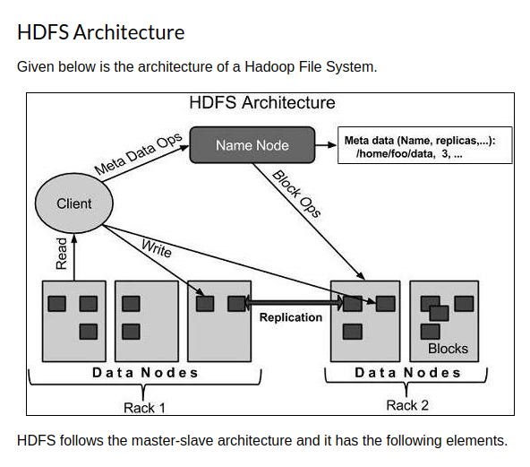
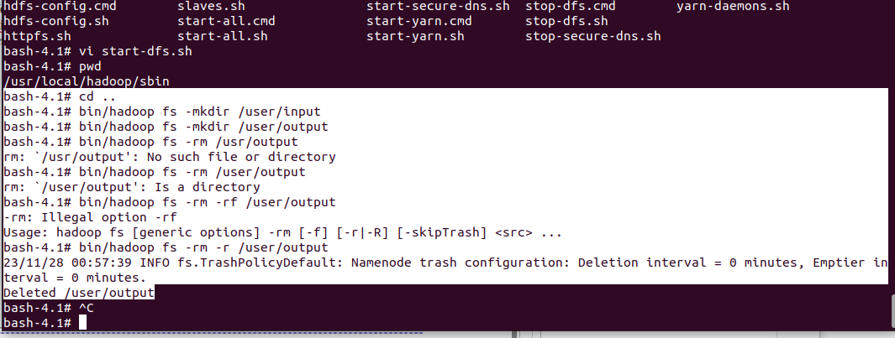

# Hadoop Lab - Legacy Hadoop 2.7.2 Image

## Lab 1 Get hadoop Container

**Start a container**

`docker run -it sequenceiq/hadoop-docker:2.7.0 /etc/bootstrap.sh -bash`

**Testing**

`cd $HADOOP_PREFIX`

`echo $HADOOP_PREFIX`



Once you are in $HADOOP_PREFIX directory, do the following,

`file hadoop`

**How do we know all the variables that are related to Hadoop in the linux container?**

* You can find out all the shell script of the VM container. The following example uses `find` command to show all the shell script with `.sh`, however, that is not complete thought. As some of the shell script in hadoop home's /bin directory does not have the `.sh` extention. A better way is to use `find` command with `-type` of shell script nature and find them all.

```shell
bash-4.1# find . -name "*.sh"
./hdfs-config.sh
./start-yarn.sh
./distribute-exclude.sh
./yarn-daemon.sh
./hadoop-daemon.sh
./stop-secure-dns.sh
./httpfs.sh
./kms.sh
./slaves.sh
./stop-dfs.sh
./stop-all.sh
./mr-jobhistory-daemon.sh
./stop-yarn.sh
./start-balancer.sh
./refresh-namenodes.sh
./start-all.sh
./start-dfs.sh
./hadoop-daemons.sh
./stop-balancer.sh
./start-secure-dns.sh
./yarn-daemons.sh
```

Once we have found all the shell scripts like above, we read them line by line, or write script to extract all the left hand side of the `=` and we can hopefully find out some variables related to the above scripts of hadoop.

However, this is tedious work. An easier way to find out all the system variables in any system, is to use the linux `env` command like below,

```shell
bash-4.1# env
BOOTSTRAP=/etc/bootstrap.sh
HOSTNAME=5259d592e010
TERM=xterm
HADOOP_PREFIX=/usr/local/hadoop
PATH=/usr/local/sbin:/usr/local/bin:/usr/sbin:/usr/bin:/sbin:/bin:/usr/java/default/bin
HADOOP_HDFS_HOME=/usr/local/hadoop
HADOOP_COMMON_HOME=/usr/local/hadoop
PWD=/usr/local/hadoop/sbin
JAVA_HOME=/usr/java/default
HADOOP_YARN_HOME=/usr/local/hadoop
HADOOP_CONF_DIR=/usr/local/hadoop/etc/hadoop
HOME=/root
SHLVL=2
YARN_CONF_DIR=/usr/local/hadoop/etc/hadoop
HADOOP_MAPRED_HOME=/usr/local/hadoop
_=/usr/bin/env
OLDPWD=/usr/local/hadoop
```

If you feel the above results are not clustering the hadoop commands, then we can sort them out and let all the hadoop grouped together like the following,

```shell
bash-4.1# env |sort
BOOTSTRAP=/etc/bootstrap.sh
HADOOP_COMMON_HOME=/usr/local/hadoop
HADOOP_CONF_DIR=/usr/local/hadoop/etc/hadoop
HADOOP_HDFS_HOME=/usr/local/hadoop
HADOOP_MAPRED_HOME=/usr/local/hadoop
HADOOP_PREFIX=/usr/local/hadoop
HADOOP_YARN_HOME=/usr/local/hadoop
HOME=/root
HOSTNAME=5259d592e010
JAVA_HOME=/usr/java/default
OLDPWD=/usr/local/hadoop
PATH=/usr/local/sbin:/usr/local/bin:/usr/sbin:/usr/bin:/sbin:/bin:/usr/java/default/bin
PWD=/usr/local/hadoop/sbin
SHLVL=2
TERM=xterm
YARN_CONF_DIR=/usr/local/hadoop/etc/hadoop
_=/usr/bin/env
```

Another command that is helpful, is the `set` command in linux, and it will give us not only the variables, but also the alias, and functions we defined in our linux profiles (.bashrc, .bash_profile).

```shell
bash-4.1# set
BASH=/bin/bash
BASHOPTS=cmdhist:expand_aliases:extquote:force_fignore:hostcomplete:interactive_comments:progcomp:promptvars:sourcepath
BASH_ALIASES=()
BASH_ARGC=()
BASH_ARGV=()
BASH_CMDS=()
BASH_LINENO=()
BASH_SOURCE=()
BASH_VERSINFO=([0]="4" [1]="1" [2]="2" [3]="1" [4]="release" [5]="x86_64-redhat-linux-gnu")
BASH_VERSION='4.1.2(1)-release'
BOOTSTRAP=/etc/bootstrap.sh
COLUMNS=177
DIRSTACK=()
EUID=0
GROUPS=()
HADOOP_COMMON_HOME=/usr/local/hadoop
HADOOP_CONF_DIR=/usr/local/hadoop/etc/hadoop
HADOOP_HDFS_HOME=/usr/local/hadoop
HADOOP_MAPRED_HOME=/usr/local/hadoop
HADOOP_PREFIX=/usr/local/hadoop
HADOOP_YARN_HOME=/usr/local/hadoop
HISTFILE=/root/.bash_history
HISTFILESIZE=500
HISTSIZE=500
HOME=/root
HOSTNAME=5259d592e010
HOSTTYPE=x86_64
IFS=$' \t\n'
JAVA_HOME=/usr/java/default
LINES=42
MACHTYPE=x86_64-redhat-linux-gnu
MAILCHECK=60
OLDPWD=/usr/local/hadoop
OPTERR=1
OPTIND=1
OSTYPE=linux-gnu
PATH=/usr/local/sbin:/usr/local/bin:/usr/sbin:/usr/bin:/sbin:/bin:/usr/java/default/bin
PIPESTATUS=([0]="0")
PPID=1
PS1='\s-\v\$ '
PS2='> '
PS4='+ '
PWD=/usr/local/hadoop/sbin
SHELL=/bin/bash
SHELLOPTS=braceexpand:emacs:hashall:histexpand:history:interactive-comments:monitor
SHLVL=2
TERM=xterm
UID=0
YARN_CONF_DIR=/usr/local/hadoop/etc/hadoop
_=clear
```

## Inspect Hadoop Processes

Once a hadoop server is running and it does not matter it is running in a VM, very likely in a VM in AWS environment or GCP.
It would be similar to what we are running right now. Without any documentation or readme.md of any arbiturary linux docker image. Because anyone can make a different docker image and pushed to the docker repo for other people to use.

If we get any random image and run into it, the following command will help us to identify the processes related to `hopefully` the hadoop. Because you can really `grep` hadoop keyword, or you just query `java`.

```shell
bash-4.1# ps axuw|grep java
root         131  0.4  0.8 1573008 273868 ?      Sl   18:17   0:10 /usr/java/default/bin/java -Dproc_namenode -Xmx1000m -Djava.net.preferIPv4Stack=true -Dhadoop.log.dir=/usr/local/hadoop/logs -Dhadoop.log.file=hadoop.log -Dhadoop.home.dir= -Dhadoop.id.str=root -Dhadoop.root.logger=INFO,console -Djava.library.path= -Dhadoop.policy.file=hadoop-policy.xml -Djava.net.preferIPv4Stack=true -Djava.net.preferIPv4Stack=true -Djava.net.preferIPv4Stack=true -Dhadoop.log.dir=/usr/local/hadoop/logs -Dhadoop.log.file=hadoop-root-namenode-5259d592e010.log -Dhadoop.home.dir=/usr/local/hadoop -Dhadoop.id.str=root -Dhadoop.root.logger=INFO,RFA -Djava.library.path=/usr/local/hadoop/lib/native -Dhadoop.policy.file=hadoop-policy.xml -Djava.net.preferIPv4Stack=true -Dhadoop.security.logger=INFO,RFAS -Dhdfs.audit.logger=INFO,NullAppender -Dhadoop.security.logger=INFO,RFAS -Dhdfs.audit.logger=INFO,NullAppender -Dhadoop.security.logger=INFO,RFAS -Dhdfs.audit.logger=INFO,NullAppender -Dhadoop.security.logger=INFO,RFAS org.apache.hadoop.hdfs.server.namenode.NameNode
root         226  0.3  0.6 1571696 214388 ?      Sl   18:17   0:09 /usr/java/default/bin/java -Dproc_datanode -Xmx1000m -Djava.net.preferIPv4Stack=true -Dhadoop.log.dir=/usr/local/hadoop/logs -Dhadoop.log.file=hadoop.log -Dhadoop.home.dir= -Dhadoop.id.str=root -Dhadoop.root.logger=INFO,console -Djava.library.path= -Dhadoop.policy.file=hadoop-policy.xml -Djava.net.preferIPv4Stack=true -Djava.net.preferIPv4Stack=true -Djava.net.preferIPv4Stack=true -Dhadoop.log.dir=/usr/local/hadoop/logs -Dhadoop.log.file=hadoop-root-datanode-5259d592e010.log -Dhadoop.home.dir=/usr/local/hadoop -Dhadoop.id.str=root -Dhadoop.root.logger=INFO,RFA -Djava.library.path=/usr/local/hadoop/lib/native -Dhadoop.policy.file=hadoop-policy.xml -Djava.net.preferIPv4Stack=true -server -Dhadoop.security.logger=ERROR,RFAS -Dhadoop.security.logger=ERROR,RFAS -Dhadoop.security.logger=ERROR,RFAS -Dhadoop.security.logger=INFO,RFAS org.apache.hadoop.hdfs.server.datanode.DataNode
root         417  0.2  0.7 1565612 238868 ?      Sl   18:17   0:06 /usr/java/default/bin/java -Dproc_secondarynamenode -Xmx1000m -Djava.net.preferIPv4Stack=true -Dhadoop.log.dir=/usr/local/hadoop/logs -Dhadoop.log.file=hadoop.log -Dhadoop.home.dir= -Dhadoop.id.str=root -Dhadoop.root.logger=INFO,console -Djava.library.path= -Dhadoop.policy.file=hadoop-policy.xml -Djava.net.preferIPv4Stack=true -Djava.net.preferIPv4Stack=true -Djava.net.preferIPv4Stack=true -Dhadoop.log.dir=/usr/local/hadoop/logs -Dhadoop.log.file=hadoop-root-secondarynamenode-5259d592e010.log -Dhadoop.home.dir=/usr/local/hadoop -Dhadoop.id.str=root -Dhadoop.root.logger=INFO,RFA -Djava.library.path=/usr/local/hadoop/lib/native -Dhadoop.policy.file=hadoop-policy.xml -Djava.net.preferIPv4Stack=true -Dhadoop.security.logger=INFO,RFAS -Dhdfs.audit.logger=INFO,NullAppender -Dhadoop.security.logger=INFO,RFAS -Dhdfs.audit.logger=INFO,NullAppender -Dhadoop.security.logger=INFO,RFAS -Dhdfs.audit.logger=INFO,NullAppender -Dhadoop.security.logger=INFO,RFAS org.apache.hadoop.hdfs.server.namenode.SecondaryNameNode
root         575  0.8  0.8 1756604 273628 pts/0  Sl   18:18   0:22 /usr/java/default/bin/java -Dproc_resourcemanager -Xmx1000m -Dhadoop.log.dir=/usr/local/hadoop/logs -Dyarn.log.dir=/usr/local/hadoop/logs -Dhadoop.log.file=yarn--resourcemanager-5259d592e010.log -Dyarn.log.file=yarn--resourcemanager-5259d592e010.log -Dyarn.home.dir= -Dyarn.id.str= -Dhadoop.root.logger=INFO,RFA -Dyarn.root.logger=INFO,RFA -Djava.library.path=/usr/local/hadoop/lib/native -Dyarn.policy.file=hadoop-policy.xml -Dhadoop.log.dir=/usr/local/hadoop/logs -Dyarn.log.dir=/usr/local/hadoop/logs -Dhadoop.log.file=yarn--resourcemanager-5259d592e010.log -Dyarn.log.file=yarn--resourcemanager-5259d592e010.log -Dyarn.home.dir=/usr/local/hadoop -Dhadoop.home.dir=/usr/local/hadoop -Dhadoop.root.logger=INFO,RFA -Dyarn.root.logger=INFO,RFA -Djava.library.path=/usr/local/hadoop/lib/native -classpath /usr/local/hadoop/etc/hadoop/:/usr/local/hadoop/etc/hadoop/:/usr/local/hadoop/etc/hadoop/:/usr/local/hadoop/share/hadoop/common/lib/*:/usr/local/hadoop/share/hadoop/common/*:/usr/local/hadoop/share/hadoop/hdfs:/usr/local/hadoop/share/hadoop/hdfs/lib/*:/usr/local/hadoop/share/hadoop/hdfs/*:/usr/local/hadoop/share/hadoop/yarn/lib/*:/usr/local/hadoop/share/hadoop/yarn/*:/usr/local/hadoop/share/hadoop/mapreduce/lib/*:/usr/local/hadoop/share/hadoop/mapreduce/*:/usr/local/hadoop/contrib/capacity-scheduler/*.jar:/usr/local/hadoop/contrib/capacity-scheduler/*.jar:/usr/local/hadoop/contrib/capacity-scheduler/*.jar:/usr/local/hadoop/share/hadoop/yarn/*:/usr/local/hadoop/share/hadoop/yarn/lib/*:/usr/local/hadoop/etc/hadoop//rm-config/log4j.properties org.apache.hadoop.yarn.server.resourcemanager.ResourceManager
root         672  0.5  0.7 1599452 236868 ?      Sl   18:18   0:13 /usr/java/default/bin/java -Dproc_nodemanager -Xmx1000m -Dhadoop.log.dir=/usr/local/hadoop/logs -Dyarn.log.dir=/usr/local/hadoop/logs -Dhadoop.log.file=yarn-root-nodemanager-5259d592e010.log -Dyarn.log.file=yarn-root-nodemanager-5259d592e010.log -Dyarn.home.dir= -Dyarn.id.str=root -Dhadoop.root.logger=INFO,RFA -Dyarn.root.logger=INFO,RFA -Djava.library.path=/usr/local/hadoop/lib/native -Dyarn.policy.file=hadoop-policy.xml -server -Dhadoop.log.dir=/usr/local/hadoop/logs -Dyarn.log.dir=/usr/local/hadoop/logs -Dhadoop.log.file=yarn-root-nodemanager-5259d592e010.log -Dyarn.log.file=yarn-root-nodemanager-5259d592e010.log -Dyarn.home.dir=/usr/local/hadoop -Dhadoop.home.dir=/usr/local/hadoop -Dhadoop.root.logger=INFO,RFA -Dyarn.root.logger=INFO,RFA -Djava.library.path=/usr/local/hadoop/lib/native -classpath /usr/local/hadoop/etc/hadoop/:/usr/local/hadoop/etc/hadoop/:/usr/local/hadoop/etc/hadoop/:/usr/local/hadoop/share/hadoop/common/lib/*:/usr/local/hadoop/share/hadoop/common/*:/usr/local/hadoop/share/hadoop/hdfs:/usr/local/hadoop/share/hadoop/hdfs/lib/*:/usr/local/hadoop/share/hadoop/hdfs/*:/usr/local/hadoop/share/hadoop/yarn/lib/*:/usr/local/hadoop/share/hadoop/yarn/*:/usr/local/hadoop/share/hadoop/mapreduce/lib/*:/usr/local/hadoop/share/hadoop/mapreduce/*:/usr/local/hadoop/contrib/capacity-scheduler/*.jar:/usr/local/hadoop/contrib/capacity-scheduler/*.jar:/usr/local/hadoop/share/hadoop/yarn/*:/usr/local/hadoop/share/hadoop/yarn/lib/*:/usr/local/hadoop/etc/hadoop//nm-config/log4j.properties org.apache.hadoop.yarn.server.nodemanager.NodeManager
root        1092  0.0  0.0   6448  1408 pts/0    S+   19:00   0:00 grep java
bash-4.1# 
```

>Hint: How to read the above process information?
> * we know who and what is the process id
> * we know what each process is, such as the the following,

```
`org.apache.hadoop.yarn.server.nodemanager.NodeManager`, `org.apache.hadoop.yarn.server.resourcemanager.ResourceManager`,`org.apache.hadoop.hdfs.server.namenode.SecondaryNameNode`, `org.apache.hadoop.hdfs.server.datanode.DataNode`, `org.apache.hadoop.hdfs.server.datanode.NameNode`. These are the classes. And the org.`apache. ...` are the java packages, which are folder.
```

> * All the -D argument such as these `-Dproc_secondarynamenode -Xmx1000m -Djava.net.preferIPv4Stack=true -Dhadoop.log.dir=/usr/local/hadoop/logs` would be passed into the respective class.
> * Java is the jvm and hadoop is implemented by Java.

When you run the above command, then you will the following in your terminal,

```shell
bash-4.1# bin/hadoop jar share/hadoop/mapreduce/hadoop-mapreduce-examples-2.7.0.jar grep input output 'dfs[a-z.]+'
24/12/12 19:07:46 INFO client.RMProxy: Connecting to ResourceManager at /0.0.0.0:8032
^[[D24/12/12 19:07:48 INFO input.FileInputFormat: Total input paths to process : 31
24/12/12 19:07:48 INFO mapreduce.JobSubmitter: number of splits:31
24/12/12 19:07:49 INFO mapreduce.JobSubmitter: Submitting tokens for job: job_1734045485087_0001
24/12/12 19:07:49 INFO impl.YarnClientImpl: Submitted application application_1734045485087_0001
24/12/12 19:07:49 INFO mapreduce.Job: The url to track the job: http://5259d592e010:8088/proxy/application_1734045485087_0001/
24/12/12 19:07:49 INFO mapreduce.Job: Running job: job_1734045485087_0001
24/12/12 19:07:56 INFO mapreduce.Job: Job job_1734045485087_0001 running in uber mode : false
24/12/12 19:07:56 INFO mapreduce.Job:  map 0% reduce 0%
24/12/12 19:08:07 INFO mapreduce.Job:  map 13% reduce 0%
24/12/12 19:08:08 INFO mapreduce.Job:  map 19% reduce 0%
24/12/12 19:08:18 INFO mapreduce.Job:  map 23% reduce 0%
24/12/12 19:08:19 INFO mapreduce.Job:  map 39% reduce 0%
24/12/12 19:08:28 INFO mapreduce.Job:  map 42% reduce 0%
24/12/12 19:08:29 INFO mapreduce.Job:  map 55% reduce 0%
24/12/12 19:08:33 INFO mapreduce.Job:  map 55% reduce 18%
24/12/12 19:08:35 INFO mapreduce.Job:  map 58% reduce 18%
24/12/12 19:08:36 INFO mapreduce.Job:  map 65% reduce 19%
24/12/12 19:08:37 INFO mapreduce.Job:  map 68% reduce 19%
24/12/12 19:08:38 INFO mapreduce.Job:  map 71% reduce 19%
24/12/12 19:08:39 INFO mapreduce.Job:  map 71% reduce 24%
24/12/12 19:08:44 INFO mapreduce.Job:  map 81% reduce 24%
24/12/12 19:08:45 INFO mapreduce.Job:  map 87% reduce 26%
24/12/12 19:08:48 INFO mapreduce.Job:  map 87% reduce 29%
24/12/12 19:08:51 INFO mapreduce.Job:  map 100% reduce 29%
24/12/12 19:08:52 INFO mapreduce.Job:  map 100% reduce 100%
24/12/12 19:08:52 INFO mapreduce.Job: Job job_1734045485087_0001 completed successfully
24/12/12 19:08:53 INFO mapreduce.Job: Counters: 49
	File System Counters
		FILE: Number of bytes read=345
		FILE: Number of bytes written=3697508
		FILE: Number of read operations=0
		FILE: Number of large read operations=0
		FILE: Number of write operations=0
		HDFS: Number of bytes read=80529
		HDFS: Number of bytes written=437
		HDFS: Number of read operations=96
		HDFS: Number of large read operations=0
		HDFS: Number of write operations=2
	Job Counters 
		Launched map tasks=31
		Launched reduce tasks=1
		Data-local map tasks=31
		Total time spent by all maps in occupied slots (ms)=252278
		Total time spent by all reduces in occupied slots (ms)=32887
		Total time spent by all map tasks (ms)=252278
		Total time spent by all reduce tasks (ms)=32887
		Total vcore-seconds taken by all map tasks=252278
		Total vcore-seconds taken by all reduce tasks=32887
		Total megabyte-seconds taken by all map tasks=258332672
		Total megabyte-seconds taken by all reduce tasks=33676288
	Map-Reduce Framework
		Map input records=2060
		Map output records=24
		Map output bytes=590
		Map output materialized bytes=525
		Input split bytes=3812
		Combine input records=24
		Combine output records=13
		Reduce input groups=11
		Reduce shuffle bytes=525
		Reduce input records=13
		Reduce output records=11
		Spilled Records=26
		Shuffled Maps =31
		Failed Shuffles=0
		Merged Map outputs=31
		GC time elapsed (ms)=3045
		CPU time spent (ms)=10500
		Physical memory (bytes) snapshot=8414613504
		Virtual memory (bytes) snapshot=23179350016
		Total committed heap usage (bytes)=6442450944
	Shuffle Errors
		BAD_ID=0
		CONNECTION=0
		IO_ERROR=0
		WRONG_LENGTH=0
		WRONG_MAP=0
		WRONG_REDUCE=0
	File Input Format Counters 
		Bytes Read=76717
	File Output Format Counters 
		Bytes Written=437
24/12/12 19:08:53 INFO client.RMProxy: Connecting to ResourceManager at /0.0.0.0:8032
24/12/12 19:08:53 INFO input.FileInputFormat: Total input paths to process : 1
24/12/12 19:08:53 INFO mapreduce.JobSubmitter: number of splits:1
24/12/12 19:08:53 INFO mapreduce.JobSubmitter: Submitting tokens for job: job_1734045485087_0002
24/12/12 19:08:53 INFO impl.YarnClientImpl: Submitted application application_1734045485087_0002
24/12/12 19:08:53 INFO mapreduce.Job: The url to track the job: http://5259d592e010:8088/proxy/application_1734045485087_0002/
24/12/12 19:08:53 INFO mapreduce.Job: Running job: job_1734045485087_0002
24/12/12 19:09:02 INFO mapreduce.Job: Job job_1734045485087_0002 running in uber mode : false
24/12/12 19:09:02 INFO mapreduce.Job:  map 0% reduce 0%
24/12/12 19:09:06 INFO mapreduce.Job:  map 100% reduce 0%
24/12/12 19:09:12 INFO mapreduce.Job:  map 100% reduce 100%
24/12/12 19:09:12 INFO mapreduce.Job: Job job_1734045485087_0002 completed successfully
24/12/12 19:09:13 INFO mapreduce.Job: Counters: 49
	File System Counters
		FILE: Number of bytes read=291
		FILE: Number of bytes written=230543
		FILE: Number of read operations=0
		FILE: Number of large read operations=0
		FILE: Number of write operations=0
		HDFS: Number of bytes read=570
		HDFS: Number of bytes written=197
		HDFS: Number of read operations=7
		HDFS: Number of large read operations=0
		HDFS: Number of write operations=2
	Job Counters 
		Launched map tasks=1
		Launched reduce tasks=1
		Data-local map tasks=1
		Total time spent by all maps in occupied slots (ms)=1963
		Total time spent by all reduces in occupied slots (ms)=3176
		Total time spent by all map tasks (ms)=1963
		Total time spent by all reduce tasks (ms)=3176
		Total vcore-seconds taken by all map tasks=1963
		Total vcore-seconds taken by all reduce tasks=3176
		Total megabyte-seconds taken by all map tasks=2010112
		Total megabyte-seconds taken by all reduce tasks=3252224
	Map-Reduce Framework
		Map input records=11
		Map output records=11
		Map output bytes=263
		Map output materialized bytes=291
		Input split bytes=133
		Combine input records=0
		Combine output records=0
		Reduce input groups=5
		Reduce shuffle bytes=291
		Reduce input records=11
		Reduce output records=11
		Spilled Records=22
		Shuffled Maps =1
		Failed Shuffles=0
		Merged Map outputs=1
		GC time elapsed (ms)=30
		CPU time spent (ms)=1150
		Physical memory (bytes) snapshot=441339904
		Virtual memory (bytes) snapshot=1473138688
		Total committed heap usage (bytes)=402653184
	Shuffle Errors
		BAD_ID=0
		CONNECTION=0
		IO_ERROR=0
		WRONG_LENGTH=0
		WRONG_MAP=0
		WRONG_REDUCE=0
	File Input Format Counters 
		Bytes Read=437
	File Output Format Counters 
		Bytes Written=197
```

**run the mapreduce**

`bin/hadoop jar share/hadoop/mapreduce/hadoop-mapreduce-examples-2.7.0.jar grep input output 'dfs[a-z.]+'`

**check the output**

`bin/hdfs dfs -cat output/*`

## Lab 2 How to use Hadoop

```bash
$ mkdir input2 
$ cp *.txt input2
$ ls -l input 
```


It will give the following files in your input directory −

```bash
total 24 
-rw-r--r-- 1 root root 15164 Feb 21 10:14 LICENSE.txt 
-rw-r--r-- 1 root root   101 Feb 21 10:14 NOTICE.txt
-rw-r--r-- 1 root root  1366 Feb 21 10:14 README.txt 
```

If output exists, then do the following,

```bash
bash-4.1# bin/hadoop fs -rm -r output
23/11/28 00:35:24 INFO fs.TrashPolicyDefault: Namenode trash configuration: Deletion interval = 0 minutes, Emptier interval = 0 minutes.
Deleted output
```

**Why we need to delete the above output dir?**

You need to delete the output/ dir in the dfs (distributed file system). And it is not in the current directory at all.
It is not visible by doing a `ls` command.

We run the deletion command above just to make sure that we do not encounter the following errors,

```shell
bash-4.1# bin/hadoop jar share/hadoop/mapreduce/hadoop-mapreduce-examples-2.7.0.jar wordcount input2 output
24/12/12 19:23:21 INFO client.RMProxy: Connecting to ResourceManager at /0.0.0.0:8032
org.apache.hadoop.mapred.FileAlreadyExistsException: Output directory hdfs://5259d592e010:9000/user/root/output already exists
	at org.apache.hadoop.mapreduce.lib.output.FileOutputFormat.checkOutputSpecs(FileOutputFormat.java:146)
	at org.apache.hadoop.mapreduce.JobSubmitter.checkSpecs(JobSubmitter.java:269)
	at org.apache.hadoop.mapreduce.JobSubmitter.submitJobInternal(JobSubmitter.java:142)
	at org.apache.hadoop.mapreduce.Job$10.run(Job.java:1290)
	at org.apache.hadoop.mapreduce.Job$10.run(Job.java:1287)
	at java.security.AccessController.doPrivileged(Native Method)
	at javax.security.auth.Subject.doAs(Subject.java:415)
	at org.apache.hadoop.security.UserGroupInformation.doAs(UserGroupInformation.java:1657)
	at org.apache.hadoop.mapreduce.Job.submit(Job.java:1287)
	at org.apache.hadoop.mapreduce.Job.waitForCompletion(Job.java:1308)
	at org.apache.hadoop.examples.WordCount.main(WordCount.java:87)
	at sun.reflect.NativeMethodAccessorImpl.invoke0(Native Method)
	at sun.reflect.NativeMethodAccessorImpl.invoke(NativeMethodAccessorImpl.java:57)
	at sun.reflect.DelegatingMethodAccessorImpl.invoke(DelegatingMethodAccessorImpl.java:43)
	at java.lang.reflect.Method.invoke(Method.java:606)
	at org.apache.hadoop.util.ProgramDriver$ProgramDescription.invoke(ProgramDriver.java:71)
	at org.apache.hadoop.util.ProgramDriver.run(ProgramDriver.java:144)
	at org.apache.hadoop.examples.ExampleDriver.main(ExampleDriver.java:74)
	at sun.reflect.NativeMethodAccessorImpl.invoke0(Native Method)
	at sun.reflect.NativeMethodAccessorImpl.invoke(NativeMethodAccessorImpl.java:57)
	at sun.reflect.DelegatingMethodAccessorImpl.invoke(DelegatingMethodAccessorImpl.java:43)
	at java.lang.reflect.Method.invoke(Method.java:606)
	at org.apache.hadoop.util.RunJar.run(RunJar.java:221)
	at org.apache.hadoop.util.RunJar.main(RunJar.java:136)
```

Because the above command is going to create a output/ dir if it does not exists, but if it exists, then it will give you the above errors,

Now let us delete it one more time,

```shell
bash-4.1# bin/hadoop fs -rm -r output
24/12/12 19:23:42 INFO fs.TrashPolicyDefault: Namenode trash configuration: Deletion interval = 0 minutes, Emptier interval = 0 minutes.
Deleted output
bash-4.1# 
```

Run the following example, and note that it is `input2` and this time we will run the word counting against the input/*.txt files.

`bin/hadoop jar share/hadoop/mapreduce/hadoop-mapreduce-examples-2.7.0.jar wordcount input2 output`



Check output,

`bash-4.1# bin/hadoop dfs -cat output/*`



Check `–help` option for usage,


## Architecture



HDFS follows the master-slave architecture and it has the following elements.

**Namenode**

The namenode is the commodity hardware that contains the GNU/Linux operating system and the namenode software. It is a software that can be run on commodity hardware. The system having the namenode acts as the master server and it does the following tasks −
    • Manages the file system namespace.
    • Regulates client’s access to files.
    • It also executes file system operations such as renaming, closing, and opening files and directories.

**Datanode**

The datanode is a commodity hardware having the GNU/Linux operating system and datanode software. For every node (Commodity hardware/System) in a cluster, there will be a datanode. These nodes manage the data storage of their system.
    • Datanodes perform read-write operations on the file systems, as per client request.
    • They also perform operations such as block creation, deletion, and replication according to the instructions of the namenode.

**Block**

Generally the user data is stored in the files of HDFS. The file in a file system will be divided into one or more segments and/or stored in individual data nodes. These file segments are called as blocks. In other words, the minimum amount of data that HDFS can read or write is called a Block. The default block size is 64MB, but it can be increased as per the need to change in HDFS configuration.

**Goals of HDFS**

* Fault detection and recovery

− Since HDFS includes a large number of commodity hardware, failure of components is frequent. Therefore HDFS should have mechanisms for quick and automatic fault detection and recovery.

* Huge datasets

− HDFS should have hundreds of nodes per cluster to manage the applications having huge datasets.

* Hardware at data

− A requested task can be done efficiently, when the computation takes place near the data. Especially where huge datasets are involved, it reduces the network traffic and increases the throughput.

## Hadoop - HDFS Operations

**Starting HDFS**

Initially you have to format the configured HDFS file system, open namenode (HDFS server), and execute the following command.

`$ hadoop namenode -format`

After formatting the HDFS, start the distributed file system. The following command will start the namenode as well as the data nodes as cluster.

`$ start-dfs.sh`

In our docker image, we did not have to do that, because we run docker image with a script like the following which we executed earlier,

`docker run -it sequenceiq/hadoop-docker:2.7.0 /etc/bootstrap.sh -bash`

We can inspect `/etc/bootstrap.sh` for the logic and it shows the following,


It did three things,

* start sshd server
* call start-dfs.sh
* call start-yarn.sh

We can see them in the following `/etc/bootstrap.sh` script,


Now, let us check the `start-dfs.sh` in the **sbin** dir, and we can see more.


Check the core startup scripts. Now inside of the start-dfs.sh it might call a chain of other scripts as well. For instance, in the hightlights of the following image, it shows it calls `hadoop-daemons.sh`.


**Listing Files in HDFS**

Note that the syntax of the following is,

***hadoop fs|dfs -linux-command path_in_dfs***

> note: the path_in_dfs such as `/user/input` is not found in your docker container but in a distributed file system, for short, we call `dfs`.

```bash
bash-4.1# bin/hadoop fs -mkdir /user/input 
bash-4.1# bin/hadoop fs -mkdir /user/output
bash-4.1# bin/hadoop fs -rm -r /user/output
23/11/28 00:57:39 INFO fs.TrashPolicyDefault: Namenode trash configuration: Deletion interval = 0 minutes, Emptier interval = 0 minutes.
Deleted /user/output
```



Make a file, and put contents in it,


Then you run the following command,

`bin/hadoop fs -put file.txt /user/input `

Then you will check the file.txt, as it is moved to user/input/ in the DFS/distributed file system by running the following command,

`bash-4.1# bin/hadoop fs -ls /user/input`


Then we will be checking the file content, 

```bash
bash-4.1# bin/hadoop fs -cat /user/input/file.txt 
helloworld
```

Then you can also get the file from the DFS into your local file system,
`mkdir tmp/`

`bin/hadoop fs -get /user/input/ tmp/`


**Shutting Down the HDFS**

You can shut down the HDFS by using the following command.

`$ stop-dfs.sh`

### Ref

- https://hub.docker.com/r/sequenceiq/hadoop-docker/

- https://www.tutorialspoint.com/hadoop/hadoop_command_reference.htm

- https://www.tutorialspoint.com/hadoop/hadoop_mapreduce.htm

- https://www.tutorialspoint.com/hadoop/hadoop_streaming.htm