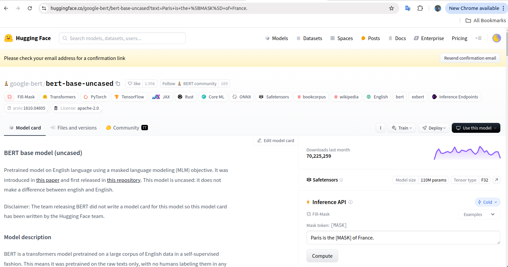
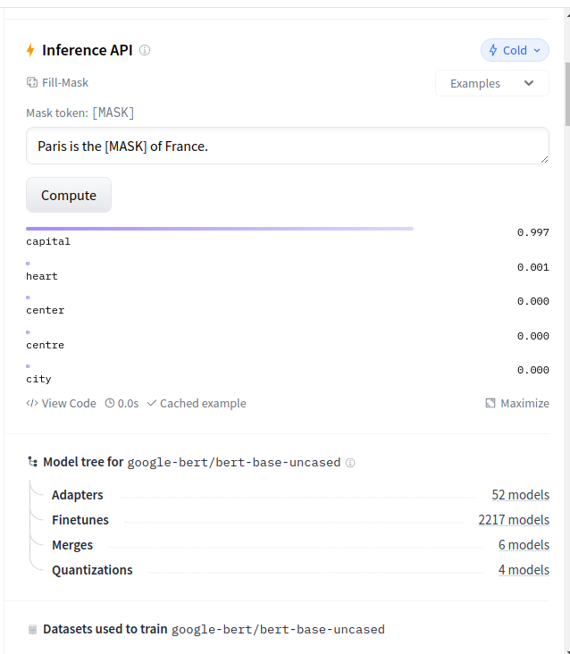

# HuggingFace

1. What is hugging face? Their business model. What they are trying offer you to build, train and deploy models in their platform? How do they make money from?

- What is hugging face?

* A machine learning and Data science platform that lets users deploy and train ML models.
it hosts open source datasets (developers can create and update) and demos where we can see the code behind the model.

* Unlike open ai which is a closed source.

* It hosts leader board that tracks ranks and evaluates the LLMs and chatbots on the platform.

The models it hosts: LLMs, computer vision, audio, image so we can transform text to image or image to image. it has many models which makes finding the right one difficult.

- Their business model

they adopt transformer-based models working in different machine learning domains as NLP, image recognition, robotics.

it uses so-called tasks to solve complex problems in computer vision, NLP, Audio.
their models are available on AWS and Azure.

- What they are trying offer you to build, train and deploy models in their platform?

**Model Building**

offers access to pre-trained models in NLP.
offers model customization where we can tune pre-trained models to fit our tasks and databases.
Provide the popular transformers library to build and experiment with models like BERT, GPT, T5.

**Model Training**

we can store, share and manage models and datasets on huggingface hub.
we can train model on custom datasets.

integrate with accelerate library to scale model training across GPU or TPU.
integrate with other platforms like PyTorch, TensorFlow, google cloud, AWS, Azure.

**Model Deployment**

Offers inference API to allow users host their models on huggingface's cloud infrastructure to deploy models without setting.

Offers a no-code solution for training and deploying ML models for people with no technical expertise.

Supports Gradio which is a tool that lets users create a web inference for the model.
offers end to end pipeline support from building, deploying and push trained models to cloud for real-time inference.

- How do they make money from?

* Licensing fees it charges for using models and software (inference endpoints costs $0.06/hr and pro-account $9/month).

* Merchandise Sales (hoodies and baseball caps) online store.

2. What type of models they have? Text? Image? Or something else?

_text models (NLP):_

Text Classification: Sentiment analysis, spam detection, topic classification, etc.
Translation

**Summarization**

* Question answering : ex.BERT

* Named entity recongition(NER): identify entities like names, places,.. in text

* text generation: using GPT-2 and 3

* conversational AI/Chatbots: pre-trained

* language models: BERT, RoBERTa, GPT2

* Token classification

* Table question answering

* zero shot classification

* feature extraction

* text2text generation

* fill-mask

* sentence similarity

_Image Models (computer vision)_

* image classification

* depth estimation

* object detection

* image segmentation

* text to image

* image to text

* image to image

* image to video

* unconditional image generation

* video classification

* text to video

* zero-shot image classification

* mask generation

* zero shot object detection

* text to 3D

* image to 3D

* image feature extraction

* keypoint detection

_Audio_

* text to speech

* text to audio

* automatic speech recognition

* audio to audio

* audio classification

* voice activity detection

_Tabular_

* tabular classification

* tabular regression

* time series forecasting

_reinforcement learning_

* robotics

* reinforcement learning

_Multi-Modal_

* image-text-to-text

* visual question answering

* document question answering

* video text to text

* any to any

3. Who are the creator, vendors or big companies behind these models listed here? Some might be big and some might be nible. We would to know the nibles ones for instance.

Mozilla foundation,
teknium,
cis-lmu,
allenai,
open ocra,
marsyas,
fka,
LDJnr,
oscar carpus,
microsoft,
wikipedia ,
meta,
black forest labs,
jasperai,
openbmb,
On oma AI research,
glif,
nvidia,
jina ai,
BA AI,
amd,
Qwen,
AIDC

4. Please survey google’s AI models, and specialties and a little summary of each model.

- datagemma-rag

**Specialty: text generation**

summary: DataGemma is a series of fine-tuned Gemma 2 models used to help LLMs access and incorporate reliable public statistical data from Data Commons into their responses. DataGemma RAG is used with Retrieval Augmented Generation, where it is trained to take a user query and generate natural language queries that can be understood by Data Commons' existing natural language interface.

Input: Text string containing a user query with a prompt to ask for statistical questions.

Output: A list of natural language queries that can be used to answer the user query and can be understood by Data Commons' existing natural language interface.  Model was trained on wide variety of datasets  and trained on TPUv5e using JAX. The model is new and not for commercial or general public use only academical use.

- BERT base model

Speciality: full-mask (NLP)

Summary: BERT is a transformers model pretrained on a large corpus of English data in a self-supervised fashion.

**Objectives:**

Masked language modeling (MLM): taking a sentence, the model randomly masks 15% of the words in the input then run the entire masked sentence through the model and has to predict the masked words.
Next sentence prediction (NSP): the models concatenates two masked sentences as inputs during pretraining. Sometimes they correspond to sentences that were next to each other in the original text, sometimes not. The model then has to predict if the two sentences were following each other or not.
the bert model was pretrained on bookcorpus and english wikipedia. 

- Gemma model

Specialization: Text Generation

Summary: text to text decoder only LLM, available in english, it includes text generaion, question answering,

Summarization and reasoning. built from the same technology of Gemini model.

Input: Text string, such as a question, a prompt, or a document to be summarized.

Output: Generated English-language text in response to the input, such as an answer to a question, or a summary of a document.

The model was trained on a dataset of text data that include a variety of sources from web documents,  code, mathematic the model was trained using last generation of TPU

- SigLIP model

Speciality: zero-shot image classification

Summary: SigLIP model pre-trained on WebLi at resolution 384x384.The sigmoid loss operates solely on image-text pairs and does not require a global view of the pairwise similarities for normalization. This allows further scaling up the batch size, while also performing better at smaller batch sizes.

5. Please survey(research) Meta’s Models. Are they brokered in Hugging face?

LLMA 3.2 11B, 90B, / image - text-to text

llma 3.2 1B,3B,8B, Guard 3-1B/text generation

Yes they are brokered in huggingface.

6. Can random people commit their model to hugging face? Is hugging face aiming to become a market place just like docker.io? (Best way to learn and efficiently use your time is Youtube, not googling not medium.com but you can do that as well).

yes because it uses an open source datasets so anyone can see the codes and datasets of the models and make change on them unlike google's brad and open ai who use a closed source

7. Research about dataset? What are these datasets? How do I choose them to fit a particular model? In another word,if I have a model, I need some data, where do I find them, or which one should I choose from down below.

the datasets are in different format and modality (3D, Audio, geospatial,image,tabular, text, time series, video), in different sizes and formats (json, csv, parquet, imagefolder, soundfolder, webdataset, text, arrow), they come in different languages, licenses and topics.

they are compatible with pandas, PyTorch, tensorFlow

how to choose a dataset:

- identify the modality (3D, Audio, geospatial...)
- identify the format
- identify the task (text classification, image to text ,...)
- identify the language
- identify the license if needed
- identify the field (medical, biology, art,..)

## Part II Handson

**Bert Model**

