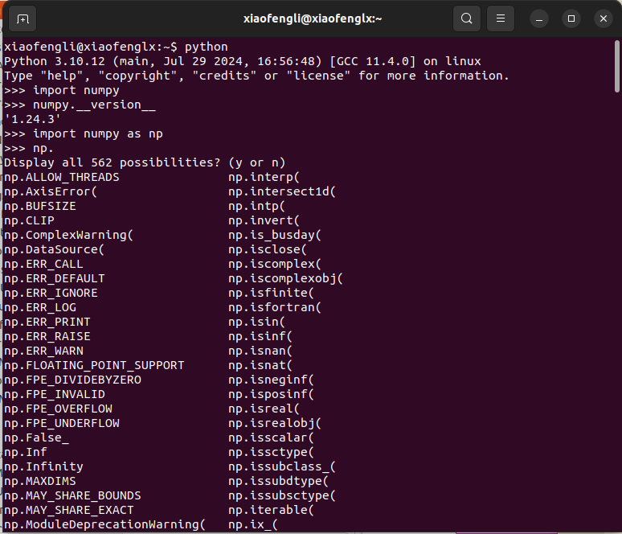

# NumPy

## Array and Coding Efficiencies

### Dynamic type and Dynamic type of Array

* Display the version

```shell
>>> import numpy
>>> numpy.__version__
'1.24.3'
```

* A tab will show you built-in functions.

```shell
>>> import numpy as np
>>> np.[tab on your keyboard]
```



* Data types is an object in C.

A Python Integer Is More Than Just an Integer.
It’s actually a pointer to a compound C struc‐
ture, which contains several values.

```C
struct _longobject {
    long ob_refcnt;
    PyTypeObject *ob_type;
    size_t ob_size;
    long ob_digit[1];
};
```

A single integer in Python 3.4 actually contains four pieces:

• ob_refcnt, a reference count that helps Python silently handle memory alloca‐
tion and deallocation
• ob_type, which encodes the type of the variable
• ob_size, which specifies the size of the following data members
• ob_digit, which contains the actual integer value that we expect the Python vari‐able to represent

This means that there is some overhead in storing an integer in Python as compared
to an integer in a compiled language like C, as illustrated below,


* A Python List Is More Than Just a List.

Because of Python’s dynamic typing, we can even create heterogeneous lists:

```python
In[5]: L3 = [True, "2", 3.0, 4]
[type(item) for item in L3]

Out[5]: [bool, str, float, int]
```

**Cons:**

But this flexibility comes at a cost: to allow these flexible types, each item in the list must contain its own type info, reference count, and other information—that is, each item is a complete Python object. In the special case that all variables are of the same type, much of this information is ***redundant***: it can be much more efficient to store data in a fixed-type array.

* For an array, it should be At the implementation level, the array essentially contains a single pointer to one con‐tiguous block of data. The Python list, on the other hand, contains a pointer to a block of pointers, each of which in turn points to a full Python object like the Python integer we saw earlier. **Array Vs LinkedList**

> Hint: Java Interview question: ArrayList vs LinkedList.

* Fixed-type NumPy-style arrays lack this flexibil‐ity, but are much more efficient for storing and manipulating data.

### Fixed-Type Arrays in Python

Python offers several different options for storing data in efficient, fixed-type data buffers. The built-in array module (available since Python 3.3) can be used to create dense arrays of a uniform type:

```python
In[6]: import array
L = list(range(10))
A = array.array('i', L)
A
Out[6]: array('i', [0, 1, 2, 3, 4, 5, 6, 7, 8, 9])
```

Here 'i' is a type code indicating the contents are integers.
Much more useful, however, is the ndarray object of the Nu

However, NumPy's ndarray provides more flexibility in efficient operations on that data.

### Creating Arrays from Python Lists

```python
In[7]: import numpy as np
In[8]: # integer array:
np.array([1, 4, 2, 5, 3])
Out[8]: array([1, 4, 2, 5, 3])
```

**Upcast**

```python
In[9]: np.array([3.14, 4, 2, 3])
Out[9]: array([ 3.14, 4.,2.,3.])
```

**Data Type**

```python
In[10]: np.array([1, 2, 3, 4], dtype='float32')
Out[10]: array([ 1.,2.,3.,4.], dtype=float32)
```

**Multidimentional**

```python
In[11]: # nested lists result in multidimensional arrays
np.array([range(i, i + 3) for i in [2, 4, 6]])
Out[11]: array([[2, 3, 4],
[4, 5, 6],
[6, 7, 8]])
```

**Creating Arrays from Scratch**

```python

Especially for larger arrays, it is more efficient to create arrays from scratch using rou‐tines built into NumPy. Here are several examples:

In[12]: # Create a length-10 integer array filled with zeros
np.zeros(10, dtype=int)
Out[12]: array([0, 0, 0, 0, 0, 0, 0, 0, 0, 0])

In[13]: # Create a 3x5 floating-point array filled with 1s
np.ones((3, 5), dtype=float)
Out[13]: array([[ 1.,[ 1.,[ 1.,1.,1.,1.,1.,1.,1.,1.,1.,1.,1.],1.],1.]])

In[14]: # Create a 3x5 array filled with 3.14
np.full((3, 5), 3.14)
Out[14]: array([[ 3.14, 3.14, 3.14, 3.14, 3.14],
                [ 3.14, 3.14, 3.14, 3.14, 3.14],
                [ 3.14, 3.14, 3.14, 3.14, 3.14]])

In[15]: # Create an array filled with a linear sequence
# Starting at 0, ending at 20, stepping by 2
# (this is similar to the built-in range() function)
np.arange(0, 20, 2)
Out[15]: array([0, 2, 4, 6, 8, 10, 12, 14, 16, 18])

In[16]: # Create an array of five values evenly spaced between 0 and 1
np.linspace(0, 1, 5)
Out[16]: array([0.,0.25,0.5,0.75,1.])

In[17]: # Create a 3x3 array of uniformly distributed
# random values between 0 and 1
np.random.random((3, 3))
Out[17]: array([[ 0.99844933,0.52183819,0.22421193],
[ 0.08007488,0.45429293, 0.20941444],
[ 0.14360941,0.96910973,0.946117 ]])

In[18]: # Create a 3x3 array of normally distributed random values
# with mean 0 and standard deviation 1
np.random.normal(0, 1, (3, 3))
Out[18]: array([[ 1.51772646, 0.39614948, -0.10634696]
                [ 0.25671348, 0.00732722, 0.37783601],
                [ 0.68446945,0.15926039, -0.70744073]])

In[19]: # Create a 3x3 array of random integers in the interval [0, 10)
np.random.randint(0, 10, (3, 3))
Out[19]: array([[2, 3, 4],
                [5, 7, 8],
                [0, 5, 0]])

In[20]: # Create a 3x3 identity matrix
np.eye(3)
Out[20]: array([[ 1., 0., 0.],
                [ 0., 1., 0.],
                [ 0., 0., 1.]])

In[21]: # Create an uninitialized array of three integers
# The values will be whatever happens to already exist at that
# memory location
np.empty(3)
Out[21]: array([ 1.,1.,1.])
```

## NumPy Standard Data Types

NumPy arrays contain values of a single type, so it is important to have detailed
knowledge of those types and their limitations. Because NumPy is built in C, the
types will be familiar to users of **C**, **Fortran**, and other related languages.

You can do either of the followings, and they are the same.

`np.zeros(10, dtype='int16')`

or

`np.zeros(10, dtype=np.int16)`

**Standard NumPy data types**


## Basics of NumPy

**The Basics of NumPy Arrays**