# Working with Time Series

## Efficiency in handling DateTime Data Type

**Dates and Times in Python**

```
In[1]: from datetime import datetime
datetime(year=2015, month=7, day=4)
Out[1]: datetime.datetime(2015, 7, 4, 0, 0)
```

Or, using the dateutil module, you can parse dates from a variety of string formats:

```
In[2]: from dateutil import parser
date = parser.parse("4th of July, 2015")
date
Out[2]: datetime.datetime(2015, 7, 4, 0, 0)
```

Once you have a datetime object, you can do things like printing the day of the week:

```
In[3]: date.strftime('%A')
Out[3]: 'Saturday'
```

when you wish to work with large arrays of dates and times: just as lists of Python numerical variables are suboptimal 
compared to NumPy-style typed numerical arrays, lists of Python datetime objects are suboptimal
compared to typed arrays of encoded dates.

**Typed arrays of times: NumPy’s datetime64**

```
In[4]: import numpy as np
date = np.array('2015-07-04', dtype=np.datetime64)
date
Out[4]: array(datetime.date(2015, 7, 4), dtype='datetime64[D]')
```

Once we have this date formatted, however, we can quickly do vectorized operations
on it:

```
In[5]: date + np.arange(12)
Out[5]:
array(['2015-07-04', '2015-07-05', '2015-07-06', '2015-07-07',
'2015-07-08', '2015-07-09', '2015-07-10', '2015-07-11',
'2015-07-12', '2015-07-13', '2015-07-14', '2015-07-15'],
dtype='datetime64[D]')
```

Because of the uniform type in NumPy datetime64 arrays, this type of operation can
be accomplished much `more quickly` than if we were working directly with Python’s
datetime objects, especially as arrays get large (we introduced this type of vectorization.

One detail of the `datetime64` and `timedelta64` objects is that they are built on a fundamental time unit. Because the datetime64 object is limited to 64-bit precision, the
range of encodable times is 264 times this fundamental unit. In other words, date
time64 imposes a trade-off between time resolution and maximum time span.

```
In[6]: np.datetime64('2015-07-04')
Out[6]: numpy.datetime64('2015-07-04')
```

Here is a minute-based datetime:

```
In[7]: np.datetime64('2015-07-04 12:00')
Out[7]: numpy.datetime64('2015-07-04T12:00')
```

Notice that the time zone is automatically set to the local time on the computer executing the code. You can force any desired fundamental unit using one of many for‐
mat codes; for example, here we’ll force a nanosecond-based time:

```
In[8]: np.datetime64('2015-07-04 12:59:59.50', 'ns')
Out[8]: numpy.datetime64('2015-07-04T12:59:59.500000000')
```


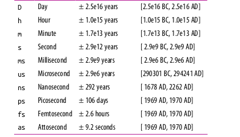

**Dates and times in Pandas**

Pandas builds upon all the tools just discussed to provide a Timestamp object, which
combines the ease of use of `datetime` and `dateutil` with the efficient storage and
vectorized interface of `numpy.datetime64`.

From a group of these Timestamp objects, Pandas can construct a DatetimeIndex that can be used to index data in a Series or DataFrame; we’ll see many examples of this below.

To repeat the example above in pandas,

```
In[9]: import pandas as pd
date = pd.to_datetime("4th of July, 2015")
date
Out[9]: Timestamp('2015-07-04 00:00:00')
```

```
In[10]: date.strftime('%A')
Out[10]: 'Saturday'
```

Additionally, we can do NumPy-style vectorized operations directly on this same object:

```
In[11]: date + pd.to_timedelta(np.arange(12), 'D')

Out[11]: DatetimeIndex(['2015-07-04', '2015-07-05', '2015-07-06', '2015-07-07',
'2015-07-08', '2015-07-09', '2015-07-10', '2015-07-11',
'2015-07-12', '2015-07-13', '2015-07-14', '2015-07-15'],
dtype='datetime64[ns]', freq=None)
```

## Pandas Time Series: Indexing by Time

Where the Pandas time series tools really become useful is when you begin to index
data by timestamps. 

For example, we can construct a Series object that has time-indexed data:

```
In[12]: index = pd.DatetimeIndex(['2014-07-04', '2014-08-04', '2015-07-04', '2015-08-04'])
data = pd.Series([0, 1, 2, 3], index=index)
data
Out[12]: 2014-07-04     0
         2014-08-04     1
         2015-07-04     2
         2015-08-04     3
         dtype: int64
```

Now that we have this data in a Series, we can make use of any of the Series index‐
ing patterns we discussed in previous sections, passing values that can be coerced into
dates:

```
In[13]: data['2014-07-04':'2015-07-04']
Out[13]: 2014-07-04    0
         2014-08-04    1
         2015-07-04    2
         dtype: int64
```

There are additional special date-only indexing operations, such as passing a year to
obtain a slice of all data from that year:

```
In[14]: data['2015']
Out[14]: 2015-07-04     2
         2015-08-04     3
         dtype: int64
```

Later, we will see additional examples of the convenience of dates-as-indices.

## Pandas Time Series Data Structures

• For time stamps, Pandas provides the Timestamp type. As mentioned before, it is
essentially a replacement for Python’s native datetime, but is based on the more
efficient `numpy.datetime64` data type. The associated index structure is
`DatetimeIndex`.

• For time periods, Pandas provides the `Period` type. This encodes a fixed-frequency interval based on numpy.datetime64. 
The associated index structure is `PeriodIndex`.

• For time deltas or durations, Pandas provides the `Timedelta` type. Timedelta is a
more efficient replacement for Python’s native datetime.timedelta type, and is
based on `numpy.timedelta64`. The associated index structure is `TimedeltaIndex`.

The most fundamental of these date/time objects are the Timestamp and DatetimeIn
dex objects. While these class objects can be invoked directly, it is more common to
use the pd.to_datetime() function, which can parse a wide variety of formats.

```
In[15]: dates = pd.to_datetime([datetime(2015, 7, 3), '4th of July, 2015',
'2015-Jul-6', '07-07-2015', '20150708'])
dates

Out[15]: DatetimeIndex(['2015-07-03', '2015-07-04', '2015-07-06', '2015-07-07',
'2015-07-08'], dtype='datetime64[ns]', freq=None)
```

Any DatetimeIndex can be converted to a PeriodIndex with the to_period() function with the addition of a frequency code; here we’ll use 'D' to indicate daily frequency:

```
In[16]: dates.to_period('D')
Out[16]: PeriodIndex(['2015-07-03', '2015-07-04', '2015-07-06', '2015-07-07',
'2015-07-08'],
dtype='int64', freq='D')
```

A TimedeltaIndex is created, for example, when one date is subtracted from another:

```
In[17]: dates - dates[0]
Out[17]: TimedeltaIndex(['0 days', '1 days', '3 days', '4 days', '5 days'],dtype='timedelta64[ns]', freq=None)
```

**Regular sequences: pd.date_range()**

`pd.period_range()` for periods, and `pd.timedelta_range()` for time deltas. We’ve seen that Python’s range() and NumPy’s np.arange() turn a startpoint, endpoint, and optional stepsize
into a sequence. Similarly, pd.date_range() accepts a start date, an end date, and an
optional frequency code to create a regular sequence of dates. By default, the frequency is one day:

```
In[18]: pd.date_range('2015-07-03', '2015-07-10')
Out[18]: DatetimeIndex(['2015-07-03', '2015-07-04', '2015-07-05', '2015-07-06',
'2015-07-07', '2015-07-08', '2015-07-09', '2015-07-10'],
dtype='datetime64[ns]', freq='D')
```

Alternatively, the date range can be specified not with a start- and endpoint, but with
a startpoint and a number of periods:

```
In[19]: pd.date_range('2015-07-03', periods=8)
Out[19]: DatetimeIndex(['2015-07-03', '2015-07-04', '2015-07-05', '2015-07-06',
'2015-07-07', '2015-07-08', '2015-07-09', '2015-07-10'],
dtype='datetime64[ns]', freq='D')
```

You can modify the spacing by altering the freq argument, which defaults to D. For
example, here we will construct a range of hourly timestamps:

```
In[20]: pd.date_range('2015-07-03', periods=8, freq='H')
Out[20]: DatetimeIndex(['2015-07-03 00:00:00', '2015-07-03 01:00:00',
'2015-07-03 02:00:00', '2015-07-03 03:00:00',
'2015-07-03 04:00:00', '2015-07-03 05:00:00',
'2015-07-03 06:00:00', '2015-07-03 07:00:00'],
dtype='datetime64[ns]', freq='H')
```

To create regular sequences of period or time delta values, the very similar
`pd.period_range()` and `pd.timedelta_range()` functions are useful. Here are some
monthly periods:

```
In[21]: pd.period_range('2015-07', periods=8, freq='M')
Out[21]:
PeriodIndex(['2015-07', '2015-08', '2015-09', '2015-10', '2015-11', '2015-12',
'2016-01', '2016-02'],
dtype='int64', freq='M')
```

And a sequence of durations increasing by an hour:

```
In[22]: pd.timedelta_range(0, periods=10, freq='H')
Out[22]:
TimedeltaIndex(['00:00:00', '01:00:00', '02:00:00', '03:00:00', '04:00:00',
'05:00:00', '06:00:00', '07:00:00', '08:00:00', '09:00:00'],
dtype='timedelta64[ns]', freq='H')
```

All of these require an understanding of Pandas frequency codes, which we’ll summarize in the next section.

## Frequencies and Offsets

Fundamental to these Pandas time series tools is the concept of a frequency or date
offset. Just as we saw the D (day) and H (hour) codes previously, we can use such codes
to specify any desired frequency spacing. Table 3-7 summarizes the main codes
available.

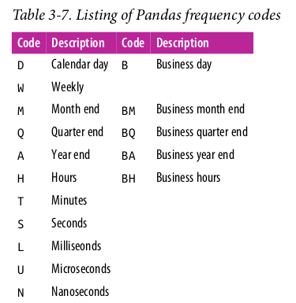

The monthly, quarterly, and annual frequencies are all marked at the end of the specified period. 
Adding an S suffix to any of these marks it instead at the beginning.

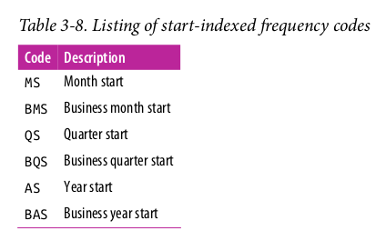

Additionally, you can change the month used to mark any quarterly or annual code
by adding a three-letter month code as a suffix:

• Q-JAN, BQ-FEB, QS-MAR, BQS-APR, etc.
• A-JAN, BA-FEB, AS-MAR, BAS-APR, etc.

In the same way, you can modify the split-point of the weekly frequency by adding a
three-letter weekday code:

• W-SUN, W-MON, W-TUE, W-WED, etc.

On top of this, codes can be combined with numbers to specify other frequencies. For
example, for a frequency of 2 hours 30 minutes, we can combine the hour (H) and minute (T) codes as follows:

```
In[23]: pd.timedelta_range(0, periods=9, freq="2H30T")
Out[23]: TimedeltaIndex(['00:00:00', '02:30:00', '05:00:00', '07:30:00', '10:00:00',
'12:30:00', '15:00:00', '17:30:00', '20:00:00'], dtype='timedelta64[ns]', freq='150T')
```

All of these short codes refer to specific instances of Pandas time series offsets, which
can be found in the pd.tseries.offsets module. For example, we can create a busi‐
ness day offset directly as follows:

```
In[24]: from pandas.tseries.offsets import BDay
pd.date_range('2015-07-01', periods=5, freq=BDay())
Out[24]: DatetimeIndex(['2015-07-01', '2015-07-02', '2015-07-03', '2015-07-06',
'2015-07-07'],
dtype='datetime64[ns]', freq='B')
```

## Resampling, Shifting, and Windowing

Pandas time series tools is an importance piece of organizing and accessing data.

**pandas-datareader package and FRED Data**

For example, the accompanying pandas-datareader package (installable via `conda install pandas-datareader`) knows how to import
financial data from a number of available sources, including Yahoo finance, Google Finance, and others. Here we will load Google’s closing price history:

```
In[25]: from pandas_datareader import data
goog = data.DataReader('GOOG', start='2004', end='2016', data_source='yahoo')
goog.head()

Out[25]:
           Open  High Low Close Volume
Date
2004-08-19 49.96 51.98 47.93 50.12 NaN

2004-08-20 50.69 54.49 50.20 54.10 NaN

2004-08-23 55.32 56.68 54.47 54.65 NaN

2004-08-24 55.56 55.74 51.73 52.38 NaN

2004-08-25 52.43 53.95 51.89 52.95 NaN
```

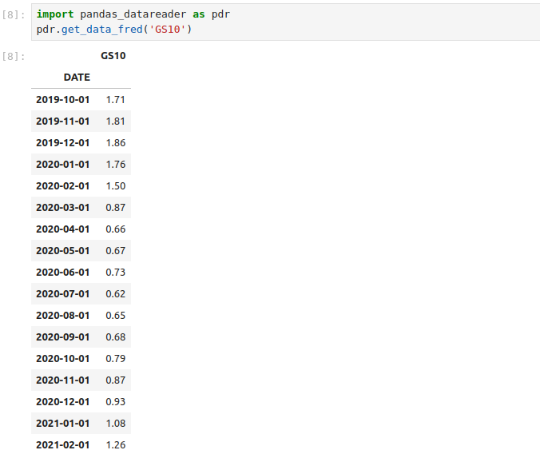

Imports data from a number of online sources.

```
    Currently supports Google Finance, St. Louis FED (FRED),
    and Kenneth French's data library, among others.

    Parameters
    ----------
    name : str or list of strs
        the name of the dataset. Some data sources (IEX, fred) will
        accept a list of names.
    data_source: {str, None}
        the data source ("iex", "fred", "ff")
    start : string, int, date, datetime, Timestamp
        left boundary for range (defaults to 1/1/2010)
    end : string, int, date, datetime, Timestamp
        right boundary for range (defaults to today)
    retry_count : {int, 3}
        Number of times to retry query request.
    pause : {numeric, 0.001}
        Time, in seconds, to pause between consecutive queries of chunks. If
        single value given for symbol, represents the pause between retries.
    session : Session, default None
        requests.sessions.Session instance to be used
    api_key : (str, None)
        Optional parameter to specify an API key for certain data sources.

    Examples
    ----------
    # Data from Google Finance
    aapl = DataReader("AAPL", "iex")

    # Price and volume data from IEX
    tops = DataReader(["GS", "AAPL"], "iex-tops")
    # Top of book executions from IEX
    gs = DataReader("GS", "iex-last")
    # Real-time depth of book data from IEX
    gs = DataReader("GS", "iex-book")

    # Data from FRED
    vix = DataReader("VIXCLS", "fred")

    # Data from Fama/French
    ff = DataReader("F-F_Research_Data_Factors", "famafrench")
    ff = DataReader("F-F_Research_Data_Factors_weekly", "famafrench")
    ff = DataReader("6_Portfolios_2x3", "famafrench")
    ff = DataReader("F-F_ST_Reversal_Factor", "famafrench")
```

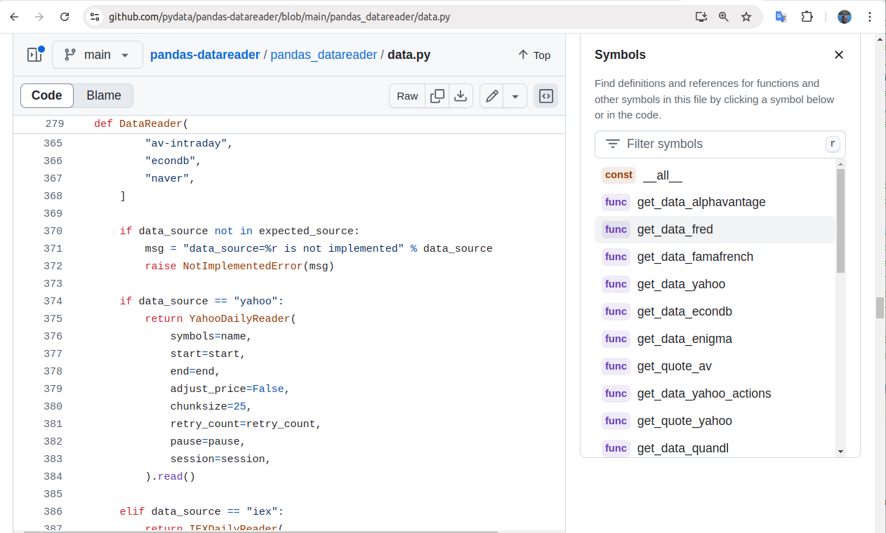

A lot of the data needs API for some reason, but we will stick to the FRED data,


> hint: VIX in finance means the COBE VIX, it is a panic index.

**Morningstar_data package**

skipped

**Yahoo Fin**

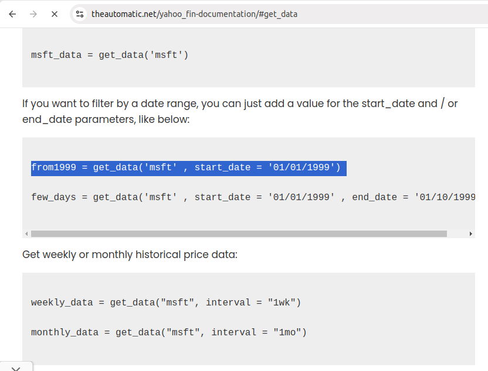

Try it in your notebook,

 

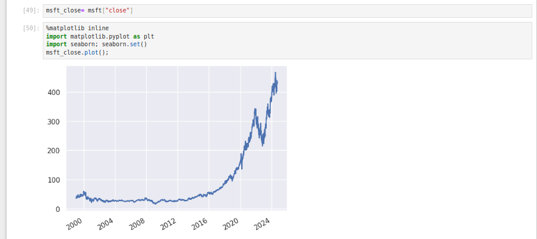

### Resampling and converting frequencies

One common need for time series data is resampling at a higher or lower frequency.
You can do this using the `resample()` method, or the much simpler `asfreq()` method.

Notice the difference: at each point, resample reports the average of the previous year,
while asfreq reports the value at the end of the year.

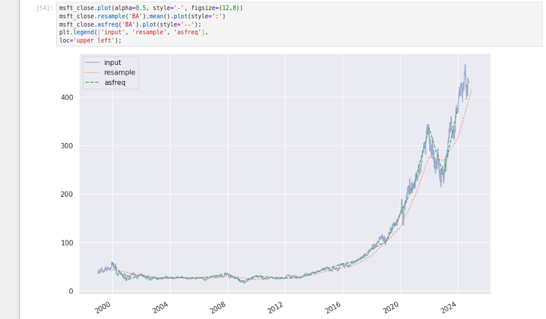

For up-sampling, resample() and asfreq() are largely equivalent, though resample
has many more options available. In this case, the default for both methods is to leave
the up-sampled points empty—that is, filled with NA values. Just as with the
pd.fillna() function discussed previously, asfreq() accepts a method argument to
specify how values are imputed. Here, we will resample the business day data at a
daily frequency (i.e., including weekends);

The top panel is the default: non-business days are left as NA values and do not
appear on the plot. The bottom panel shows the differences between two strategies
for filling the gaps: forward-filling and backward-filling.

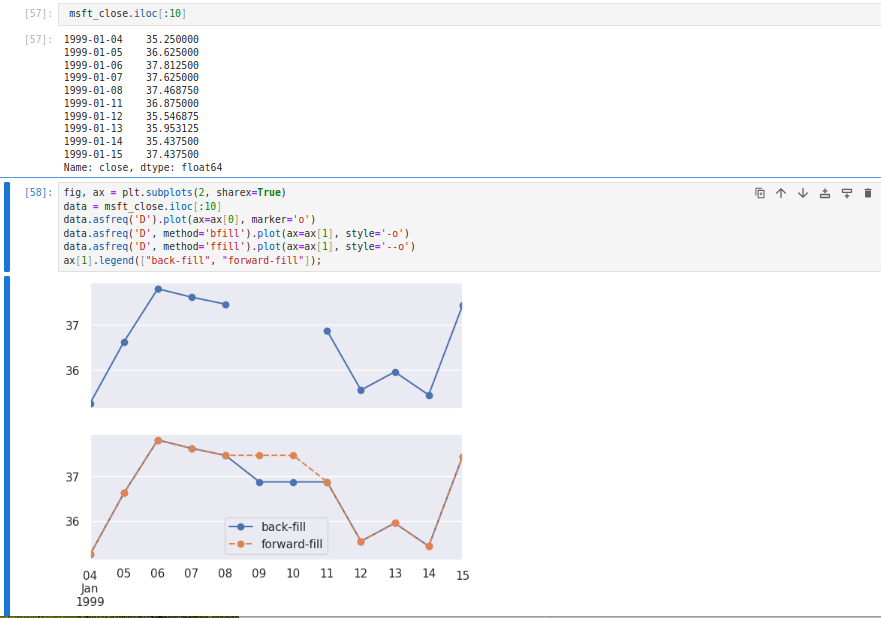

### Time-shifts

Another common time series–specific operation is shifting of data in time. Pandas
has two closely related methods for computing this: `shift()`. In short,
the difference between them is that shift() shifts the data.

```
fig, ax = plt.subplots(2, sharey=True)
# apply a frequency to the data
msft = msft_close.asfreq('D', method='pad')
msft.plot(ax=ax[0])
msft.shift(900).plot(ax=ax[1])

# legends and annotations
local_max = pd.to_datetime('2007-11-05')
offset = pd.Timedelta(900, 'D')
ax[0].legend(['input'], loc=2)
ax[0].get_xticklabels()[4].set(weight='heavy', color='red')
ax[0].axvline(local_max, alpha=0.3, color='red')

ax[1].legend(['shift(900)'], loc=2)
ax[1].get_xticklabels()[4].set(weight='heavy', color='red')
ax[1].axvline(local_max + offset, alpha=0.3, color='red'
```


We see here that shift(900) shifts the data by 900 days, pushing some of it off the end of the graph (and leaving NA values at the other end).
A common context for this type of shift is computing differences over time. 
For example, we use shifted values to compute the one-year return on investment for Microsoft stock over the course of the dataset.

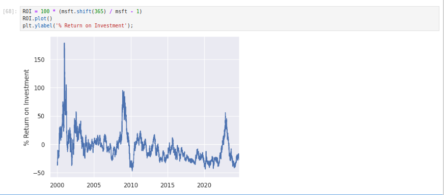

This helps us to see the overall trend in Google stock: thus far, the most profitable
times to invest in Google have been (unsurprisingly, in retrospect) shortly after its
IPO, and in the middle of the 2009 recession.

**Rolling windows**

For example, here is the one-year centered rolling mean and standard deviation of the
Microsoft stock prices.

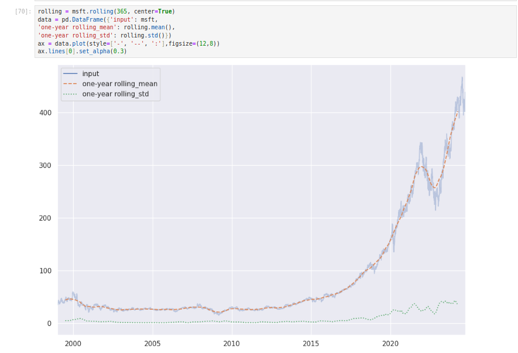

As with `groupby` operations, the `aggregate()` and `apply()` methods can be used for
custom rolling computations.

### ref

- https://pandas-datareader.readthedocs.io/en/latest/
- https://github.com/pydata/pandas-datareader/blob/main/pandas_datareader/data.py
- https://research.stlouisfed.org/docs/api/

* /category
* /category/children
* /category/series

- https://fred.stlouisfed.org/tags/series
- https://fred.stlouisfed.org/categories
- https://www.morningstar.com/business/brands/data-analytics/products/direct/features/python-package?utm_source=google&utm_medium=cpc&utm_campaign=MORND%3AG%3AS%3ANB%3AAnalyticsLab%3APython%3AUS%20Python%3APandas&utm_content=engine%3Agoogle%7Ccampaignid%3A21144444361%7Cadid%3A695000595243&utm_term=pandas%20stock%20data&gad_source=1&gclid=Cj0KCQjwr9m3BhDHARIsANut04Y4oF1pw10Dx_GtsGNvG2bX-XGBoLxekZWFxHAE6lbn7Ljd7ewHNxEaAmUGEALw_wcB


