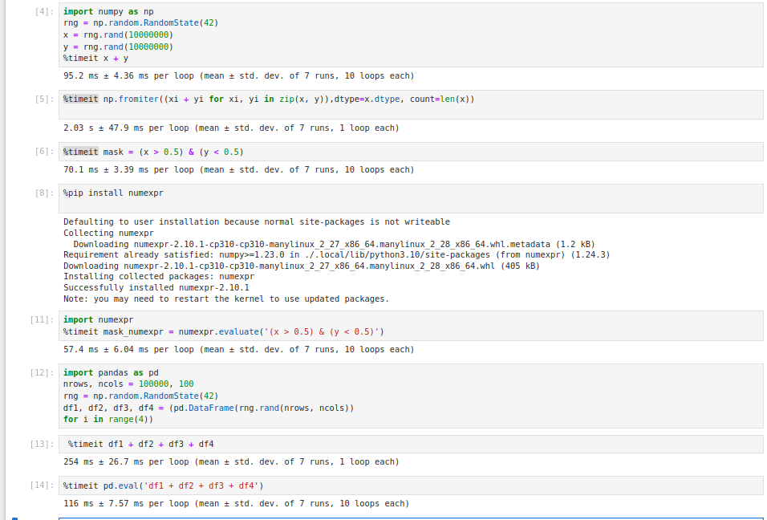
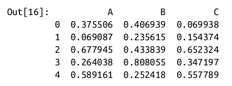
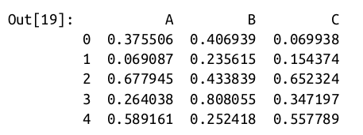

# High-Performance Pandas

## Outline

* PyData Stack
* Numexpr package
* eval()
* query()

The power of the `PyData` stack is built upon the ability of NumPy and Pandas to push basic operations into C via an intuitive syntax: examples are vectorized/broadcasted operations in NumPy, and
grouping-type operations in Pandas.

While these abstractions are efficient and effective for many common use cases, they often rely on the creation of temporary inter‐
mediate objects, which can cause `undue overhead` in computational time and
memory use.

These are the eval() and query() functions, which rely on the
Numexpr package which allows you to directly access C-speed operations without costly allocation of inter‐
mediate arrays.

## Motivating query() and eval(): Compound Expressions

Please do the following in the class as a lab,

```
import numpy as np
rng = np.random.RandomState(42)
x = rng.rand(1E6)
y = rng.rand(1E6)
%timeit x + y
```

This is much faster than doing the addition via a Python loop or comprehension:

```
%timeit np.fromiter((xi + yi for xi, yi in zip(x, y)),dtype=x.dtype, count=len(x))
1 loop, best of 3: 266 ms per loop
```

But this abstraction can become less efficient when you are computing compound
expressions. For example, consider the following expression:

```In[3]: mask = (x > 0.5) & (y < 0.5)```

Because NumPy evaluates each subexpression, this is roughly equivalent to the
following:

```
In[4]: tmp1 = (x > 0.5)
tmp2 = (y < 0.5)
mask = tmp1 & tmp2
```

In other words, every intermediate step is explicitly allocated in memory. If the x and y
arrays are very large, this can lead to significant memory and computational over‐
head. The Numexpr library gives you the ability to compute this type of compound
expression element by element, without the need to allocate full intermediate arrays.
The Numexpr documentation has more details, but for the time being it is sufficient
to say that the library accepts a string giving the NumPy-style expression you’d like to
compute:

```
In[5]: import numexpr
mask_numexpr = numexpr.evaluate('(x > 0.5) & (y < 0.5)')
np.allclose(mask, mask_numexpr)
Out[5]: True
```

The benefit here is that Numexpr evaluates the expression in a way that does not use
full-sized temporary arrays, and thus can be much more efficient than NumPy, especially for large arrays. The Pandas eval() and query() tools that we will discuss here
are conceptually similar, and depend on the Numexpr package.

## pandas.eval() for Efficient Operations

The eval() function in Pandas uses string expressions to efficiently compute opera‐
tions using DataFrames. For example, consider the following DataFrames:

```
In[6]: import pandas as pd
nrows, ncols = 100000, 100
rng = np.random.RandomState(42)
df1, df2, df3, df4 = (pd.DataFrame(rng.rand(nrows, ncols))
for i in range(4))
```

To compute the sum of all four DataFrames using the typical Pandas approach, we can
just write the sum:

```
In[7]: %timeit df1 + df2 + df3 + df4
10 loops, best of 3: 87.1 ms per loop
```

We can compute the same result via pd.eval by constructing the expression as a
string:

```
In[8]: %timeit pd.eval('df1 + df2 + df3 + df4')
10 loops, best of 3: 42.2 ms per loop
```

The eval() version of this expression is about 50% faster (and uses much less mem‐
ory), while giving the same result:

```
In[9]: np.allclose(df1 + df2 + df3 + df4,
pd.eval('df1 + df2 + df3 + df4'))
Out[9]: True
```

See the following image,



**Operations supported by pd.eval()**

As of Pandas v0.16, pd.eval() supports a wide range of operations. To demonstrate
these, we’ll use the following integer DataFrames:

```
In[10]: df1, df2, df3, df4, df5 = (pd.DataFrame(rng.randint(0, 1000, (100, 3)))
for i in range(5))
```

Arithmetic operators. pd.eval() supports all arithmetic operators. For example:

```
In[11]: result1 = -df1 * df2 / (df3 + df4) - df5
result2 = pd.eval('-df1 * df2 / (df3 + df4) - df5')
np.allclose(result1, result2)
Out[11]: True
```

**Comparison operators**

pd.eval() supports all comparison operators, including chained expressions:

```
In[12]: result1 = (df1 < df2) & (df2 <= df3) & (df3 != df4)
result2 = pd.eval('df1 < df2 <= df3 != df4')
np.allclose(result1, result2)
Out[12]: True
```

Bitwise operators. pd.eval() supports the & and | bitwise operators:

```
In[13]: result1 = (df1 < 0.5) & (df2 < 0.5) | (df3 < df4)
result2 = pd.eval('(df1 < 0.5) & (df2 < 0.5) | (df3 < df4)')
np.allclose(result1, result2)
Out[13]: True
```

In addition, it supports the use of the literal and and or in Boolean expressions:

```
In[14]: result3 = pd.eval('(df1 < 0.5) and (df2 < 0.5) or (df3 < df4)')
np.allclose(result1, result3)
Out[14]: True
```

Object attributes and indices. pd.eval() supports access to object attributes via the
obj.attr syntax, and indexes via the obj[index] syntax:

```
In[15]: result1 = df2.T[0] + df3.iloc[1]
result2 = pd.eval('df2.T[0] + df3.iloc[1]')
np.allclose(result1, result2)
Out[15]: True
```

Other operations. Other operations, such as function calls, conditional statements,
loops, and other more involved constructs, are currently not implemented in
pd.eval(). If you’d like to execute these more complicated types of expressions, you
can use the Numexpr library itself.

### DataFrame.eval() for Column-Wise Operations
Just as Pandas has a top-level pd.eval() function, DataFrames have an eval()
method that works in similar ways. The benefit of the eval() method is that columns
can be referred to by name. We’ll use this labeled array as an example:

```
In[16]: df = pd.DataFrame(rng.rand(1000, 3), columns=['A', 'B', 'C'])
df.head()
```



Using pd.eval() as above, we can compute expressions with the three columns like
this:

```
In[17]: result1 = (df['A'] + df['B']) / (df['C'] - 1)
result2 = pd.eval("(df.A + df.B) / (df.C - 1)")
np.allclose(result1, result2)
Out[17]: True
```

The DataFrame.eval() method allows much more succinct evaluation of expressions
with the columns:

```
In[18]: result3 = df.eval('(A + B) / (C - 1)')
np.allclose(result1, result3)
Out[18]: True
```

Notice here that we treat column names as variables within the evaluated expression,
and the result is what we would wish.

### Assignment in DataFrame.eval()

In addition to the options just discussed, DataFrame.eval() also allows assignment
to any column. Let’s use the DataFrame from before, which has columns 'A', 'B', and
'C':

`In[19]: df.head()`


We can use df.eval() to create a new column 'D' and assign to it a value computed
from the other columns:

```
In[20]: df.eval('D = (A + B) / C', inplace=True)
df.head()
```


In the same way, any existing column can be modified:

```
In[21]: df.eval('D = (A - B) / C', inplace=True)
df.head()
```


### Local variables in DataFrame.eval()

The DataFrame.eval() method supports an additional syntax that lets it work with
local Python variables. Consider the following:

```
In[22]: column_mean = df.mean(1)
result1 = df['A'] + column_mean
result2 = df.eval('A + @column_mean')
np.allclose(result1, result2)
Out[22]: True
```

The @ character here marks a variable name rather than a column name, and lets you
efficiently evaluate expressions involving the two “namespaces”: the namespace of
columns, and the namespace of Python objects. Notice that this @ character is only
supported by the DataFrame.eval() method, not by the pandas.eval() function,
because the pandas.eval() function only has access to the one (Python) namespace.

### DataFrame.query() Method

The DataFrame has another method based on evaluated strings, called the query()
method. Consider the following:

```
In[23]: result1 = df[(df.A < 0.5) & (df.B < 0.5)]
result2 = pd.eval('df[(df.A < 0.5) & (df.B < 0.5)]')
np.allclose(result1, result2)
Out[23]: True
```

As with the example used in our discussion of DataFrame.eval(), this is an expression involving columns of the DataFrame. It cannot be expressed using the Data
Frame.eval() syntax, however! Instead, for this type of filtering operation, you can
use the query() method:

```
In[24]: result2 = df.query('A < 0.5 and B < 0.5')
np.allclose(result1, result2)
Out[24]: True
```

In addition to being a more efficient computation, compared to the masking expression this is much easier to read and understand. Note that the query() method also
accepts the @ flag to mark local variables:

```
In[25]: Cmean = df['C'].mean()
result1 = df[(df.A < Cmean) & (df.B < Cmean)]
result2 = df.query('A < @Cmean and B < @Cmean')
np.allclose(result1, result2)
Out[25]: True
```

### Performance: When to Use These Functions

When considering whether to use these functions, there are two considerations: computation time and memory use. Memory use is the most predictable aspect. As already
mentioned, every compound expression involving NumPy arrays or Pandas Data
Frames will result in implicit creation of temporary arrays: For example, this:

```
In[26]: x = df[(df.A < 0.5) & (df.B < 0.5)]
```

is roughly equivalent to this:

```
In[27]: tmp1 = df.A < 0.5
tmp2 = df.B < 0.5
tmp3 = tmp1 & tmp2
x = df[tmp3]
```

If the size of the temporary DataFrames is significant compared to your available sys‐
tem memory (typically several gigabytes), then it’s a good idea to use an eval() or
query() expression. You can check the approximate size of your array in bytes using
this:

```
In[28]: df.values.nbytes
Out[28]: 32000
```

On the performance side, eval() can be faster even when you are not maxing out
your system memory. The issue is how your temporary DataFrames compare to the
size of the L1 or L2 CPU cache on your system (typically a few megabytes in 2016); if
they are much bigger, then eval() can avoid some potentially slow movement of val‐
ues between the different memory caches. In practice, I find that the difference in
computation time between the traditional methods and the eval/query method is
usually not significant—if anything, the traditional method is faster for smaller
arrays! The benefit of eval/query is mainly in the saved memory, and the sometimes
cleaner syntax they offer.

We’ve covered most of the details of eval() and query() here; for more information
on these, you can refer to the Pandas documentation. In particular, different parsers
and engines can be specified for running these queries; for details on this, see the dis‐
cussion within the “Enhancing Performance” section.