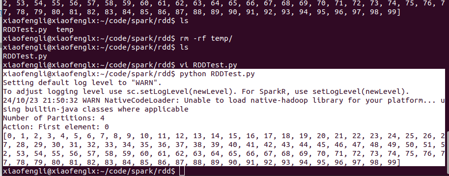
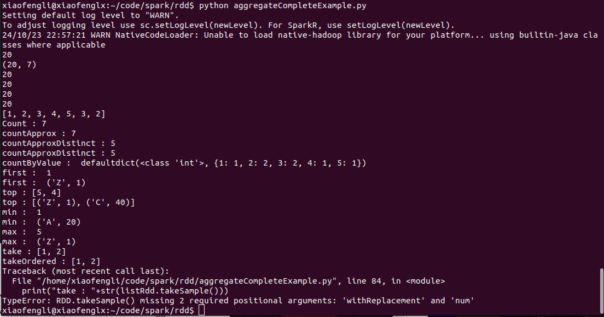
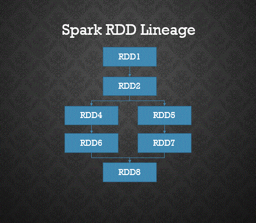
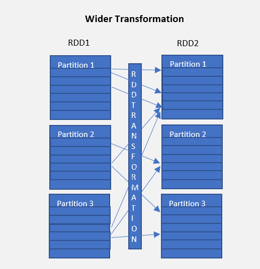
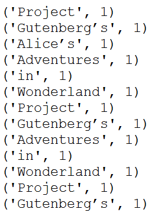
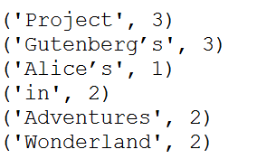
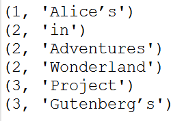

# RDD Programming Guide (Resilient Distributed Dataset)

Resilient Distributed Datasets (RDD) is a fundamental data structure of PySpark.
It is an immutable-distributed collection of objects. Each dataset in RDD is divided into logical partitions, which may be computed on different nodes of the cluster.


## RDD Creation

**Example 1**

Create a file called "RDDTest.py",


Paste the content in,

```python
from pyspark import SparkContext, SparkConf
import numpy as np
 
 conf = SparkConf().setAppName("appName")
 #.setMaster(master)
 sc = SparkContext(conf=conf)
 data = np.arange(100)
 rdd = sc.parallelize(data)
 rdd.reduce(lambda a, b: a + b)
 dataCollect = rdd.collect()
  
 print("Number of Partitions: "+str(rdd.getNumPartitions()))
 print("Action: First element: "+str(rdd.first()))
 print(dataCollect)
```

It should look like the following,


Run the code,


***Explanation:***

* We created SparkConf and then SparkContext.
* PySpark shell provides SparkContext variable "sc", use sc.parallelize() to create an RDD.

**Example 2**

Since PySpark 2.0, First, you need to create a `SparkSession` which internally creates a `SparkContext` for you.

**`source_code`**

```python
import pyspark
from pyspark.sql import SparkSession
import numpy as np
 
spark = SparkSession.builder.appName('SparkBySession').getOrCreate()
sc=spark.sparkContext
data = np.arange(100)
rdd = sc.parallelize(data)
rdd.reduce(lambda a, b: a + b)
dataCollect = rdd.collect()
 
print("Number of Partitions: " + str(rdd.getNumPartitions()))
print("Action: First element: " + str(rdd.first()))
print(dataCollect)
```



**create empty RDD by using sparkContext.parallelize**

```shell
emptyRDD = sparkContext.emptyRDD()
emptyRDD2 = rdd=sparkContext.parallelize([])
print("is Empty RDD : "+str(emptyRDD2.isEmpty()))
```

## aggregate – action

Aggregate the elements of each partition, and then the results for all the partitions, using a given combine functions “combOp” and a neutral “zero value.”

The first function (seqOp) can return a different result type, U, than the type of this RDD. Thus, we need one operation for merging a T into an U and one operation for merging two U

`syntax: aggregate(zeroValue, seqOp, combOp)`

**Example 1**

**Source**

`aggregateExample1.py`

```python

import pyspark
from pyspark.sql import SparkSession

spark = SparkSession.builder.appName('SparkBySession').getOrCreate()
listRdd = spark.sparkContext.parallelize([1,2,3,4,5,3,2])

#aggregate
seqOp = (lambda x, y: x + y)
combOp = (lambda x, y: x + y)
agg=listRdd.aggregate(0, seqOp, combOp)
print(agg) # output 20
```

Run the code,


**Example 2**

```python
import pyspark
from pyspark.sql import SparkSession
 
spark = SparkSession.builder.appName('SparkBySession').getOrCreate()
listRdd = spark.sparkContext.parallelize([1,2,3,4,5,3,2])
 
#aggregate 2
seqOp2 = (lambda x, y: (x[0] + y, x[1] + 1))
combOp2 = (lambda x, y: (x[0] + y[0], x[1] + y[1]))
agg2=listRdd.aggregate((0, 0), seqOp2, combOp2)
print(agg2) # output (20,7)
```

Run the code,


## treeAggregate – action

treeAggregate() – Aggregates the elements of this RDD in a multi-level tree pattern. The output of this function will be similar to the aggregate function.

`Syntax: treeAggregate(zeroValue, seqOp, combOp, depth=2)`

## fold – action
fold() – Aggregate the elements of each partition, and then the results for all the partitions.

```python
#fold
from operator import add
foldRes=listRdd.fold(0, add)
print(foldRes)
```

## reduce

`reduce()` – Reduces the elements of the dataset using the specified binary operator.

```python
#reduce
redRes=listRdd.reduce(add)
print(redRes) # output 20
```

## treeReduce

`treeReduce()` – Reduces the elements of this RDD in a multi-level tree pattern.

```python

#treeReduce. This is similar to reduce
add = lambda x, y: x + y
redRes=listRdd.treeReduce(add)
print(redRes) # output 20
```

## collect

`collect()` -Return the complete dataset as an Array.

```python
#Collect
data = listRdd.collect()
print(data)
```

## count, countApprox, countApproxDistinct

`count()` – Return the count of elements in the dataset.

`countApprox()` – Return approximate count of elements in the dataset, this method returns incomplete when execution time meets timeout.

`countApproxDistinct()` – Return an approximate number of distinct elements in the dataset.

```python
#count, countApprox, countApproxDistinct
print("Count : "+str(listRdd.count()))
#Output: Count : 20
print("countApprox : "+str(listRdd.countApprox(1200)))
#Output: countApprox : (final: [7.000, 7.000])
print("countApproxDistinct : "+str(listRdd.countApproxDistinct()))
#Output: countApproxDistinct : 5
print("countApproxDistinct : "+str(inputRDD.countApproxDistinct()))
#Output: countApproxDistinct : 5
```

## countByValue

`countByValue()` – Return Map[T,Long] key representing each unique value in dataset and value represents count each value present.

```python
#countByValue, countByValueApprox
print("countByValue :  "+str(listRdd.countByValue()))
```

## first
`first()` – Return the first element in the dataset.

```python
#first
print("first :  "+str(listRdd.first()))
#Output: first :  1
print("first :  "+str(inputRDD.first()))
#Output: first :  (Z,1)
```

## top

`top()` – Return top n elements from the dataset.

Note: Use this method only when the resulting array is small, as all the data is loaded into the driver’s memory.

```python

#top
print("top : "+str(listRdd.top(2)))
#Output: take : 5,4
print("top : "+str(inputRDD.top(2)))
#Output: take : (Z,1),(C,40)
```


## min
`min()` – Return the minimum value from the dataset.

```python

#min
print("min :  "+str(listRdd.min()))
#Output: min :  1
print("min :  "+str(inputRDD.min()))
#Output: min :  (A,20)  
```

## max

`max()` – Return the maximum value from the dataset.

```python
#max
print("max :  "+str(listRdd.max()))
#Output: max :  5
print("max :  "+str(inputRDD.max()))
#Output: max :  (Z,1)
```

## take, takeOrdered, takeSample
`take()` – Return the first num elements of the dataset.

`takeOrdered()` – Return the first num (smallest) elements from the dataset and this is the opposite of the take() action.
Note: Use this method only when the resulting array is small, as all the data is loaded into the driver’s memory.

`takeSample()` – Return the subset of the dataset in an Array.
Note: Use this method only when the resulting array is small, as all the data is loaded into the driver’s memory.

```python
#take, takeOrdered, takeSample
print("take : "+str(listRdd.take(2)))
#Output: take : 1,2
print("takeOrdered : "+ str(listRdd.takeOrdered(2)))
#Output: takeOrdered : 1,2
print("take : "+str(listRdd.takeSample()))
```

## Example 3  A complete example

```python
from pyspark.sql import SparkSession
spark = SparkSession.builder.appName('SparkByExamples.com').getOrCreate()
data=[("Z", 1),("A", 20),("B", 30),("C", 40),("B", 30),("B", 60)]
inputRDD = spark.sparkContext.parallelize(data)
  
listRdd = spark.sparkContext.parallelize([1,2,3,4,5,3,2])

#aggregate
seqOp = (lambda x, y: x + y)
combOp = (lambda x, y: x + y)
agg=listRdd.aggregate(0, seqOp, combOp)
print(agg) # output 20

#aggregate 2
seqOp2 = (lambda x, y: (x[0] + y, x[1] + 1))
combOp2 = (lambda x, y: (x[0] + y[0], x[1] + y[1]))
agg2=listRdd.aggregate((0, 0), seqOp2, combOp2)
print(agg2) # output (20,7)

agg2=listRdd.treeAggregate(0,seqOp, combOp)
print(agg2) # output 20

#fold
from operator import add
foldRes=listRdd.fold(0, add)
print(foldRes) # output 20

#reduce
redRes=listRdd.reduce(add)
print(redRes) # output 20

#treeReduce. This is similar to reduce
add = lambda x, y: x + y
redRes=listRdd.treeReduce(add)
print(redRes) # output 20

#Collect
data = listRdd.collect()
print(data)

#count, countApprox, countApproxDistinct
print("Count : "+str(listRdd.count()))
#Output: Count : 20
print("countApprox : "+str(listRdd.countApprox(1200)))
#Output: countApprox : (final: [7.000, 7.000])
print("countApproxDistinct : "+str(listRdd.countApproxDistinct()))
#Output: countApproxDistinct : 5
print("countApproxDistinct : "+str(inputRDD.countApproxDistinct()))
#Output: countApproxDistinct : 5

#countByValue, countByValueApprox
print("countByValue :  "+str(listRdd.countByValue()))


#first
print("first :  "+str(listRdd.first()))
#Output: first :  1
print("first :  "+str(inputRDD.first()))
#Output: first :  (Z,1)

#top
print("top : "+str(listRdd.top(2)))
#Output: take : 5,4
print("top : "+str(inputRDD.top(2)))
#Output: take : (Z,1),(C,40)

#min
print("min :  "+str(listRdd.min()))
#Output: min :  1
print("min :  "+str(inputRDD.min()))
#Output: min :  (A,20)  

#max
print("max :  "+str(listRdd.max()))
#Output: max :  5
print("max :  "+str(inputRDD.max()))
#Output: max :  (Z,1)

#take, takeOrdered, takeSample
print("take : "+str(listRdd.take(2)))
#Output: take : 1,2
print("takeOrdered : "+ str(listRdd.takeOrdered(2)))
#Output: takeOrdered : 1,2
print("take : "+str(listRdd.takeSample()))

```




## RDD Transformation and Lineage

PySpark RDD Transformations are lazy evaluation and is used to transform/update from one RDD into another.
When executed on RDD, it results in a single or multiple new RDD.

Since RDD are immutable in nature, transformations always create a new RDD without updating an existing one hence,
a chain of RDD transformations creates an RDD lineage.



RDD Lineage is also known as the RDD operator graph or RDD dependency graph.

In this tutorial, you will learn lazy transformations, types of transformations, a complete list of transformation functions using wordcount example.

### RDD Transformations are Lazy

RDD Transformations are lazy operations meaning none of the transformations get executed until you call an action on PySpark RDD.
Since RDD’s are immutable, any transformations on it result in a new RDD leaving the current one unchanged.

### RDD Transformation Types

There are two types of transformations.

#### Narrow Transformation

Narrow transformations are the result of map() and filter() functions and these compute data that live on a single partition meaning there will not be any data movement between partitions to execute narrow transformations.

Functions such as `map()`, `mapPartition()`, `flatMap()`, `filter()`, `union()` are some examples of narrow transformation.


#### Wider Transformation

Functions such as `groupByKey()`, `aggregateByKey()`, `aggregate()`, `join()`, `repartition()` are some examples of a wider transformations.

Wider transformations are the result of groupByKey() and reduceByKey() functions and these compute data that live on many
partitions meaning there will be data movements between partitions to execute wider transformations.

Since these shuffles the data, they also called shuffle transformations.



## PySpark RDD Transformations Examples

### Create RDD

```python
from pyspark.sql import SparkSession
spark = SparkSession.builder.appName('SparkByExamples.com').getOrCreate()
rdd = spark.sparkContext.textFile("/apps/sparkbyexamples/src/pyspark-examples/data.txt")
```

Let us replace the above data.txt file with the following contents.

```shell
Project Gutenberg’s Alice’s Adventures in Wonderland Project Gutenberg’s Adventures in Wonderland Project Gutenberg’s
```

printing RDD after collect results in.

### flatMap() Transformation

flatMap() transformation flattens the RDD after applying the function and returns a new RDD. In other words, The flatMap() transformation is similar to the map() transformation but with one key difference: it allows each input element to map to zero or more output elements.

```python
# Using flatMap()
rdd2=rdd.flatMap(lambda x: x.split(" "))
```

Yields below output. In the above example, it splits the element by space and flattens the data.

```shell
# Output:
Project
Gutenberg’s
Alice’s
Adventures
in
Wonderland
Project
Gutenberg’s
Adventures
in
Wonderland
Project
Gutenberg’s
```

### map() Transformation
map() transformation is used the apply any complex operations by applying a function to each element.

In our word count example, we are adding a new column with value 1 for each word, the result of the RDD is PairRDDFunctions which contains key-value pairs, word of type String as Key and 1 of type Int as value.

```python
rdd3=rdd2.map(lambda x: (x,1))
```

Collecting and Printing rdd3 yields below output.



## reduceByKey() Transformation

reduceByKey() merges the values for each key with the function specified. 
In our example, it reduces the word string by applying the sum function on value. 
The result of our RDD contains unique words and their count.

```python
# reduceByKey()
rdd4=rdd3.reduceByKey(lambda a,b: a+b)
```

Collecting and Printing rdd4 yields below output.



## sortByKey() Transformation
sortByKey() transformation is used to sort RDD elements on key. In our example, first, we convert RDD[(String,Int]) to RDD[(Int,String]) using map transformation and later apply sortByKey which ideally does sort on an integer value. And finally, foreach with println statement prints all words in RDD and their count as key-value pair to console.

```python
# sortByKey()
rdd5 = rdd4.map(lambda x: (x[1],x[0])).sortByKey()
```

Collecting and Printing rdd5 yields below output. Note the columns order has changed.



## filter() Transformation
filter() transformation is used to filter the records in an RDD. In our example we are filtering all words starts with “a”.

```python
# filter()
rdd6 = rdd5.filter(lambda x : 'a' in x[1])
```

This above statement yields “(2, 'Wonderland')” that has a value ‘a’.

## Ref

- https://spark.apache.org/docs/latest/rdd-programming-guide.html

- https://sparkbyexamples.com/pyspark/pyspark-parallelize-create-rdd/

- https://sparkbyexamples.com/pyspark/pyspark-rdd-transformations/
- 
- https://sparkbyexamples.com/pyspark/pyspark-rdd-actions/