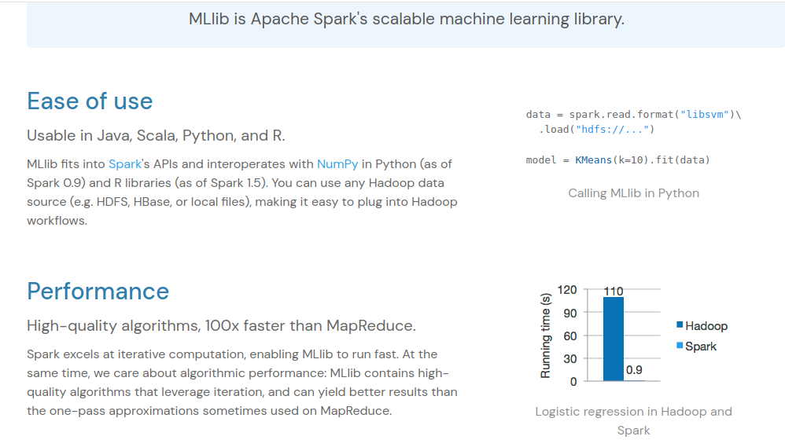
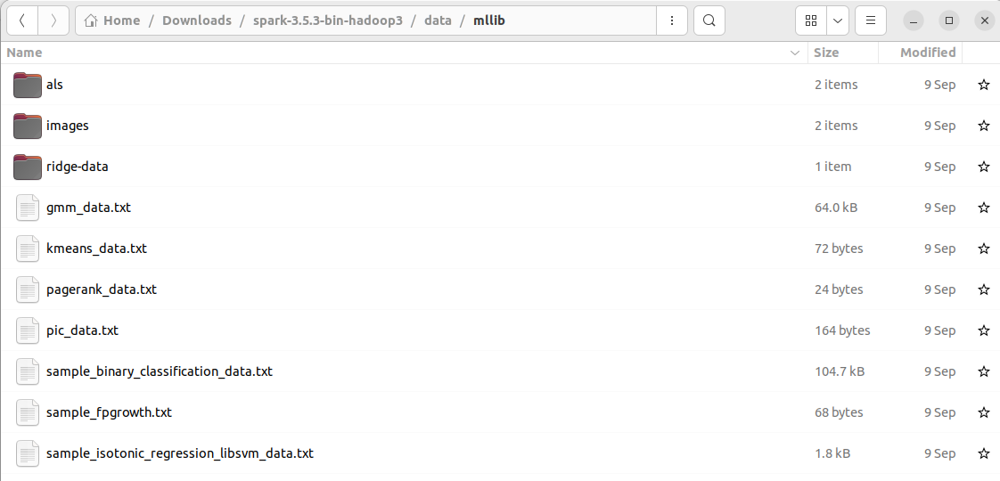

# Spark ML

Machine Learning Library (MLlib) Guide

MLlib is Spark’s machine learning (ML) library. Its goal is to make practical machine learning scalable and easy. At a high level, it provides tools such as:

* ML Algorithms: common learning algorithms such as classification, regression, clustering, and collaborative filtering
* Featurization: feature extraction, transformation, dimensionality reduction, and selection
* Pipelines: tools for constructing, evaluating, and tuning ML Pipelines
* Persistence: saving and load algorithms, models, and Pipelines
* Utilities: linear algebra, statistics, data handling, etc.



**Algorithms**

MLlib contains many algorithms and utilities.

**ML algorithms include:**

* Classification: logistic regression, naive Bayes,...
* Regression: generalized linear regression, survival regression,...
* Decision trees, random forests, and gradient-boosted trees
* Recommendation: alternating least squares (ALS)
* Clustering: K-means, Gaussian mixtures (GMMs),...
* Topic modeling: latent Dirichlet allocation (LDA)
* Frequent itemsets, association rules, and sequential pattern mining

**ML workflow utilities include:**

* Feature transformations: standardization, normalization, hashing,...
* ML Pipeline construction
* Model evaluation and hyper-parameter tuning
* ML persistence: saving and loading models and Pipelines

**Other utilities include:**

* Distributed linear algebra: SVD, PCA,...
* Statistics: summary statistics, hypothesis testing,...

## What are the implications?

MLlib will still support the RDD-based API in spark.mllib with bug fixes.

MLlib will not add new features to the RDD-based API.

In the Spark 2.x releases, MLlib will add features to the DataFrames-based API to reach feature parity with the RDD-based API.

## Why is MLlib switching to the DataFrame-based API?

DataFrames provide a more user-friendly API than RDDs. The many benefits of DataFrames include Spark Datasources, SQL/DataFrame queries, Tungsten and Catalyst optimizations, and uniform APIs across languages.

The DataFrame-based API for MLlib provides a uniform API across ML algorithms and across multiple languages.
DataFrames facilitate practical ML Pipelines, particularly feature transformations. See the Pipelines guide for details.

## What is “Spark ML”?

“Spark ML” is not an official name but occasionally used to refer to the MLlib DataFrame-based API. This is majorly due to the org.apache.spark.ml Scala package name used by the DataFrame-based API, and the “Spark ML Pipelines” term we used initially to emphasize the pipeline concept.

## Is MLlib deprecated?

No. MLlib includes both the RDD-based API and the DataFrame-based API. The RDD-based API is now in maintenance mode. But neither API is deprecated, nor MLlib as a whole.

## Dependencies

* MLlib uses linear algebra packages Breeze and dev.ludovic.netlib for optimised numerical processing1. Those packages may call native acceleration libraries such as `Intel MKL` or `OpenBLAS` if they are available as system libraries or in runtime library paths.

* To use MLlib in Python, you will need NumPy version 1.4 or newer.

## Data sources

In this section, we introduce how to use data source in ML to load data. Besides some general data sources such as Parquet, CSV, JSON and JDBC, we also provide some specific data sources for ML.

Table of Contents

* Image data source
* LIBSVM data source

When we download the zip and unarchive it, we can see a data dir,



### Image data source

This image data source is used to load image files from a directory, it can load compressed image (jpeg, png, etc.) into raw image representation via ImageIO in Java library. The loaded DataFrame has one StructType column: “image”, containing image data stored as image schema. The schema of the image column is:

* origin: StringType (represents the file path of the image)
* height: IntegerType (height of the image)
* width: IntegerType (width of the image)
* nChannels: IntegerType (number of image channels)
* mode: IntegerType (OpenCV-compatible type)
* data: BinaryType (Image bytes in OpenCV-compatible order: row-wise BGR in most cases)

```python
>>> df = spark.read.format("image").option("dropInvalid", True).load("data/mllib/images/origin/kittens")
>>> df.select("image.origin", "image.width", "image.height").show(truncate=False)
+-----------------------------------------------------------------------+-----+------+
|origin                                                                 |width|height|
+-----------------------------------------------------------------------+-----+------+
|file:///spark/data/mllib/images/origin/kittens/54893.jpg               |300  |311   |
|file:///spark/data/mllib/images/origin/kittens/DP802813.jpg            |199  |313   |
|file:///spark/data/mllib/images/origin/kittens/29.5.a_b_EGDP022204.jpg |300  |200   |
|file:///spark/data/mllib/images/origin/kittens/DP153539.jpg            |300  |296   |
+-----------------------------------------------------------------------+-----+------+
```

* Copy the data/ directory from unarchived spark dir to your code dir,

Copy from spark dir/


To my dev dir/


* Prepare the above code in datasource.py

```python
from pyspark.sql import SparkSession

spark = SparkSession.builder.appName("SimpleApp").getOrCreate()

df = spark.read.format("image").option("dropInvalid", True).load("data/mllib/images/origin/kittens")
df.select("image.origin", "image.width", "image.height").show(truncate=False)
spark.stop()
```

* Then run the code


### LIBSVM data source

This LIBSVM data source is used to load ‘libsvm’ type files from a directory. The loaded DataFrame has two columns: label containing labels stored as doubles and features containing feature vectors stored as Vectors. The schemas of the columns are:

* label: DoubleType (represents the instance label)
* features: VectorUDT (represents the feature vector)

In PySpark we provide Spark SQL data source API for loading LIBSVM data as a DataFrame.

```python
>>> df = spark.read.format("libsvm").option("numFeatures", "780").load("data/mllib/sample_libsvm_data.txt")
>>> df.show(10)
+-----+--------------------+
|label|            features|
+-----+--------------------+
|  0.0|(780,[127,128,129...|
|  1.0|(780,[158,159,160...|
|  1.0|(780,[124,125,126...|
|  1.0|(780,[152,153,154...|
|  1.0|(780,[151,152,153...|
|  0.0|(780,[129,130,131...|
|  1.0|(780,[158,159,160...|
|  1.0|(780,[99,100,101,...|
|  0.0|(780,[154,155,156...|
|  0.0|(780,[127,128,129...|
+-----+--------------------+
```

only showing top 10 rows

## Basic Statistics

## Ref

- https://spark.apache.org/mllib/
- https://spark.apache.org/docs/latest/ml-guide.html
- https://spark.apache.org/docs/latest/ml-statistics.html