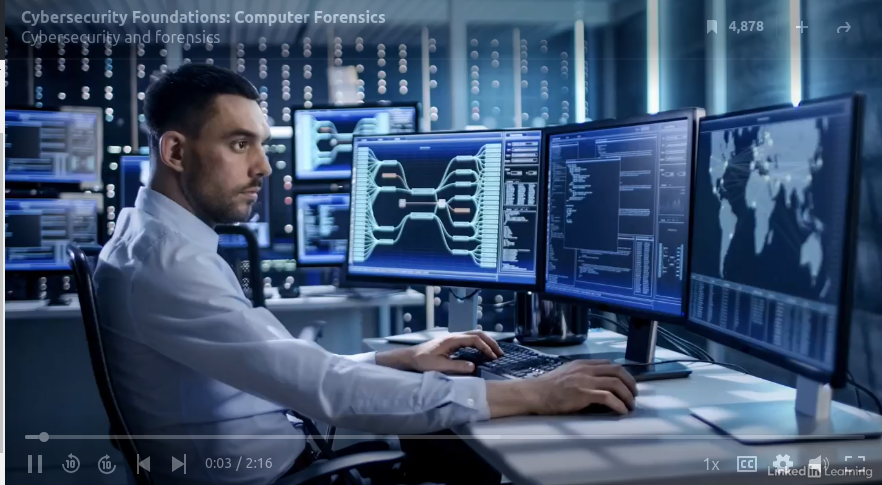
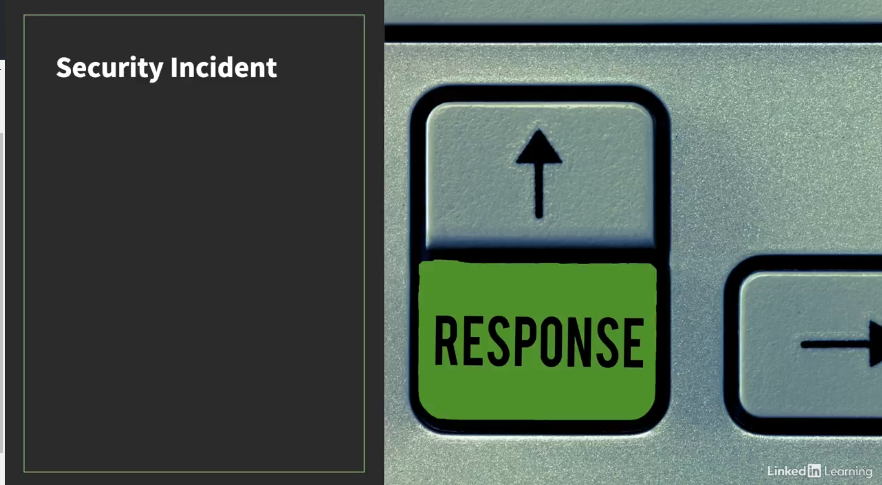
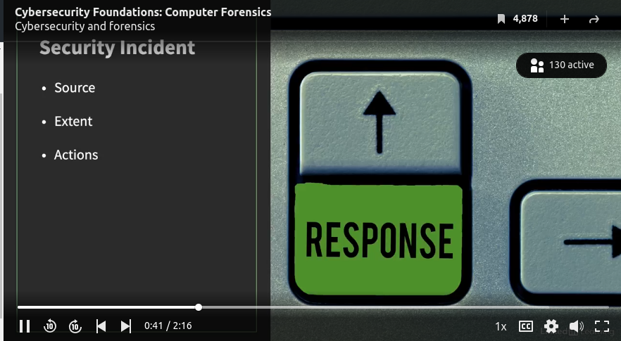
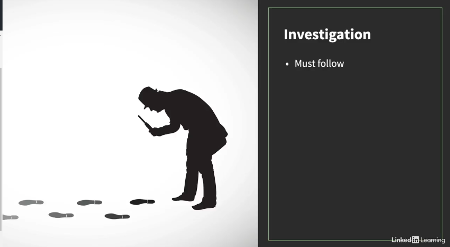
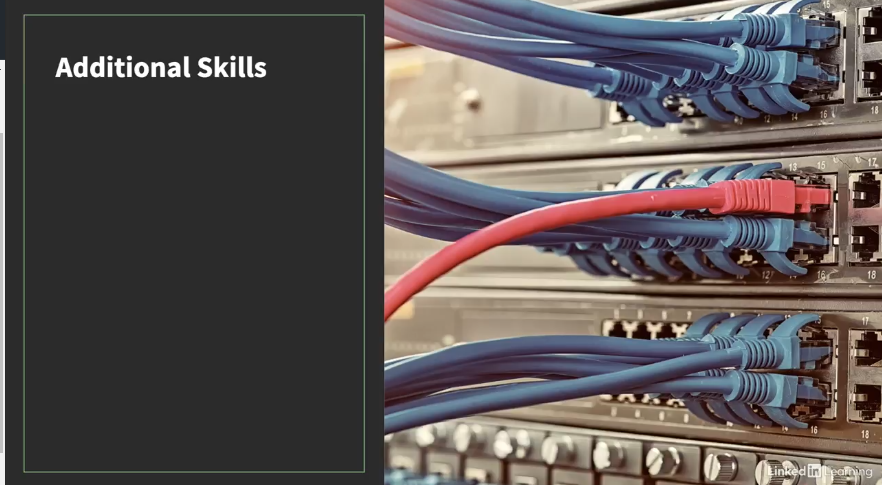
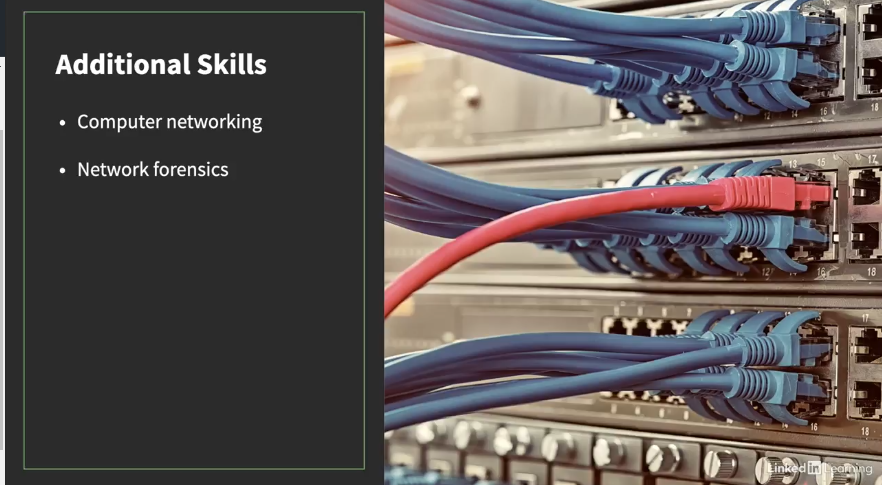

## **Cybersecurity and forensics**

Cyber crimes are increasingly affecting our lives. We routinely hear news about data breaches and wonder whether criminals stole our data. 

Cybersecurity is all about preventing and responding to cyber crimes, which requires the heavy use of computer forensics techniques. 

Whenever there is a security incident such as unauthorized access to a server, it's crucial trace back to the source of the attack and to understand how it happened. 

By doing this, we determine the damages extent and take appropriate actions. We can also prevent future attacks by making adjustments according to the lessons we learned from a comprehensive investigation. 

Since the evidence of cyber crime is mostly present on computing devices like laptops, routers, and firewalls, a computer forensics investigation must accompany every cybersecurity action. 

Due to this close relationship between cybersecurity and computer forensics, professionals are paying more attention to developing additional skills specific to handling cyber crimes. 

One expertise required to more effectively investigate a cyber crime is knowledge of computer networking, which is the study of connecting machines using various media, including radio signals, internet and fiber optics cables. 

As computer forensics workers who are seeking more specialization in cybersecurity regarding computer networking, they created an entirely new discipline called network forensics. This subfield of computer forensics focuses on violations and crimes occurring in the context of a computer network. Cyber crimes and computer forensics are now inseparable, and you need to develop at least a reasonable understanding of computer networking to play any significant role in a computer forensics investigation.