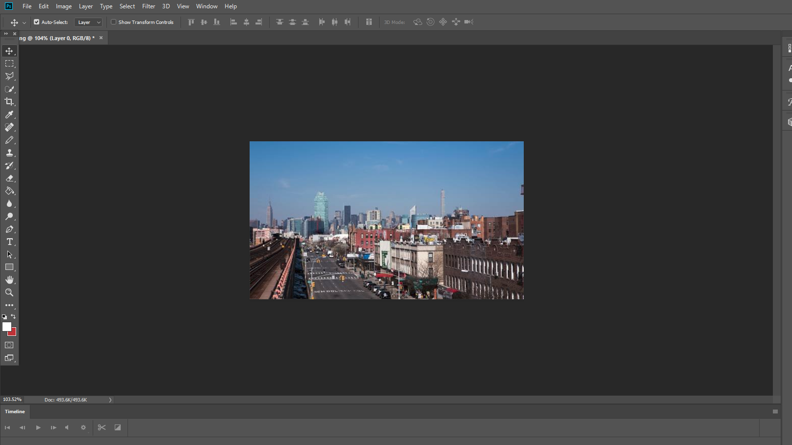
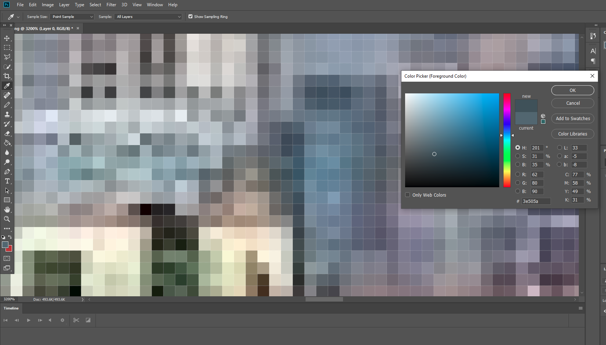
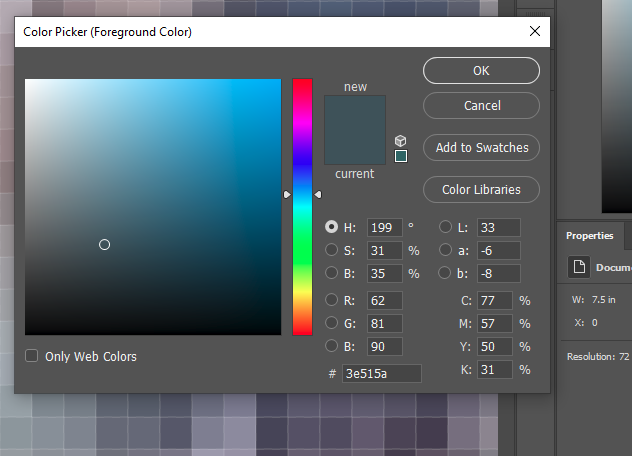
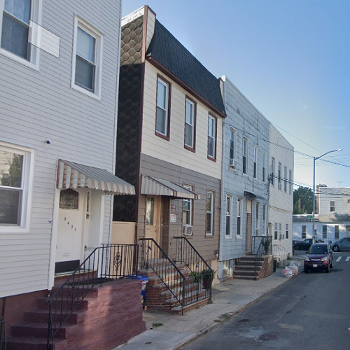
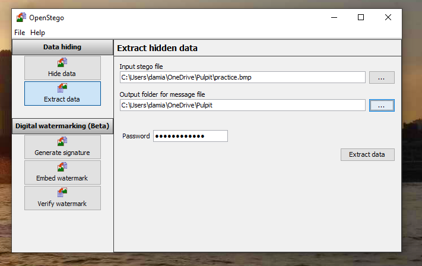

# Lab - Stenography

## Lab 1

### Step 1: Understanding Pixel Data

Every pixel in an image consists of three color values: Red (R), Green (G), and Blue (B). Each of these values is stored as an integer from 0 to 255.

    • Example pixel: (R: 173, G: 201, B: 124)

The least significant bit (LSB) of these values determines tiny changes that are invisible to the human eye. By tweaking these LSBs, we can hide binary data inside an image.

### Step 2: Preparing Your Files

    1. Choose a PNG image
        ◦ Use any small, simple image (less than 500x500 pixels is ideal).
        ◦ Open it in a basic image editor like Microsoft Paint (Windows) or Preview (Mac).
        
        
        
    2. Prepare Your Secret Message
        ◦ Convert your message to binary using an online ASCII to binary converter or a calculator.
        ◦ Example:
            ▪ "NYC" → 01001110 01011001 01000011
        ◦ Add a stop sequence (11111111 11111110) to mark the end.

### Step 3: Hiding the Message

    1. Open the PNG file in an Image Editor
        ◦ Zoom in and select individual pixels for editing.
        ◦ Check the RGB values of a few pixels.

        

    2. Modify the Least Significant Bit (LSB)
        ◦ Convert the pixel values to binary.
        ◦ Example: A pixel with values (62, 80, 90) in binary:
            ▪ 62 → 00111110
            ▪ 80 → 01010000
            ▪ 90 → 01011010

        

        ◦ Modify the last bit of each color channel to match the binary message.
        ◦ Example (hiding "NYC" in two pixels):
            ▪ Before: (62, 80, 90) → 00111110 01010000 01011010
            ▪ After: (62, 81, 90) → 00111110 01010001 01011010
            ▪ Since "NYC" requires 8 pixels, the process continues across multiple pixels until the full message is embedded.

        

    3. Save the Image
        ◦ Export the modified image as a new PNG file.

### Step 4: Extracting the Hidden Message

    1. Open the PNG File Again
        ◦ Pick the same pixels you modified.
        ◦ Convert their RGB values back to binary.

    2. Extract the Last Bits
        ◦ Read the LSB from each value and reconstruct the message.
        ◦ Stop when you reach the stop sequence (11111111 11111110).

    3. Convert Back to Text
        ◦ Group the extracted bits into 8-bit segments.
        ◦ Convert them back to characters using an ASCII table.

## lab 2 Hidding Messages in PNG files using OpenStego

1. Choose Your Image
    • Use an image, for example of Maspeth, Queens (let’s call it maspeth.png). Make sure it’s under 500x500 pixels for simplicity.

2. Prepare Your Secret Message
    • You already have a secret message in message.txt. This can be any text you want to hide in the image.

3. Hide the Message with OpenStego

    1. Open OpenStego

        ◦ Launch the OpenStego app.

    2. Load Files

        ◦ Message File: Click "Browse" and select message.txt (your secret message).
        ◦ Cover File: Click "Browse" and choose maspeth.png (the image where the message will be hidden).

    3. Set Output File

        ◦ Choose a name for your new image, like practice.png.

    4. Encrypt (Optional)

        ◦ If you want extra security, select "Encrypt message" and enter a password (e.g., "bestpassword").

    5. Hide the Message

        ◦ Click "Hide Data". This will create practice.png, an image with your secret message hidden inside.

4. Extract the Hidden Message

    1. Open OpenStego

        ◦ Go back to OpenStego, and click on "Extract Data".

    2. Load the Stego Image

        ◦ Click "Browse" and select practice.png (the image with the hidden message).

    3. Enter the Password (If Used)

        ◦ If you encrypted the message, enter the password.

    4. Extract the Message

        ◦ Click "Extract Data", and OpenStego will give you a file with the hidden message, like extracted_message.txt.

## ref

- https://www.garykessler.net/library/fsc_stego.html

- https://forensicstats.org/steganography/