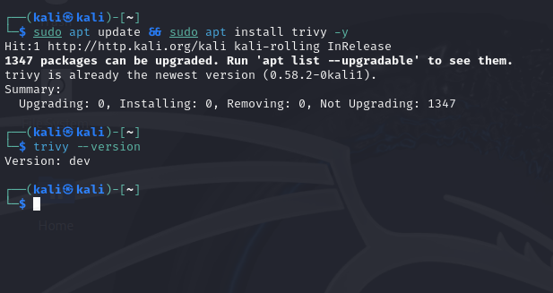
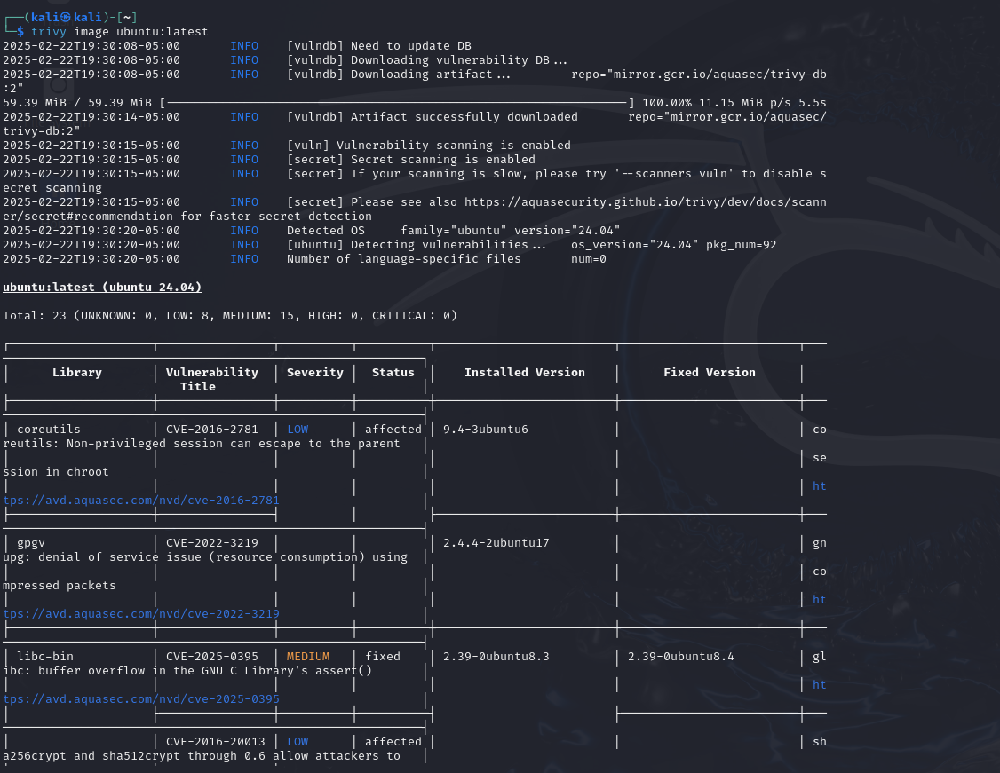
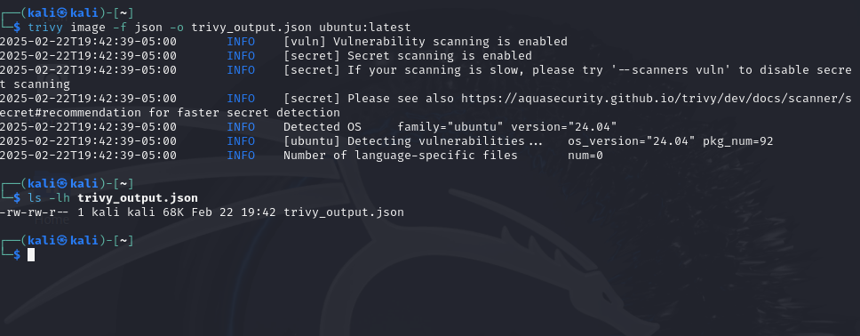
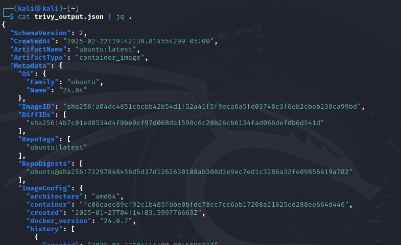
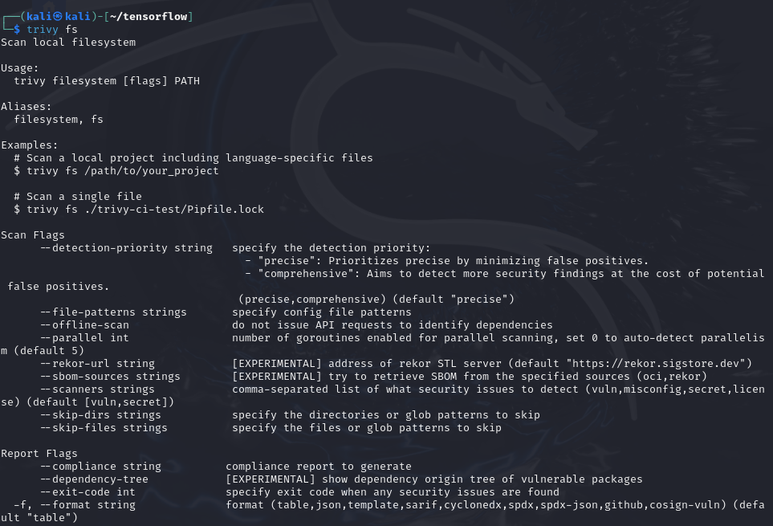
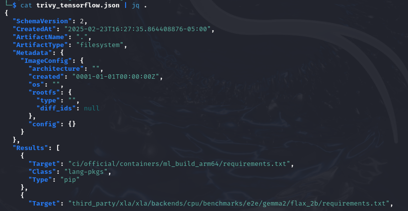

# Trivy Scanner

    • Purpose: Scans for vulnerabilities in container images, filesystems, and Git repositories. It’s like an antivirus, but instead of looking for malware, it hunts for known vulnerabilities in the software you’re using.
    • Key Features:
        ◦ Scans your OS and software packages to see if they have known vulnerabilities that hackers could exploit.
        ◦ Reports in different styles
            ▪ Table: Simple, readable, and great for quick checks.
            ▪ JSON: More structured, useful if you’re automating stuff.
            ▪ SARIIF: A format that plays with security tools in CI/CD pipelines
        ◦ Uses Real Security Databases
            ▪ NVD (National Vulnerability Database)
            ▪ GitHub Security Advisories: Where dev report and patch security issues.
            ▪ Vendor Databases: Straight from OS and software creators, so you get the latest info.
            ▪ In short, it constantly reads vulnerability reports.

Basically, Trivy helps you find security problems before they become real problems.

## Installation

## Scanning

In this section we will see what trivy can scan and how it scans.

### Scan a Docker Image

Command: `trivy image ubuntu:latest`

    • What this does: Scans the latest Ubuntu container image for vulnerabilities.
    • Output:
        ◦ Lists found vulnerabilities (CVE IDs, severity, and affected packages).
        ◦ Shows where vulnerabilities were detected (OS packages, libraries, etc.).

### Scan a Local Filesystem

Command:  `trivy fs /etc/`
    • What this does: Scans a local folder for vulnerabilities in installed software.
    • Output:
        ◦ Shows security issues in systems packages or binaries
        ◦ Useful for scanning a server or workstation

### Save Scan Output to a File

Command:  `trivy image -f json -o trivy_output.json ubuntu:latest`
    • What this does: Saves the scan results in JSON format for later analysis
    • To confirm that the JSON file was created, run: ls -lh trivy_output.json
    • To view the content side the JSON file: `cat trivy_output.json | jq .`

View the output saved in the above file,

### Scanning the Repo with Trivy

    • Lists vulnerabilities in dependencies and system packages
    • Shows severity levels (High, critical, etc.)

**Saving the output in JSON format**

The JSON output includes a list of found vulnerabilities, categorized by severity (low, medium, high, critical). It also provides details like the affected package, CVE ID, and possible fixes.

**Viewing the JSON output**

## Ref

- https://github.com/aquasecurity/trivy