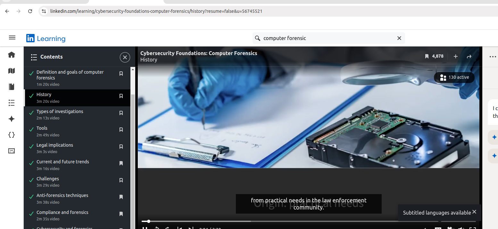
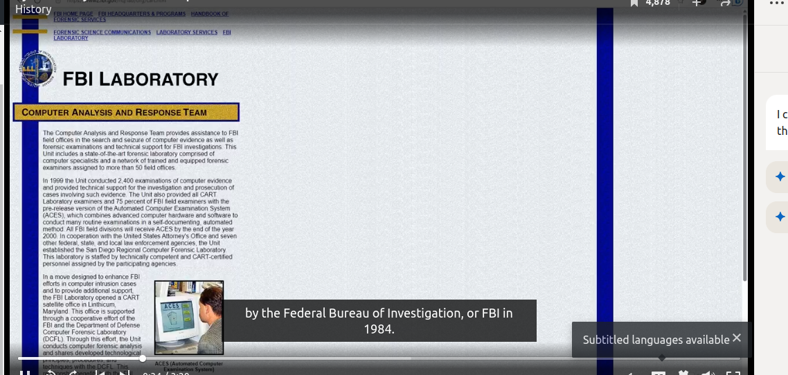
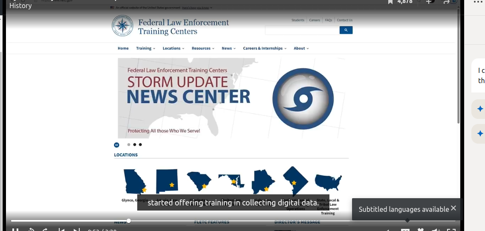
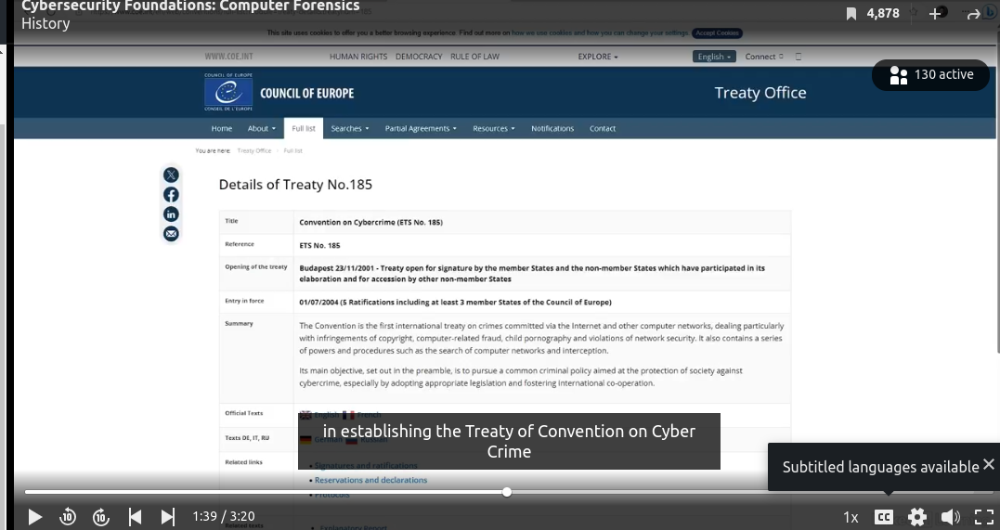
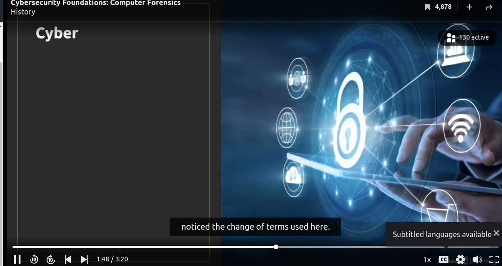
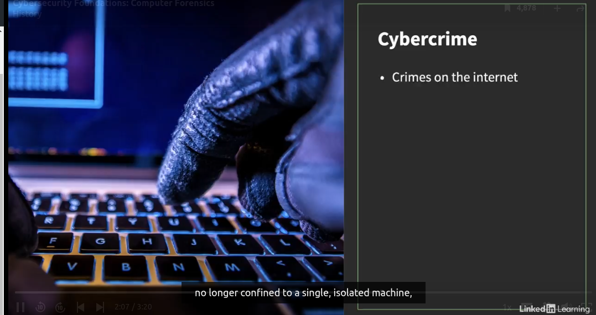
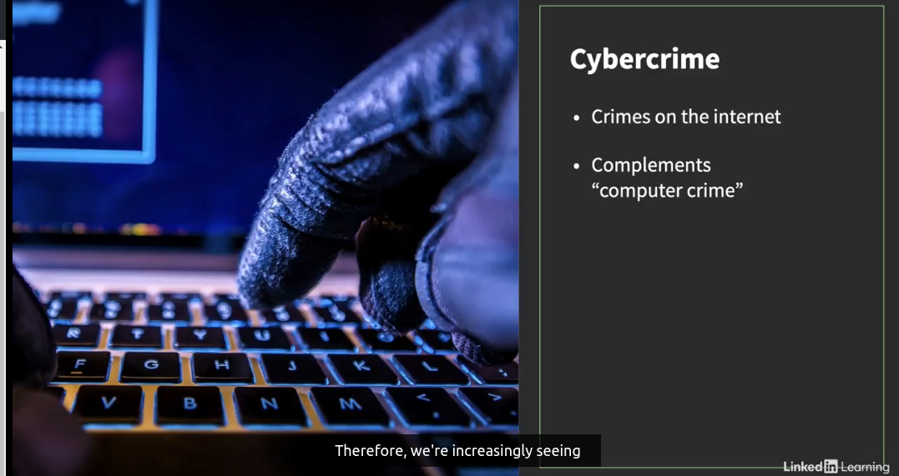
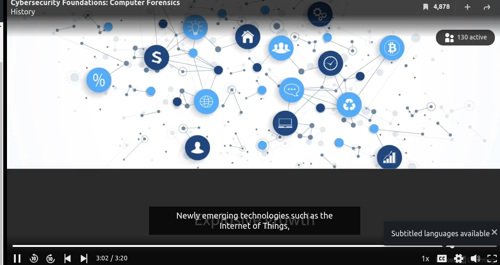

# History

### **History**

Computer forensics originated from practical needs in the law enforcement community. Criminals started using computers to commit crimes and law enforcement officers in the trenches had to deal with the new phenomenon at the time.

 One of the first official recognitions of computer forensics in the US as a separate field was the formation of a computer analysis response team, or CART by the Federal Bureau of Investigation, or FBI in 1984\. 
 
 

 As the field matured, more players appeared. The Federal Law Enforcement Training Centers, or FLETC started offering training in collecting digital data. 
 
 
 In 2005, the International Organization for Standardization, or ISO published a new standard called ISO 17025, general requirements for the competence of testing and calibration laboratories. 
 
 Since crimes have no borders, countries also had to work together to reconcile the differences in their laws to prosecute criminals successfully.
 
 

  Europeans led this effort and played a significant role in establishing the Treaty of Convention on Cyber Crime in 2004, and the US signed the treaty. 
  
  

  As an astute viewer, you may have noticed the change of terms used here. Cyber is a shorthand for cyberspace and refers to a virtual environment where information exchanges occur among computing devices. 
  
  
  
  The word cybercrime emphasizes that computer crimes are no longer confined to a single, isolated machine, but touch on a collection of devices connected through a communications network like the internet. 
  
  

  The word cybercrime compliments the more conventional label, "computer crime." Therefore, we're increasingly seeing both computer and cyber used together in media, as in computer and cyber forensics.
  
   
  
  You can also use digital forensics to cover both computer and cyber forensics because digital means anything using zeros and ones for representing data, which computers and cyberspaces do. Since its humble beginning in the 1970s, computer forensics has seen explosive growth and continues to expand its scope. Newly emerging technologies such as the Internet of Things, or IoT are constantly pushing the limits of the field. 
  
  
  
  I'm sure some future successor will soon replace IoT, which will help keep expanding the field of digital forensics.