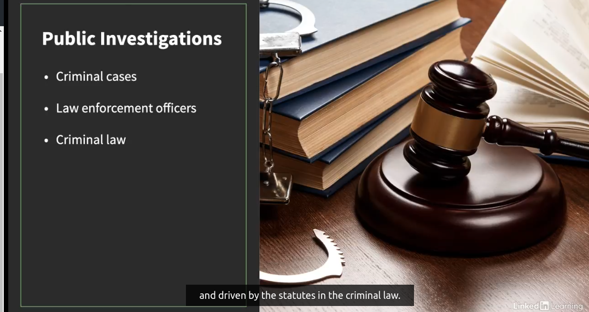
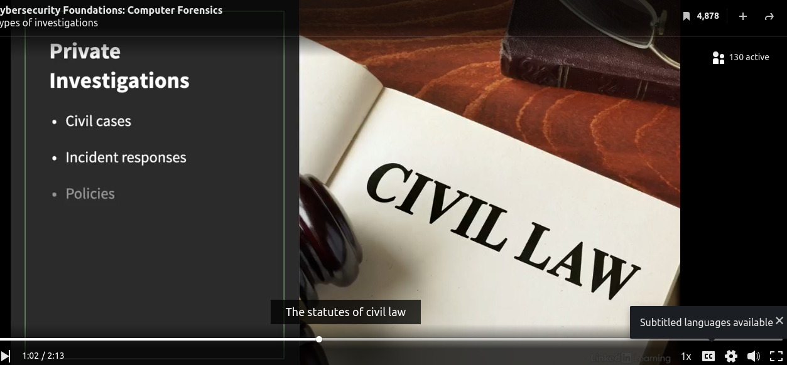
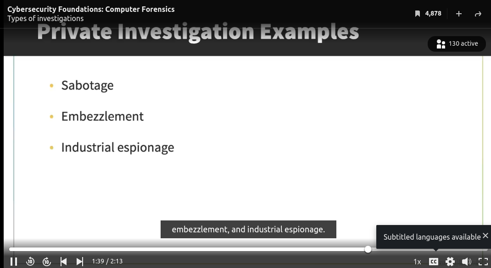
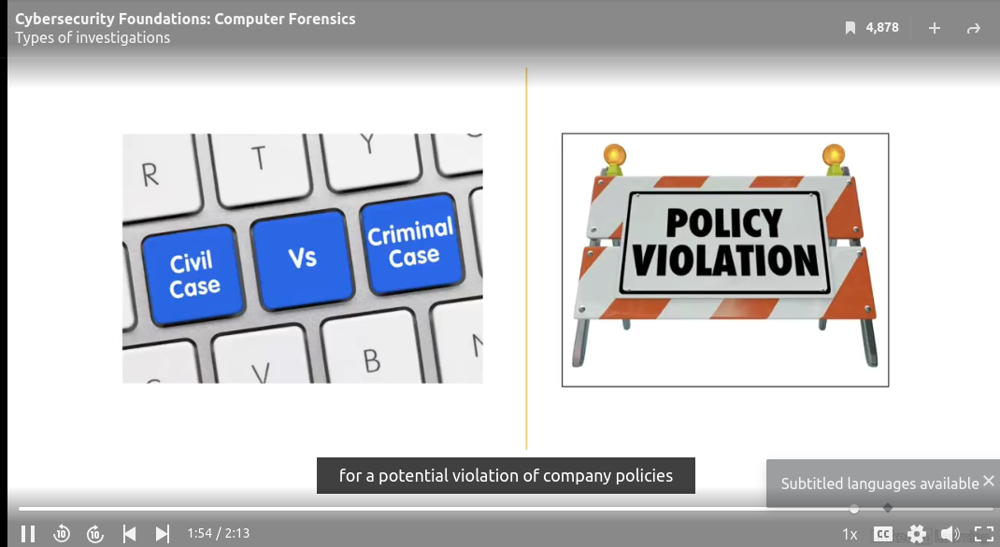

# Forenstic Types

### **Types of investigations**

There are two primary types of computer forensics investigations. One is public and the other is private. Public investigations occur in the context of criminal cases. They're usually conducted by law enforcement officers and driven by the statutes in the criminal law. 

Examples of public investigations include drug crimes, sexual exploitation, and theft. 

Private investigations occur in the context of civil cases.
Organizations try to avoid any form of litigation due to the enormous associated cost. As a result, many private investigations turn out to be incident responses.

Private investigations are typically conducted by corporations or similar types of organizations. The statutes of civil law or organizational policies drive private investigations. One of the most important things to consider in private investigations is business continuity.

If your investigation hurts your business' bottom line, it's probably not worth the effort. Therefore, your priority has to be stopping the violations instead of litigating. Examples of private investigations include sabotage, embezzlement, and industrial espionage.

The boundary between public and private investigations is often unclear. For example, when you're investigating an employee for a potential violation of company policies and coming across illegal pornography, the investigation quickly turns into a public case. Because of this reason, as a computer forensics investigator, you should be able to handle both public and private cases.

