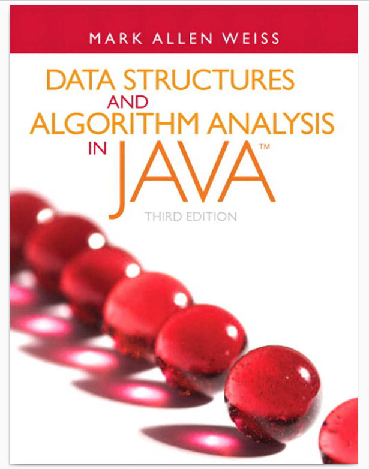
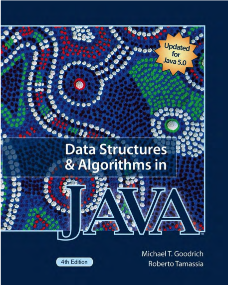
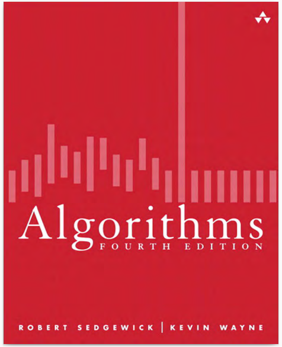

# Data Structure in Java - Syllabus

## Course Intro

Please refer to the information from your school website.

## Type

Online/Asynchrnous

## QA Time

Zoom Friday afternoon 4-5 PM.

## Textbook

### Main Book

* **Data Structures and Algorithms in Java by Mark Allen Weiss.**

ISBN 10: 0-13-257627-9

Published by PEARSON

### References textbook

* **Data Structures and Algorithms in Java by Michael T. Goodrich and Roberto Tamassia.** Fourth Edition. ISBN: 0-471-73884-0. Publisher: John Wiley & Sons, Inc.

* **Algorithms**

ISBN-10: 0-321-57351-X

Published by Addison-Wesley.

## Goal

After a 15-week study of Java data structure, we would master basic algorithm programming, including bastic data stuctures array, linklist, stack, queue, tree, graph, also with these data structures, we would be learning some most popular algorithms in searching, sorting, tree and graph theory. And optionally we will look at a lot of new and advanced data structures which would not likely be covered in most coding interviews but we would lightly touch up those.

We will provide you a comprehensive introduction of coding interview, how to should prepare for it, and the various platforms you can brush up your coding skills. I will also give you tips on algorithm design in general, thinking process, factors that might impact your coding behaviors and performance such as keyboard, mouse, cheatsheet, and digitalize and quick index of your code base...etc.

## Homework

Per week or biweekly. Depending on the homework size.

**Submission requirement**

* Homework Submission: File upload
* Homework should include at least one word or pdf document. Any code should be put into a zip file, please do not use WinRAR or tar.gz format.
* Please write your full name in the homework document.
* For assignment with coding, please take screenshot to prove that it is working.

## No late submission

* Professor will not send email to urge you for homework.
* It is your responsibility to submit them on time.
* Late submission are subject to 10 pts loss.

## Course Schedule

This course provides an opportunity for students to learn the foundations of computer data structure programming with required algorithms.

| Week    | Course title                     | Expectation |
|---------|----------------------------------|--------------|
| Week 1  | Introduction to Data Structure   | ADT, memory management including stack and heap|
| Week 2  | Algorithm Analysis               |                                                |
| Week 3  | LinkedList        | Array and pointer based data structures implementation|
| Week 4  | Stack        | Array and pointer based data structures implementation|
| Week 5  | Queue        | Array and pointer based data structures implementation|
| Week 6  | Hashing and Priority Queues      | Hashtable and Hashmap implementation|
| Week 7  | Sorting                          | Bubble, Selection, Insertion, Merge, Quick and Heap sort |
| Week 8  | Trees                     | Recursion, BFS and DFS, traversal, rebalance tree, construction and Tree path problems|
| Mid-term| Coding Assignment                | Distribute Midterm Project  |
| Week 9  | MST - Graph Theory                 |Find and Union Algorithm Implementation |
| Week 10  | Shortest Path - Graph Algorithms Continued       | Solving Leetcode Questions  |
| Week 11  | Amortized Analysis               | Solving Leetcode Questions  |
| Week 12 | Disjoint Set Class               |  |
| Week 13 | Special topics - Greedy Algorithms | Solve leetcode questions   |
| Final-project | Coding Assignment | Distribute Final project |
| Week 14 | Special topics - Divide and Conquer Algorithm | Solve leetcode questions  |
| Week 15 | Special topics - Sliding Window and Backtracing |  Solve leetcode questions                   |

## Homework, Midterm and Final Project

* Only homework including installation of software, essay and writing code.

## Grading

Final grade will be calculated based on homework 40%, midterm project 30% and final project 30%.