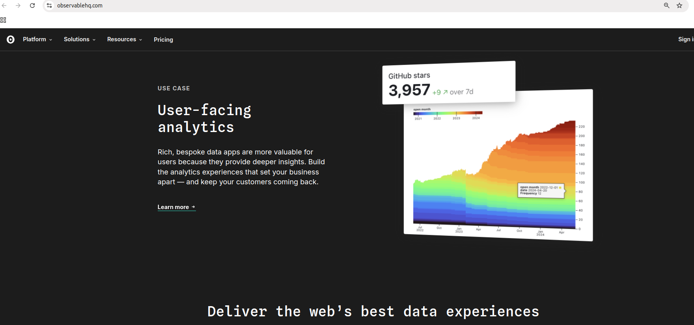
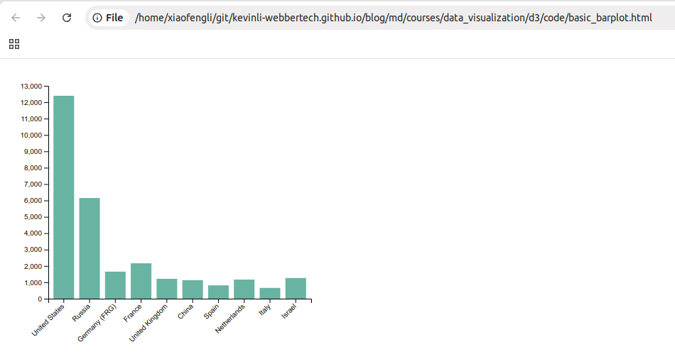

# D3 - Use D3 to Visualize on Your Data

## Takeaway

* D3 works in any JavaScript environment.

* [D3 online - Observable](https://observablehq.com/)

D3 is available by default in notebooks as part of Observable’s standard library. To create something with D3, return the generated DOM element from a cell.

Here is a blank chart to get you started:


Here is the observable platform,


A data analytical platform,



Obserable's architecture,


* Line Chart

In this tutorial, we will focus on vanilla JS not reactjs.

```html
<!DOCTYPE html>
<html>
<head>
<meta charset="utf-8">
</head>

<body>
<!-- Load d3.js -->
<script src="https://d3js.org/d3.v6.js"></script>

<!-- Create a div where the graph will take place -->
<div id="my_dataviz"></div>

<script>

  // set the dimensions and margins of the graph
  const margin = {top: 10, right: 30, bottom: 30, left: 60},
      width = 460 - margin.left - margin.right,
      height = 400 - margin.top - margin.bottom;
  
  // append the svg object to the body of the page
  const svg = d3.select("#my_dataviz")
    .append("svg")
      .attr("width", width + margin.left + margin.right)
      .attr("height", height + margin.top + margin.bottom)
    .append("g")
      .attr("transform", `translate(${margin.left},${margin.top})`);
  
  //Read the data
  d3.csv("https://raw.githubusercontent.com/holtzy/data_to_viz/master/Example_dataset/3_TwoNumOrdered_comma.csv",
  
    // When reading the csv, I must format variables:
    function(d){
      return { date : d3.timeParse("%Y-%m-%d")(d.date), value : d.value }
    }).then(
  
    // Now I can use this dataset:
    function(data) {
  
      // Add X axis --> it is a date format
      const x = d3.scaleTime()
        .domain(d3.extent(data, function(d) { return d.date; }))
        .range([ 0, width ]);
      svg.append("g")
        .attr("transform", `translate(0, ${height})`)
        .call(d3.axisBottom(x));
  
      // Add Y axis
      const y = d3.scaleLinear()
        .domain([0, d3.max(data, function(d) { return +d.value; })])
        .range([ height, 0 ]);
      svg.append("g")
        .call(d3.axisLeft(y));
  
      // Add the line
      svg.append("path")
        .datum(data)
        .attr("fill", "none")
        .attr("stroke", "steelblue")
        .attr("stroke-width", 1.5)
        .attr("d", d3.line()
          .x(function(d) { return x(d.date) })
          .y(function(d) { return y(d.value) })
        )
})
</script>
</body>
</html>
```


### Steps

* The Html part of the code just creates a div that will be modified by d3 later on.

* The first part of the javascript code set a svg area. It specify the chart size and its margin. Read more.

* Data show the evolution of bitcoin price. read more.

* Line is drawn using a path, and using the d3.line utility.

*ref*

- https://observablehq.com/@d3/line-chart/2

- [line mark](https://observablehq.com/plot/marks/line)

- [rule mark](https://observablehq.com/plot/marks/rule)

* Bar Chart

```html
<!DOCTYPE html>

<html>
<head>
<meta charset="utf-8">
<!-- Load d3.js -->
<script src="https://d3js.org/d3.v6.js"></script>
</head>


<body>
<!-- Create a div where the graph will take place -->
<div id="my_dataviz"></div>

<script>

  // set the dimensions and margins of the graph
  const margin = {top: 30, right: 30, bottom: 70, left: 60},
      width = 460 - margin.left - margin.right,
      height = 400 - margin.top - margin.bottom;
  
  // append the svg object to the body of the page
  const svg = d3.select("#my_dataviz")
    .append("svg")
      .attr("width", width + margin.left + margin.right)
      .attr("height", height + margin.top + margin.bottom)
    .append("g")
      .attr("transform", `translate(${margin.left},${margin.top})`);
  
  // Parse the Data
  d3.csv("https://raw.githubusercontent.com/holtzy/data_to_viz/master/Example_dataset/7_OneCatOneNum_header.csv").then( function(data) {
  
  // X axis
  const x = d3.scaleBand()
    .range([ 0, width ])
    .domain(data.map(d => d.Country))
    .padding(0.2);
  svg.append("g")
    .attr("transform", `translate(0, ${height})`)
    .call(d3.axisBottom(x))
    .selectAll("text")
      .attr("transform", "translate(-10,0)rotate(-45)")
      .style("text-anchor", "end");
  
  // Add Y axis
  const y = d3.scaleLinear()
    .domain([0, 13000])
    .range([ height, 0]);
  svg.append("g")
    .call(d3.axisLeft(y));
  
  // Bars
  svg.selectAll("mybar")
    .data(data)
    .join("rect")
      .attr("x", d => x(d.Country))
      .attr("y", d => y(d.Value))
      .attr("width", x.bandwidth())
      .attr("height", d => height - y(d.Value))
      .attr("fill", "#69b3a2")
  
  })
  </script>
</body>
</html>
```



### Ref

- https://d3js.org/what-is-d3
- https://d3-graph-gallery.com/index.html