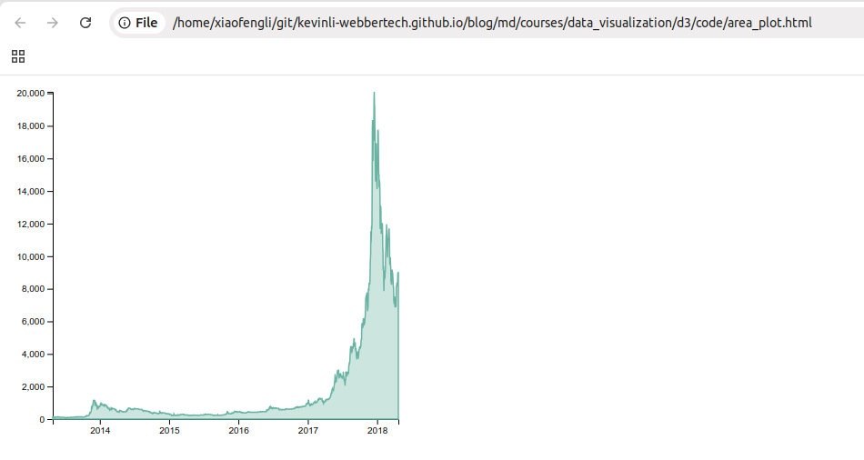
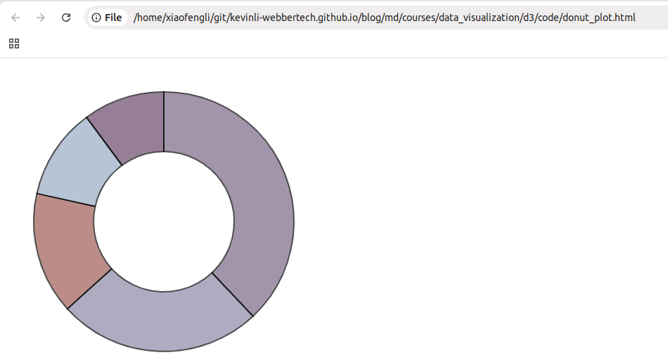
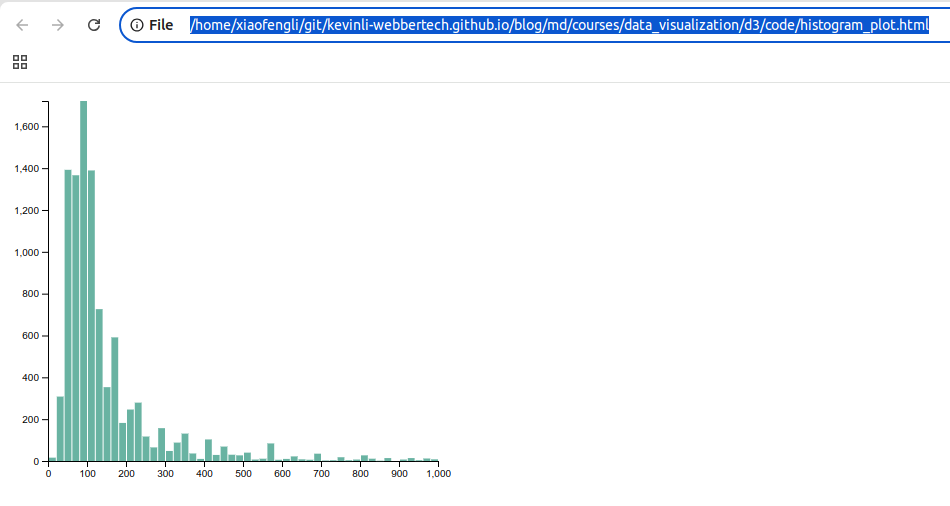
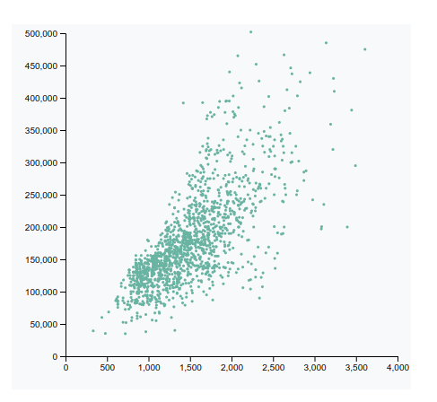
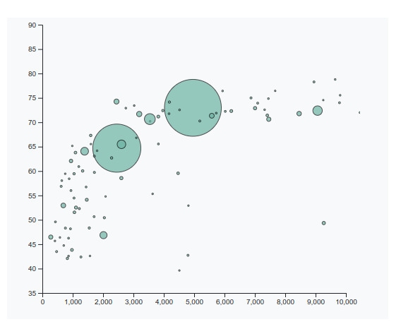

# D3 Visualization - Area, Donut and Histogram Charts

In this tutorial, we will take a look at the area, donut and histogram charts.

Please note that most of the examples here are the most basic examples. I listed their reference pages in the bottom of this page, if you would like to explore more advanced features of each, please extend your reading.

## Takeaway

* Area chart
* Donut chart
* Histogram
* Scatter
* Bubble

## Area Chart

**Save the following code to area_plot.html**

```html
<!DOCTYPE html>

<html>
<head>
<meta charset="utf-8">

<!-- Load d3.js -->
<script src="https://d3js.org/d3.v6.js"></script>

<!-- Create a div where the graph will take place -->
<div id="my_dataviz"></div>
</head>

<body>
<script>

  // set the dimensions and margins of the graph
  const margin = {top: 10, right: 30, bottom: 30, left: 50},
        width = 460 - margin.left - margin.right,
        height = 400 - margin.top - margin.bottom;
  
  // append the svg object to the body of the page
  const svg = d3.select("#my_dataviz")
    .append("svg")
      .attr("width", width + margin.left + margin.right)
      .attr("height", height + margin.top + margin.bottom)
    .append("g")
      .attr("transform",`translate(${margin.left},${margin.top})`);
  
  //Read the data
  d3.csv("https://raw.githubusercontent.com/holtzy/data_to_viz/master/Example_dataset/3_TwoNumOrdered_comma.csv",
  
    // When reading the csv, I must format variables:
    d => {
      return {
            date: d3.timeParse("%Y-%m-%d")(d.date),
            value : d.value
          }
        }).then(
  
    // Now I can use this dataset:
    function(data) {
  
    // Add X axis --> it is a date format
    const x = d3.scaleTime()
      .domain(d3.extent(data, d => d.date))
      .range([ 0, width ]);
      svg.append("g")
        .attr("transform", `translate(0,${height})`)
        .call(d3.axisBottom(x));
  
    // Add Y axis
    const y = d3.scaleLinear()
      .domain([0, d3.max(data, d => +d.value)])
      .range([ height, 0 ]);
      svg.append("g")
        .call(d3.axisLeft(y));
  
    // Add the area
    svg.append("path")
      .datum(data)
      .attr("fill", "#cce5df")
      .attr("stroke", "#69b3a2")
      .attr("stroke-width", 1.5)
      .attr("d", d3.area()
        .x(d => x(d.date))
        .y0(y(0))
        .y1(d => y(d.value))
          )
      })
  
  </script>
</body>
</html>
```

Open the html you just saved, and open it with a browser, and  You should see the chart like the following,



### Steps

* The Html part of the code just creates a div that will be modified by d3 later on.

* The first part of the javascript code set a svg area. It specify the chart size and its margin. Read more.

* This graph shows the evolution of the bitcoin price, see this post for more info.

* The area is built appending a path to the plot, and using the d3.area() helper function. See here to learn more about this kind of function.


## Donut Chart

**Save the following code to donut_plot.html**

```html
<!DOCTYPE html>
<html>
<head>
<meta charset="utf-8">

<!-- Load d3.js -->
<script src="https://d3js.org/d3.v6.js"></script>
</head>

<body>
  <!-- Create a div where the graph will take place -->
<div id="my_dataviz"></div>
<script>

  // set the dimensions and margins of the graph
  const width = 450,
      height = 450,
      margin = 40;
  
  // The radius of the pieplot is half the width or half the height (smallest one). I subtract a bit of margin.
  const radius = Math.min(width, height) / 2 - margin
  
  // append the svg object to the div called 'my_dataviz'
  const svg = d3.select("#my_dataviz")
    .append("svg")
      .attr("width", width)
      .attr("height", height)
    .append("g")
      .attr("transform", `translate(${width / 2},${height / 2})`);
  
  // Create dummy data
  const data = {a: 9, b: 20, c:30, d:8, e:12}
  
  // set the color scale
  const color = d3.scaleOrdinal()
    .range(["#98abc5", "#8a89a6", "#7b6888", "#6b486b", "#a05d56"])
  
  // Compute the position of each group on the pie:
  const pie = d3.pie()
    .value(d=>d[1])
  
  const data_ready = pie(Object.entries(data))
  
  // Build the pie chart: Basically, each part of the pie is a path that we build using the arc function.
  svg
    .selectAll('whatever')
    .data(data_ready)
    .join('path')
    .attr('d', d3.arc()
      .innerRadius(100)         // This is the size of the donut hole
      .outerRadius(radius)
    )
    .attr('fill', d => color(d.data[0]))
    .attr("stroke", "black")
    .style("stroke-width", "2px")
    .style("opacity", 0.7)
  </script>
  </body>
  </html>
```

Open the html you just saved, and open it with a browser, and  You should see the chart like the following,



### Steps

* Warning: are you sure you want to use a donut chart? Learn why it is not recommended.

* Note: Building a donut chart follows exactly the same process than a pie chart.

* Input dataset provides the group names and their corresponding numeric value.

* The first step is to use the pie() function. It takes this input and return the coordinates of each part of the pie.

* For instance: a:9 becomes index:0 / padAngle:0 / startAngle: 0 / endAngle: 0.71

* This new information can finally be given to the d3.arc() helper that will draw the shape.

## Histogram

**Save the following code to histogram_plot.html**

```html
<!DOCTYPE html>
<html>
<head>
<meta charset="utf-8">

<!-- Load d3.js -->
<script src="https://d3js.org/d3.v6.js"></script>
</head>

<body>
<!-- Create a div where the graph will take place -->
<div id="my_dataviz"></div>

<script>

  // set the dimensions and margins of the graph
  const margin = {top: 10, right: 30, bottom: 30, left: 40},
      width = 460 - margin.left - margin.right,
      height = 400 - margin.top - margin.bottom;
  
  // append the svg object to the body of the page
  const svg = d3.select("#my_dataviz")
    .append("svg")
      .attr("width", width + margin.left + margin.right)
      .attr("height", height + margin.top + margin.bottom)
    .append("g")
      .attr("transform",
            `translate(${margin.left},${margin.top})`);
  
  // get the data
  d3.csv("https://raw.githubusercontent.com/holtzy/data_to_viz/master/Example_dataset/1_OneNum.csv").then( function(data) {
  
    // X axis: scale and draw:
    const x = d3.scaleLinear()
        .domain([0, 1000])     // can use this instead of 1000 to have the max of data: d3.max(data, function(d) { return +d.price })
        .range([0, width]);
    svg.append("g")
        .attr("transform", `translate(0, ${height})`)
        .call(d3.axisBottom(x));
  
    // set the parameters for the histogram
    const histogram = d3.histogram()
        .value(function(d) { return d.price; })   // I need to give the vector of value
        .domain(x.domain())  // then the domain of the graphic
        .thresholds(x.ticks(70)); // then the numbers of bins
  
    // And apply this function to data to get the bins
    const bins = histogram(data);
  
    // Y axis: scale and draw:
    const y = d3.scaleLinear()
        .range([height, 0]);
        y.domain([0, d3.max(bins, function(d) { return d.length; })]);   // d3.hist has to be called before the Y axis obviously
    svg.append("g")
        .call(d3.axisLeft(y));
  
    // append the bar rectangles to the svg element
    svg.selectAll("rect")
        .data(bins)
        .join("rect")
          .attr("x", 1)
      .attr("transform", function(d) { return `translate(${x(d.x0)} , ${y(d.length)})`})
          .attr("width", function(d) { return x(d.x1) - x(d.x0) -1})
          .attr("height", function(d) { return height - y(d.length); })
          .style("fill", "#69b3a2")
  
  });
  </script>
  </body>
  </html>
```

Open the html you just saved, and open it with a browser, and  You should see the chart like the following,



## Steps

* The Html part of the code just creates a div that will be modified by d3 later on.

* The first part of the javascript code set a svg area. It specify the chart size and its margin. Read more.

* A histogram displays the distribution of a numeric variable. So you basically need only one column in your input file. (see input here)

* This numeric variable is provided to the d3.histogram() function that will compute the binning and returns the coordinates of each bar.

* These bars can thus be drawn using a classic .append("rect") approach.

## Scatter Chart

```html
<!DOCTYPE html>

<html>
<head>
<meta charset="utf-8">

<!-- Load d3.js -->
<script src="https://d3js.org/d3.v6.js"></script>
</head>

<body>
<!-- Create a div where the graph will take place -->
<div id="my_dataviz"></div>
<script>

  // set the dimensions and margins of the graph
  const margin = {top: 10, right: 30, bottom: 30, left: 60},
          width = 460 - margin.left - margin.right,
          height = 400 - margin.top - margin.bottom;
  
  // append the svg object to the body of the page
  const svg = d3.select("#my_dataviz")
      .append("svg")
      .attr("width", width + margin.left + margin.right)
      .attr("height", height + margin.top + margin.bottom)
      .append("g")
      .attr("transform", `translate(${margin.left}, ${margin.top})`);
  
  //Read the data
  d3.csv("https://raw.githubusercontent.com/holtzy/data_to_viz/master/Example_dataset/2_TwoNum.csv").then( function(data) {
  
      // Add X axis
      const x = d3.scaleLinear()
      .domain([0, 4000])
      .range([ 0, width ]);
      svg.append("g")
      .attr("transform", `translate(0, ${height})`)
      .call(d3.axisBottom(x));
  
      // Add Y axis
      const y = d3.scaleLinear()
      .domain([0, 500000])
      .range([ height, 0]);
      svg.append("g")
      .call(d3.axisLeft(y));
  
      // Add dots
      svg.append('g')
      .selectAll("dot")
      .data(data)
      .join("circle")
          .attr("cx", function (d) { return x(d.GrLivArea); } )
          .attr("cy", function (d) { return y(d.SalePrice); } )
          .attr("r", 1.5)
          .style("fill", "#69b3a2")
  
  })
  </script>
  </body>
  </html>

```

Open the html you just saved, and open it with a browser, and  You should see the chart like the following,



### Steps

* The 2 first code chunks are always the same: it defines a svg area with margins. Explanation about it here.

* The d3.csv() function allows to parse the input dataset that is stored on the web. It has 2 numeric variables called GrLivArea and SalePrice.

* The X and Y scales and axis are built using linearScale. Visit this page for more about axis and scales.

* Lastly, points are added by appending circle to the svg.

## Bubble Chart

```html

<!DOCTYPE html>
<html>
  <head>
<meta charset="utf-8">

<!-- Load d3.js -->
<script src="https://d3js.org/d3.v6.js"></script>
  </head>

<body>
<!-- Create a div where the graph will take place -->
<div id="my_dataviz"></div>
<script>

  // set the dimensions and margins of the graph
  const margin = {top: 10, right: 20, bottom: 30, left: 50},
      width = 500 - margin.left - margin.right,
      height = 420 - margin.top - margin.bottom;
  
  // append the svg object to the body of the page
  const svg = d3.select("#my_dataviz")
    .append("svg")
      .attr("width", width + margin.left + margin.right)
      .attr("height", height + margin.top + margin.bottom)
    .append("g")
      .attr("transform", `translate(${margin.left},${margin.top})`);
  
  //Read the data
  d3.csv("https://raw.githubusercontent.com/holtzy/data_to_viz/master/Example_dataset/4_ThreeNum.csv").then( function(data) {
  
    // Add X axis
    const x = d3.scaleLinear()
      .domain([0, 10000])
      .range([ 0, width ]);
    svg.append("g")
      .attr("transform", `translate(0, ${height})`)
      .call(d3.axisBottom(x));
  
    // Add Y axis
    const y = d3.scaleLinear()
      .domain([35, 90])
      .range([ height, 0]);
    svg.append("g")
      .call(d3.axisLeft(y));
  
    // Add a scale for bubble size
    const z = d3.scaleLinear()
      .domain([200000, 1310000000])
      .range([ 1, 40]);
  
    // Add dots
    svg.append('g')
      .selectAll("dot")
      .data(data)
      .join("circle")
        .attr("cx", d => x(d.gdpPercap))
        .attr("cy", d => y(d.lifeExp))
        .attr("r", d => z(d.pop))
        .style("fill", "#69b3a2")
        .style("opacity", "0.7")
        .attr("stroke", "black")
  
  })
  
  </script>

</body>

</html>
```

Open the html you just saved, and open it with a browser, and  You should see the chart like the following,



### Steps

* The Html part of the code just creates a div that will be modified by d3 later on.

* The first part of the javascript code set a svg area. It specify the chart size and its margin. Read more.

* Here the gapminder dataset is used, showing the relationship between life expectancy, gdp per capita and population size for more than 100 countries. (.csv format).

* The building process is basically the same as for a scatterplot. Just add a linear scale for the circle size.

### Ref

- https://d3js.org/what-is-d3
- https://d3-graph-gallery.com/area.html
- https://d3-graph-gallery.com/graph/donut_basic.html
- https://d3-graph-gallery.com/graph/histogram_basic.html
- https://d3-graph-gallery.com/scatter.html
- https://d3-graph-gallery.com/bubble.html
- https://d3-graph-gallery.com/graph/scatter_basic.html
- https://d3-graph-gallery.com/graph/bubble_basic.html