# Introduction Data Visualization

## Graphics and Traditional Visualization

**Computer graphics** is a field of computer science that focuses on creating, manipulating, and rendering visual images and animations using computers. It involves the use of algorithms, mathematical models, and hardware to generate and display visual content. Computer graphics are used in a wide range of industries, including entertainment (movies, video games), design (architecture, industrial design), scientific visualization, virtual reality (VR), and many others.

Here's an overview of key concepts in **computer graphics**:

### 1. **Types of Computer Graphics**:
   - **Raster Graphics**: These are images composed of pixels arranged in a grid. Common formats include **JPEG**, **PNG**, and **GIF**. Raster graphics are best suited for photographs and complex images with intricate color variations.
   - **Vector Graphics**: These use geometric shapes such as lines, circles, and polygons, represented by mathematical equations. Vector graphics are scalable without losing quality and are often used for logos, illustrations, and schematics (e.g., formats like **SVG** and **EPS**).

### 2. **Rendering**:
   - **Rendering** is the process of generating an image from a 3D model by means of computer programs. The goal is to produce a 2D image or animation that appears realistic or artistic, depending on the use case.
   - **Types of Rendering**:
     - **Real-time rendering**: Used in video games, simulations, and virtual environments, where images must be generated at high speed for smooth interactivity.
     - **Offline rendering**: Used for high-quality visual effects in movies, where the rendering process may take longer but produces more detailed results.
   
### 3. **3D Graphics**:
   - **3D Modeling**: This refers to the creation of 3D objects in software, often using vertices (points in space) connected by edges to form faces and create a mesh. Common software used for 3D modeling includes **Blender**, **Maya**, and **3ds Max**.
   - **3D Rendering**: After creating a model, the next step is rendering the 3D scene to create images or animations. This can involve adding textures, lighting, and materials to make objects appear more realistic.
   - **Lighting and Shading**: Lighting in a 3D scene is crucial to determine how objects will appear based on the source of light. Shaders are programs that control how light interacts with objects' surfaces, affecting their color, texture, and reflectivity.

### 4. **Textures and Materials**:
   - **Textures**: These are images that are applied to the surfaces of 3D models to provide detailed surface information, such as wood grain, skin, or stone. Textures are mapped onto 3D models using a technique called **UV mapping**.
   - **Materials**: Materials define how objects interact with light. They control properties like color, shininess, reflectiveness, transparency, and bumpiness. Materials are crucial for achieving realistic rendering effects.

### 5. **Animation**:
   - **Keyframe Animation**: Involves setting key points in an animation (keyframes) and then using interpolation to fill in the movement between them. This is widely used in character animation and motion graphics.
   - **Procedural Animation**: This is generated algorithmically, rather than manually creating keyframes. It is often used for simulations of physics, such as the movement of water, fire, or cloth.
   - **Rigging and Skeleton Animation**: In character animation, "rigging" involves creating a skeleton for a 3D model, allowing for realistic movement. This technique is widely used in films and video games.

### 6. **Graphics Hardware**:
   - **Graphics Processing Unit (GPU)**: The GPU is a specialized processor designed to handle the complex calculations required for rendering graphics, especially in real-time applications like video games and VR. GPUs can perform many calculations in parallel, making them ideal for graphics rendering.
   - **Graphics Card**: A graphics card is a physical component that houses the GPU and memory. It is responsible for outputting graphics to a display.
   - **Ray Tracing**: A rendering technique that simulates the way light interacts with objects to produce realistic shadows, reflections, and refractions. It’s often used in high-end rendering applications like movies or architectural visualization.

### 7. **Graphics Algorithms**:
   - **Rasterization**: The process of converting 3D models into a 2D image by determining the pixel values (colors) for the objects based on their position in 3D space. This is commonly used in real-time rendering.
   - **Ray Tracing**: Unlike rasterization, ray tracing simulates the behavior of light rays and calculates their interactions with objects. It produces highly realistic images but is computationally expensive and primarily used in offline rendering.
   - **Z-buffering**: A technique used to manage image depth in 3D rendering to ensure that objects closer to the camera obscure objects that are farther away.

### 8. **Graphics APIs**:
   - **OpenGL**: A widely used cross-platform API for rendering 2D and 3D vector graphics. OpenGL is often used for creating applications like video games and simulations.
   - **DirectX**: A collection of APIs developed by Microsoft, mainly for use in video games and other multimedia applications on Windows platforms. **Direct3D** is the graphics API used for rendering 3D graphics.
   - **Vulkan**: A modern, low-overhead graphics API developed by the **Khronos Group** that provides high-performance rendering with more direct control over the GPU.

### 9. **Virtual Reality (VR) and Augmented Reality (AR)**:
   - **Virtual Reality (VR)**: Computer-generated environments that simulate real-world or imaginary places. VR requires specialized hardware like headsets (e.g., **Oculus Rift**, **HTC Vive**) to create immersive experiences.
   - **Augmented Reality (AR)**: Combines real-world environments with computer-generated images or objects, often viewed through smartphones or AR glasses (e.g., **Microsoft HoloLens**, **Pokémon GO**).

### 10. **Graphics Design and Digital Art**:
   - **Vector Design**: Graphic designers often use vector-based tools like **Adobe Illustrator** to create illustrations and designs for logos, icons, and other graphics that need to be scalable without losing quality.
   - **Raster Image Editing**: Software like **Adobe Photoshop** is used for editing raster images, such as photographs, applying effects, and performing retouching or digital painting.

### 11. **Computer-Generated Imagery (CGI)**:
   - **CGI** is the use of computer graphics to create visual content in movies, TV shows, advertisements, and more. It involves everything from modeling, texturing, lighting, rendering, and animation to produce realistic or stylized images and animations.
   - Popular tools for CGI include **Autodesk Maya**, **Cinema 4D**, and **Blender**.

### 12. **Graphical User Interfaces (GUI)**:
   - GUIs make extensive use of computer graphics to create the visual elements of software applications, such as buttons, icons, windows, and menus. User interface design focuses on creating an intuitive experience for users.

### 13. **3D Printing and Computer-Aided Design (CAD)**:
   - **3D Printing**: The use of 3D models to create physical objects using a layer-by-layer process. 3D graphics are essential in designing the models before printing.
   - **CAD (Computer-Aided Design)**: Software used by engineers, architects, and product designers to create 2D or 3D models of objects. CAD applications like **AutoCAD** and **SolidWorks** are commonly used for engineering and architectural design.

---

### Applications of Computer Graphics:
1. **Entertainment**: Used in movies, video games, VR/AR experiences, and animations.
2. **Design and Visualization**: Employed in architecture, interior design, product design, and industrial design to create realistic models and prototypes.
3. **Scientific Visualization**: Helps researchers visualize complex data, such as molecular structures, climate simulations, and astronomical phenomena.
4. **Medical Imaging**: Used for creating detailed 3D models of organs, tissues, and surgical procedures.

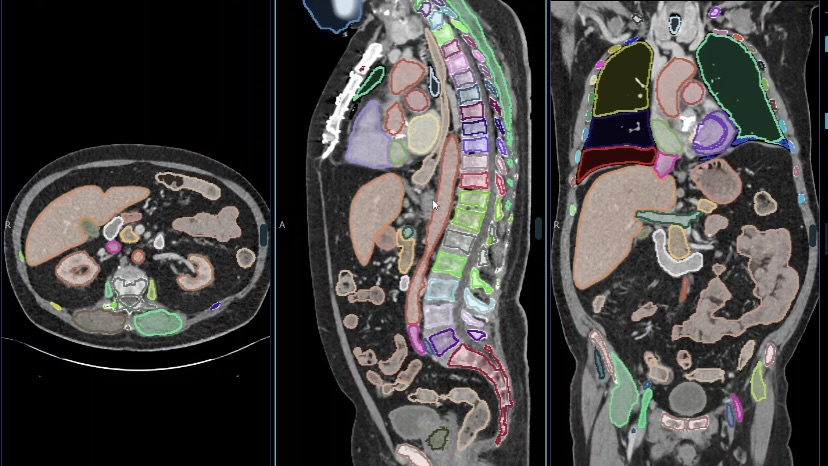

5. **Education**: Enhances learning through interactive and immersive graphics, such as educational games or virtual classrooms.
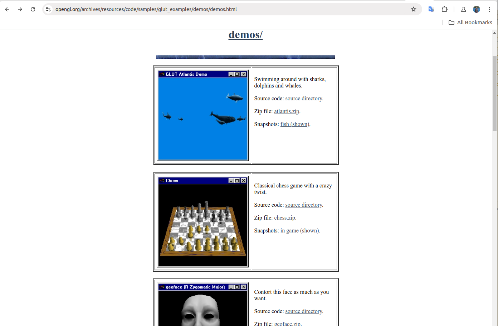

6. **Simulations**: Used in flight simulators, military training, or industrial simulations to recreate real-world scenarios for testing and training.

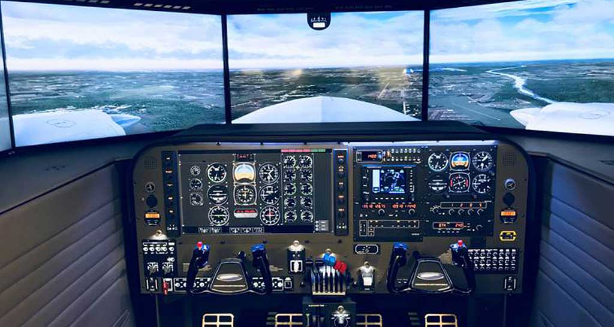

Computer graphics is a vast and multi-faceted field that continues to evolve rapidly, particularly with the advancement of real-time rendering techniques, machine learning, and artificial intelligence. 


## Visualize Data from Data Analysis

Statistician professor Edward Tufte described Charles Joseph Minard's 1869 graphic of Napoleonic France's invasion of Russia as what "may well be the best statistical graphic ever drawn", noting that it captures six variables in two dimensions.

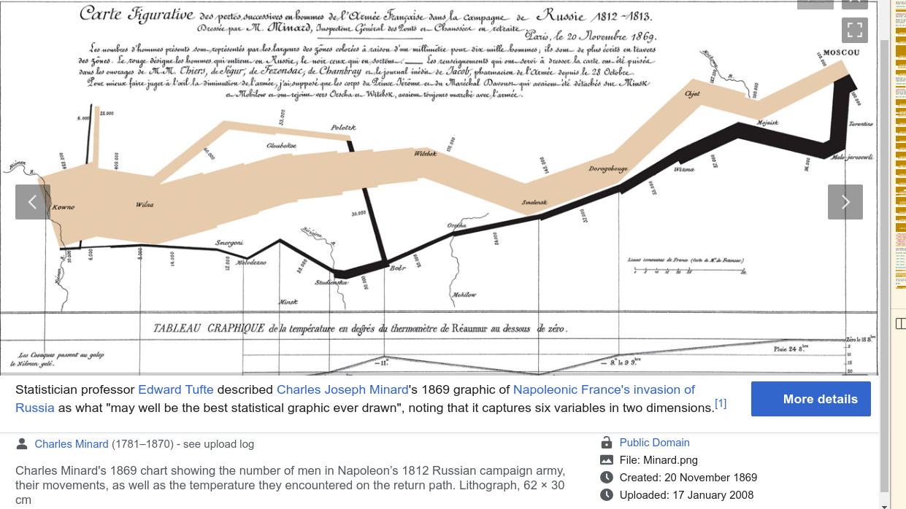

When we study data science, Machine Learning or any fundamental python or data programming, we might have been learning a little bit or heard about the following Python libraries for data visualization.

Data Visualization has become an indispensable parts of the data science including ML and any business key metrics.
We need to learn not only various charting types as regard with what they are and what they are best used for but also to learn some emerging new chart types. But anyhow, in the following section, we are going to unearth some of these python libraries and give you some idea how the commercial software have been built with these underlined libraries behind the scene including Python and Javascript.

### Matplotlib

Matplotlib is a Python plotting library that provides a MATLAB-like interface. Here are a few examples of how to create plots using Matplotlib that resemble MATLAB plots:

**Line Plot**

```python
import matplotlib.pyplot as plt
import numpy as np

# Generate some data
x = np.linspace(0, 10, 100)
y = np.sin(x)

# Create the plot
plt.plot(x, y)
plt.xlabel('x')
plt.ylabel('y')
plt.title('Sine Wave')
plt.grid(True)
plt.show()
```

**Scatter Plot**

```python
import matplotlib.pyplot as plt
import numpy as np

# Generate some random data
x = np.random.rand(100)
y = np.random.rand(100)

# Create the plot
plt.scatter(x, y)
plt.xlabel('x')
plt.ylabel('y')
plt.title('Scatter Plot')
plt.grid(True)
plt.show()
```

**Bar Plot**

```python
import matplotlib.pyplot as plt
import numpy as np

# Create some data
categories = ['A', 'B', 'C', 'D']
values = [10, 25, 15, 30]

# Create the plot
plt.bar(categories, values)
plt.xlabel('Categories')
plt.ylabel('Values')
plt.title('Bar Chart')
plt.grid(True)
plt.show()
```

**Histogram**

```python
import matplotlib.pyplot as plt
import numpy as np

# Generate some random data
data = np.random.randn(1000)

# Create the plot
plt.hist(data, bins=20)
plt.xlabel('Value')
plt.ylabel('Frequency')
plt.title('Histogram')
plt.grid(True)
plt.show()
```


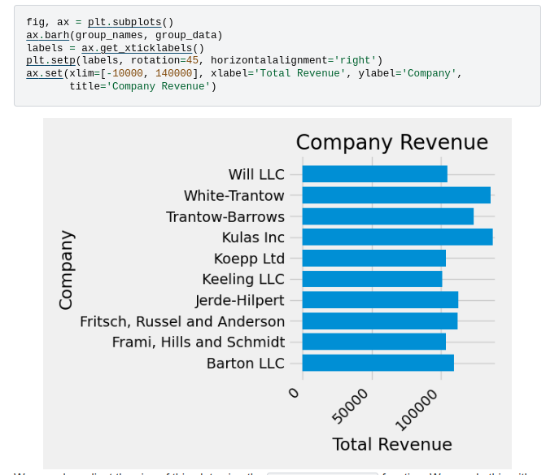

### Seaborn


## D3 - A JavaScript Visualization Library for the Web Development

Apache ECharts, which is an open-source visualization library used to create interactive charts. It supports a variety of charts such as line charts, bar charts, pie charts, scatter plots, heatmaps, etc. ECharts is highly customizable and can be used in web applications, integrating well with JavaScript frameworks like React, Vue, and Angular.


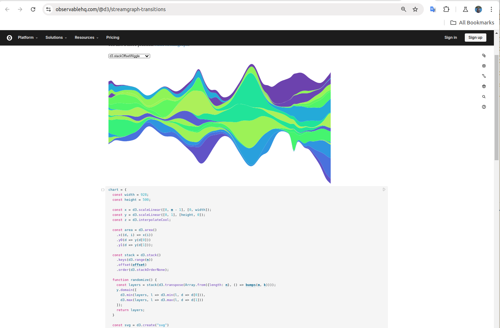


## Apache Echarts

Apache ECharts is an open-source visualization library used to create interactive charts. It supports a variety of charts such as line charts, bar charts, pie charts, scatter plots, heatmaps, etc. ECharts is highly customizable and can be used in web applications, integrating well with JavaScript frameworks like React, Vue, and Angular.

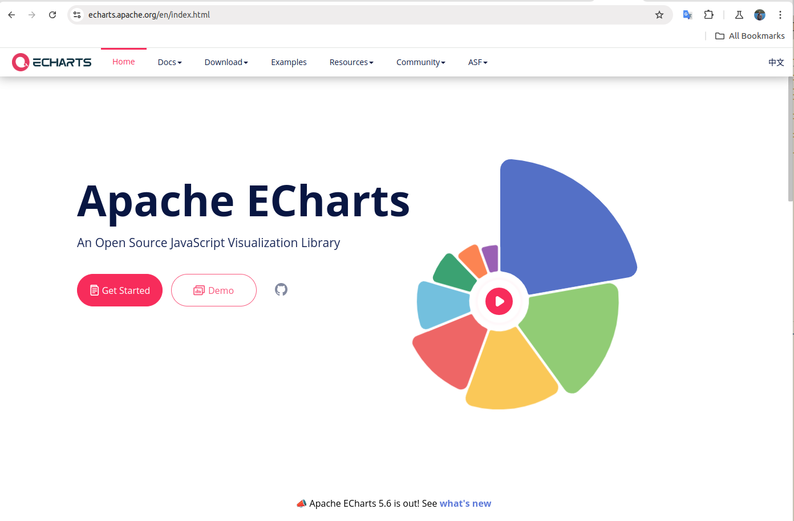

It provides rich and slick charting libraries to visualize data,


The following image shows the syntax & code on the left, and the effect on the right.


## Visualization is everywhere

In this section, I would like to show you a wide range of software systems(commercial software) that could do data visualization. As a matter of fact, data visualization has become a great selling-point for these commercial softwares.

You might be wondering why there are so many commercial software doing visualization or in another word, there are less open-source visualization software as thorough as commercials. The reason behind is that, there are a lot of software development efforts to analyze the market's real needs and putting a lot of capital efforts to implement such softwares.

The following are a group of the most popular and famous commercial softwares we have seen in the market and each of them are serving for different purpose but most likely they are all using different charts and behind the charts are the data science and mathematics to accure and aggrate the data. It is more visual to give customers an idea what is going on.

## **Grafana**

Grafana is an open-source data visualization and monitoring platform that allows you to create interactive and customizable dashboards. It is commonly used for visualizing time-series data, particularly for infrastructure monitoring, application performance, and system observability. Grafana supports a wide variety of data sources, including:

1. **Prometheus** – for monitoring and alerting.
2. **Elasticsearch** – for log and event data.
3. **InfluxDB** – for time-series data.
4. **MySQL, PostgreSQL** – for relational data sources.
5. **Cloud services** like AWS, Azure, and Google Cloud.


Grafana provides various visualization options, such as graphs, tables, heatmaps, and alerting capabilities. It is widely used for real-time monitoring dashboards and provides features like:

- **Alerts**: You can set up rules to trigger notifications based on certain thresholds or conditions.
- **Dashboard sharing**: Dashboards can be shared with teams or publicly.
- **User access control**: Granular permissions for dashboard views and settings.
- **Plugins**: Grafana supports plugins to extend its functionality, including new visualization options, data sources, and apps.

Grafana also integrates with other tools like Loki for log aggregation and Tempo for tracing.

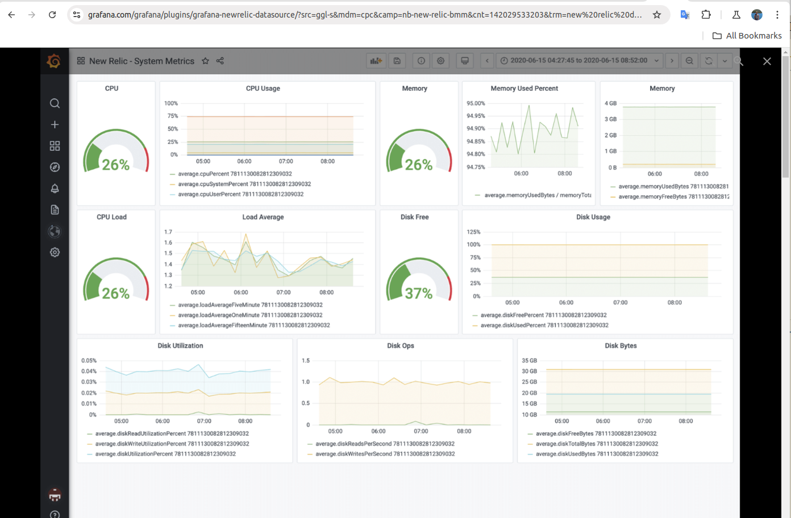

## **Data Dog**


**Datadog** is a cloud-based monitoring and analytics platform primarily designed to provide observability into infrastructure, applications, and log data. It helps organizations monitor the health and performance of their applications and services in real-time. Datadog collects, analyzes, and visualizes various metrics and traces to enable proactive monitoring, troubleshooting, and optimization.

Key features of **Datadog** include:

* 1. **Infrastructure Monitoring**:
   - Datadog provides visibility into server health, cloud environments, containers, databases, and services. It allows monitoring of metrics like CPU usage, memory, disk space, network throughput, and more.
   - It integrates with cloud providers like AWS, Azure, and Google Cloud, as well as container orchestrators like Kubernetes.

* 2. **Application Performance Monitoring (APM)**:
   - Datadog offers distributed tracing and APM to monitor the performance of applications and microservices.
   - It allows you to visualize and trace requests across various services to identify performance bottlenecks and optimize response times.

* 3. **Log Management**:
   - Datadog collects and indexes logs from various sources, providing insights into the behavior and performance of applications and services.
   - Logs are integrated with metrics and traces for full-stack observability, enabling faster root-cause analysis.

* 4. **Synthetic Monitoring**:
   - You can simulate user traffic to test the availability and performance of your web applications from different geographic locations.
   - This helps ensure optimal end-user experience by monitoring uptime and response time of critical services.

* 5. **Security Monitoring**:
   - Datadog includes features for security monitoring, allowing you to track vulnerabilities, detect anomalies, and correlate security incidents with infrastructure and application performance data.

* 6. **Dashboards & Visualizations**:
   - Datadog provides customizable dashboards where you can visualize data from multiple sources (metrics, logs, traces) in a unified view.
   - It offers advanced features for filtering, grouping, and alerting on metrics and logs.

* 7. **Alerting & Notification**:
   - You can set up alerting rules based on various thresholds or anomalies in your data. Alerts can trigger notifications through email, Slack, PagerDuty, or other integrations.

* 8. **Integrations**:
   - Datadog has a rich ecosystem of integrations with over 450 technologies, including databases, web servers, cloud services, and messaging systems. It integrates seamlessly with popular tools like Kubernetes, Docker, AWS, and Microsoft Azure.

* 9. **Collaboration Features**:
   - Datadog supports collaboration among teams by sharing dashboards, reports, and alerting configurations.
   - Teams can work together on issues and incidents, with centralized access to monitoring data.

* 10. **Machine Learning**:
   - Datadog includes anomaly detection powered by machine learning, which automatically identifies abnormal behavior in your systems based on historical data, helping to detect potential issues before they escalate.

Datadog is widely used in DevOps environments and by companies adopting cloud-native architectures due to its flexibility and extensive integration options. It supports monitoring of containers, serverless environments, and microservices, making it suitable for both traditional and modern application architectures.

## **Dynatrace**

**Dynatrace** is a leading software intelligence platform designed for application performance monitoring (APM), infrastructure monitoring, and digital experience management. It is widely used for providing deep observability into complex, cloud-native environments, enabling enterprises to monitor, optimize, and manage the performance of their applications, infrastructure, and user experience.

Here are the key features and capabilities of **Dynatrace**:

* 1. **Full-stack Monitoring**:

- **Dynatrace** provides end-to-end monitoring of applications, microservices, containers, databases, and infrastructure across hybrid and multi-cloud environments.

- It automatically discovers and maps your entire technology stack (from front-end applications to back-end services and infrastructure) to provide visibility into system dependencies.

* 2. **Application Performance Monitoring (APM)**:
- **Dynatrace APM** offers deep insights into the performance of your applications, including distributed tracing, transaction analysis, and code-level diagnostics.

- It provides real-time data on application response times, throughput, errors, and bottlenecks to help identify and resolve issues quickly.

* 3. **AI-powered Root Cause Analysis**:

- **Dynatrace** leverages artificial intelligence (AI) and machine learning to automatically detect anomalies, performance issues, and root causes across your entire environment.

- Its **Davis AI** engine uses intelligent algorithms to proactively identify performance problems and help pinpoint the underlying cause, significantly reducing the time required for troubleshooting.

* 4. **Cloud and Hybrid Monitoring**:

- Dynatrace offers powerful monitoring capabilities for cloud platforms (such as AWS, Azure, Google Cloud) and on-premises environments, enabling seamless hybrid cloud observability.

- It provides visibility into cloud services like Kubernetes, containerized applications, serverless functions, and microservices architectures.

* 5. **Infrastructure Monitoring**:

- **Dynatrace** can monitor servers, virtual machines (VMs), and cloud infrastructure in real-time, tracking critical metrics like CPU usage, memory consumption, disk space, and network traffic.

- It integrates with cloud providers like AWS, Azure, and Google Cloud, as well as with virtualization technologies like VMware and OpenStack.

* 6. **Digital Experience Monitoring (DEM)**:

- **Dynatrace** enables digital experience monitoring, focusing on tracking the user experience for web and mobile applications.

- It uses **real-user monitoring (RUM)** and synthetic monitoring to measure and optimize page load times, user interactions, and application availability from a global perspective.

- It also offers session replay to better understand user behavior and pinpoint usability issues.

* 7. **Distributed Tracing**:

- Dynatrace supports **distributed tracing**, allowing you to trace requests across services and microservices to understand the flow of transactions through your environment.

- It provides full visibility into the request life cycle from front-end to back-end, making it easier to detect and resolve performance bottlenecks.

* 8. **Log Management**:

- Dynatrace allows you to collect, analyze, and correlate logs from applications, infrastructure, and services.

- Logs are seamlessly integrated with monitoring data (metrics, traces, and events), providing a complete picture of the system’s behavior for troubleshooting and observability.

* 9. **Automated Monitoring**:

- **Dynatrace** automates the discovery and monitoring of services and infrastructure, which eliminates the need for manual configuration and custom instrumentation.

- It provides out-of-the-box monitoring for a wide variety of technologies, including Kubernetes, Docker, AWS Lambda, and more.

* 10. **Advanced Dashboards and Visualization**:

- Dynatrace provides customizable dashboards for visualizing key performance metrics, logs, and traces.

- It allows you to create high-level overviews or drill down into specific details for any part of your system, providing insights into everything from user experience to infrastructure health.

* 11. **Automation and Integrations**:

- Dynatrace integrates with various automation and incident management tools, such as ServiceNow, PagerDuty, Slack, and more, for enhanced collaboration and streamlined incident response.

- It also integrates with CI/CD pipelines, enabling DevOps teams to monitor and improve application performance during the development lifecycle.

* 12. **Security Monitoring**:

- Dynatrace includes security monitoring to help detect vulnerabilities and potential security threats.

- It provides visibility into vulnerabilities in your application stack and helps secure cloud-native environments through threat intelligence and real-time monitoring.

* 13. **SaaS or Managed Deployment**:

- **Dynatrace** offers both a Software-as-a-Service (SaaS) deployment model and the option for managed deployment on your own infrastructure, giving flexibility to suit different organizational needs.

* 14. **Scalability and Cloud-Native Support**:

- Dynatrace is designed to scale with modern, dynamic cloud environments, including Kubernetes, containerized applications, and serverless computing.

- It provides visibility across large, distributed systems, automatically adjusting to changes in your environment.

Dynatrace’s **AI-driven insights** and automated monitoring capabilities make it an ideal choice for organizations looking to manage complex, large-scale applications and infrastructures with minimal manual intervention.

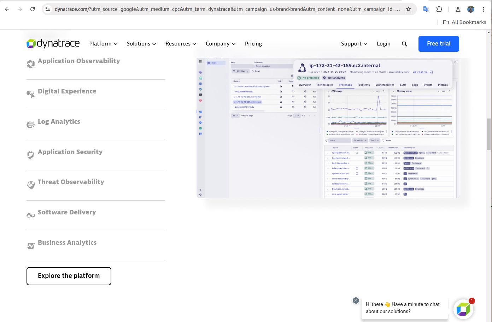

## **Databricks**

**Databricks** is a cloud-based platform designed to facilitate big data analytics and machine learning. It provides a unified environment for data engineers, data scientists, and business analysts to collaborate and streamline the process of building, deploying, and managing data-driven applications.

Databricks was founded by the creators of **Apache Spark**, an open-source, distributed computing system, and has become a key player in the data engineering and data science spaces, especially for organizations working with large-scale data in cloud environments.

Here are the key features and capabilities of **Databricks**:

* 1. **Unified Data Analytics Platform**:
- Databricks integrates data engineering, data science, and machine learning workflows into a single platform, enabling teams to work together seamlessly.

- It provides a collaborative environment for building, training, and deploying machine learning models, as well as analyzing large datasets.

* 2. **Apache Spark Integration**:

- Databricks is built on top of **Apache Spark**, providing a scalable, high-performance engine for processing large volumes of data. It supports both batch and real-time processing of structured and unstructured data.

- Spark enables distributed computing, making it suitable for big data analytics tasks like ETL (Extract, Transform, Load), data cleaning, aggregations, and complex analytics.

* 3. **Collaborative Notebooks**:

- Databricks provides **notebooks** (similar to Jupyter notebooks) that allow data scientists and analysts to write, document, and execute code interactively in languages like Python, Scala, SQL, and R.

- These notebooks support rich visualizations, inline dhttps://en.wikipedia.org/wiki/Data_and_information_visualization

* 9. **Databricks Runtime**:

- Databricks provides a custom runtime environment called **Databricks Runtime** that optimizes Apache Spark performance for specific workloads, such as ML or SQL queries.

- It includes performance enhancements and built-in libraries for various big data and machine learning tasks, ensuring faster data processing and lower operational overhead.

* 10. **Data Lakehouse Architecture**:

- Databricks promotes the **Lakehouse architecture**, which combines the best of data lakes (flexible storage, scalability) and data warehouses (structured, reliable analytics).

- Using Delta Lake, Databricks enables the use of a unified storage layer that supports both batch and streaming data processing with strong consistency guarantees, making it easier for businesses to store, manage, and analyze data without moving between different systems.

* 11. **Collaborative Data Science and ML Ops**:

- Databricks enables data scientists and data enghttps://en.wikipedia.org/wiki/Data_and_information_visualization

- Databricks SQL is a fully managed service designed for running fast, interactive SQL queries on large datasets. It supports Delta Lake tables and provides a robust SQL interface for business analysts and data scientists.

Databricks is often used by data teams to accelerate the process of building and deploying data-driven applications, creating real-time analytics solutions, and performing large-scale machine learning experiments. It is especially well-suited for organizations working with big data, complex data pipelines, and AI/ML workloads.

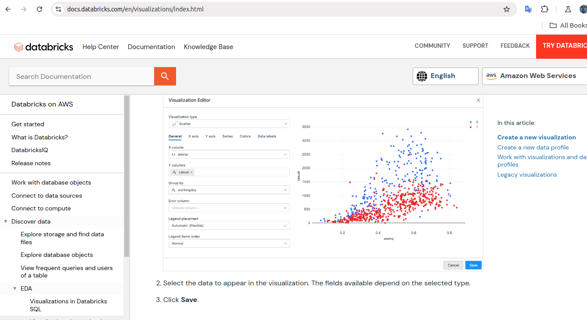

## **Snowflake**

**Snowflake** is a cloud-based data warehousing platform designed to enable organizations to store and analyze large volumes of data in a scalable, flexible, and secure way. It is known for its simplicity, high performance, and ability to handle both structured and semi-structured data, making it a popular choice for businesses across various industries looking to optimize their data analytics workflows.

Here are the key features and capabilities of **Snowflake**:

* 1. **Cloud-Native Architecture**:
   - Snowflake is built for the cloud and operates on public cloud platforms like **Amazon Web Services (AWS)**, **Microsoft Azure**, and **Google Cloud Platform (GCP)**.
   - It is a fully managed service, which means Snowflake handles infrastructure management, including scaling, maintenance, and optimizations, so users can focus on their data tasks.

* 2. **Data Warehouse and Data Lake Integration**:
   - Snowflake combines the benefits of both **data warehouses** and **data lakes**, often referred to as the **data cloud**.
   - You can store and process structured data (e.g., relational data) and semi-structured data (e.g., JSON, Parquet, Avro) in the same platform, making it versatile for various types of workloads.
   - It uses **structured storage** for relational data and **variant data types** for semi-structured data, allowing for seamless querying and analysis.

* 3. **Separation of Storage and Compute**:
   - Snowflake separates storage from compute, meaning you can scale them independently based on your needs. This allows for cost optimization because you only pay for the storage and computing power you actually use.
   - The **compute layer** provides virtual warehouses that perform tasks like querying, data loading, and transformation, while the **storage layer** holds all the data in a centralized location.

* 4. **Elastic Scaling**:
   - Snowflake provides automatic scaling, meaning it can dynamically adjust the amount of compute resources allocated to workloads based on demand.
   - It supports **multi-cluster virtual warehouses**, allowing different teams or workloads to run concurrently without performance degradation. This means that users can scale up or down depending on the workload's needs.

* 5. **SQL-Based Querying**:
   - Snowflake uses SQL as its primary query language, making it easy for analysts and data engineers to interact with the data using standard SQL syntax.
   - Snowflake also supports **ANSI SQL**, so users can leverage their existing SQL knowledge to write queries and manage data.

* 6. **Zero-Copy Cloning**:
   - Snowflake allows users to create **zero-copy clones** of databases, tables, and schemas. This enables teams to quickly create replicas of datasets without consuming additional storage.
   - This feature is valuable for scenarios like testing, staging, or exploring new features, without needing to replicate or copy data physically.

* 7. **Data Sharing**:
   - Snowflake offers a unique **data sharing** feature, enabling organizations to securely share live data with external partners, customers, or other teams without moving the data.
   - You can share **read-only** access to specific datasets with authorized users, facilitating collaboration while ensuring data security.

* 8. **Semi-Structured Data Support**:
   - Snowflake is capable of natively handling **semi-structured data** formats such as **JSON**, **Avro**, **XML**, and **Parquet**. You don’t need to pre-process or flatten this data before loading it into Snowflake.
   - The platform automatically optimizes storage and querying of semi-structured data using its built-in **variant** data type, making it easy to query nested data without complex transformations.

* 9. **Time Travel**:
   - Snowflake's **Time Travel** feature allows users to access historical data at any point in the past, even if it has been modified or deleted.
   - This feature supports data recovery, auditing, and historical analysis, which is valuable for compliance and troubleshooting.

* 10. **Automatic Data Optimization**:
   - Snowflake automatically optimizes and compresses data, using techniques like **automatic clustering** and **micro-partitioning**. This means that you don’t have to manually tune your data storage for performance.
   - The platform also takes care of partitioning large datasets and automatically handles indexing and optimization without requiring manual intervention.

* 11. **Data Integration and ETL**:
   - Snowflake supports **ETL** (Extract, Transform, Load) workflows, allowing users to integrate and process data from various sources.
   - Snowflake integrates with a variety of ETL tools like **Apache NiFi**, **Fivetran**, **Talend**, and more, for automated data integration and transformation.
   - Additionally, Snowflake has native connectors and supports **streaming data** ingestion for real-time analytics.

* 12. **Security Features**:
   - Snowflake provides robust **security** features, including data encryption, role-based access control (RBAC), and multi-factor authentication (MFA).
   - Data is automatically encrypted in transit and at rest using strong encryption standards (e.g., AES-256).
   - Snowflake also supports **network policies**, **virtual private networks (VPNs)**, and integration with cloud-native security tools to control access and prevent unauthorized data access.

* 13. **Support for Machine Learning and Data Science**:
   - Snowflake supports data science workloads, making it easy to integrate with popular machine learning frameworks like **TensorFlow**, **scikit-learn**, **Python**, and **R**.
   - It also integrates with third-party ML tools and platforms (such as **DataRobot**, **H2O.ai**, and **MLflow**) to accelerate machine learning model training and deployment.

* 14. **Serverless Compute for Specific Use Cases**:
   - Snowflake provides **serverless compute** options, such as **Snowpipe** for continuous data ingestion and loading.
   - This allows for the seamless flow of data from various sources into Snowflake without requiring dedicated compute clusters or manual provisioning.

* 15. **Marketplace**:
   - Snowflake has a **data marketplace** where users can buy and sell data and analytics services. This provides access to third-party data sets and insights, helping organizations augment their existing datasets for analysis.
   - The marketplace also supports sharing datasets between Snowflake users, further enhancing collaboration and access to data.

* Snowflake Use Cases:

- **Data Warehousing**: Traditional use cases for Snowflake involve consolidating data from multiple sources into a centralized data warehouse for analytics and reporting.
- **Data Lake**: Snowflake is also used as a data lake for storing unstructured and semi-structured data, such as logs, IoT data, and JSON files.
- **Real-Time Analytics**: Organizations use Snowflake for real-time analytics, where it handles both batch and streaming data.
- **Business Intelligence (BI)**: With its integration with BI tools, Snowflake is often used to support dashboards, reporting, and analytics workflows.
- **Data Sharing**: Snowflake is a popular choice for sharing data between departments, organizations, and external partners without physically moving the data.

Snowflake’s ease of use, scalability, and performance make it an attractive choice for businesses looking to leverage cloud data solutions without the complexity of managing on-premise data warehouses.

Snowflake uses the above programming language's libraries such as python and Javascript to visualize data.

Programming libraries supported by Snowflake,


Certain syntax of a programming language to visualize a bar chart,

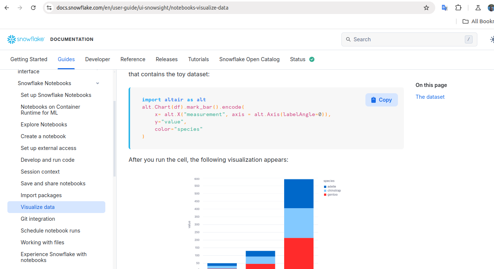

Python syntax to simplify programming,


The following shows you the Python's Seanborn library to visualize in the snowflake,

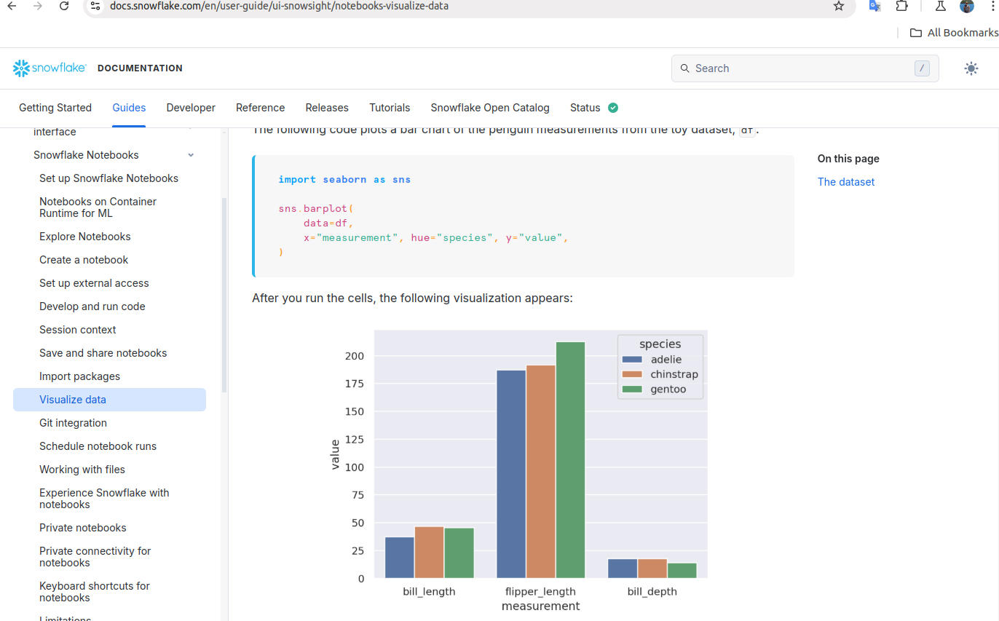

## Visualization in Business Application

Since we are business major, we are more interested in learning more specialized softwares such as Tableau and PowerBI.
In the next few classes we will be learning a little more about these two softwares.

* Tableau

Please see more introduction of Tableau in the next few chapters,

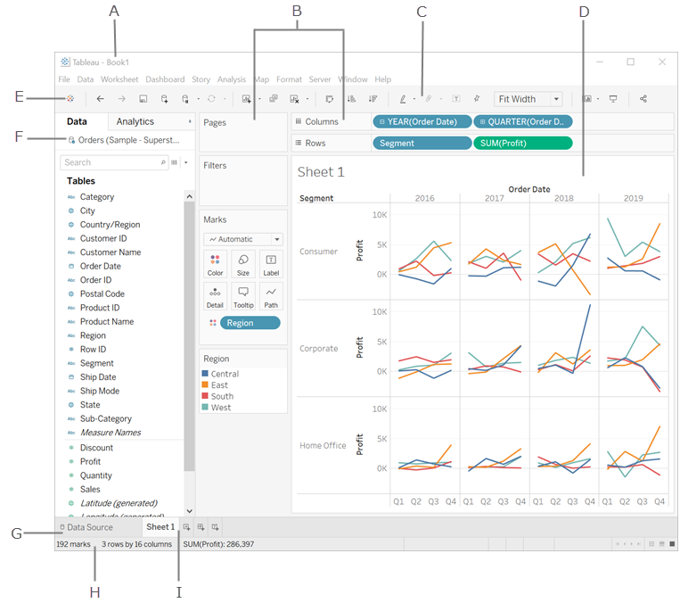

* PowerBI

PowerBI is another popular data analysis and visualization platform,
Please see more in the next few chapters.


## Ref

- https://en.wikipedia.org/wiki/Data_and_information_visualization
- chatGPT