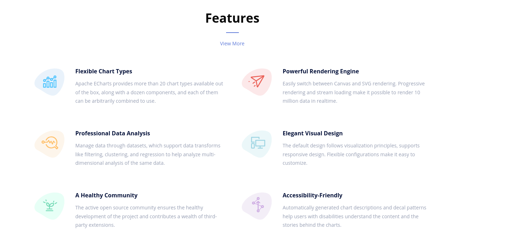
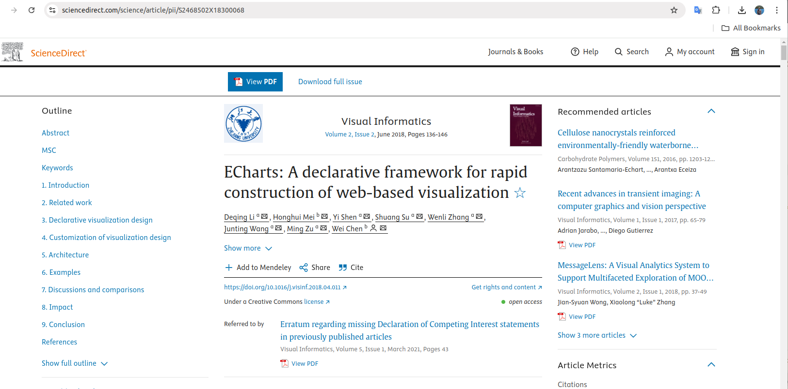
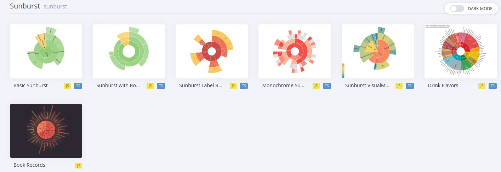
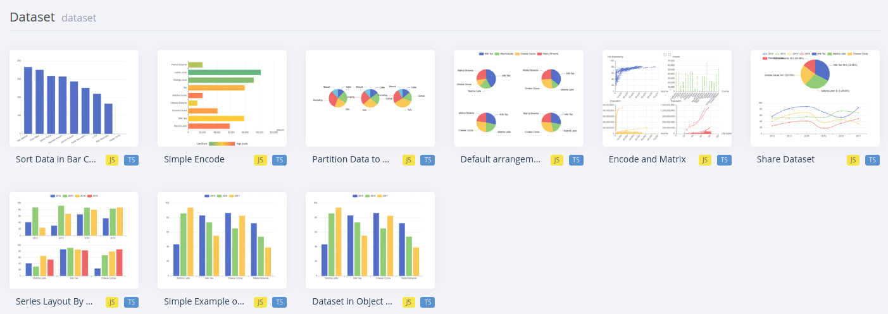
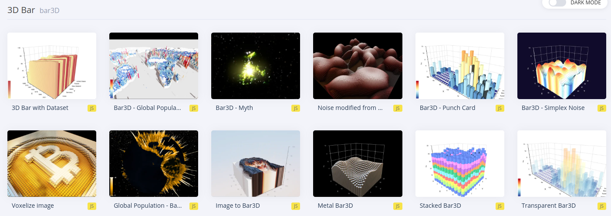
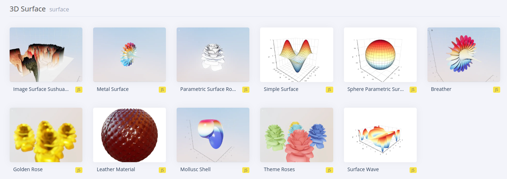
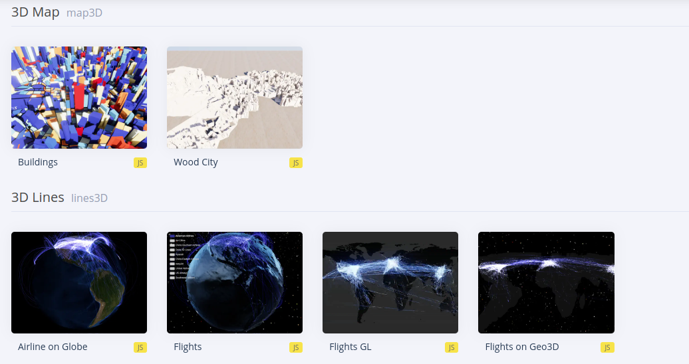
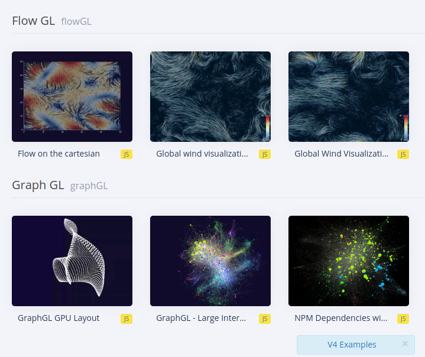
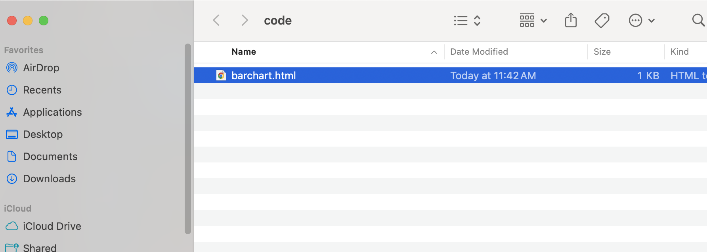
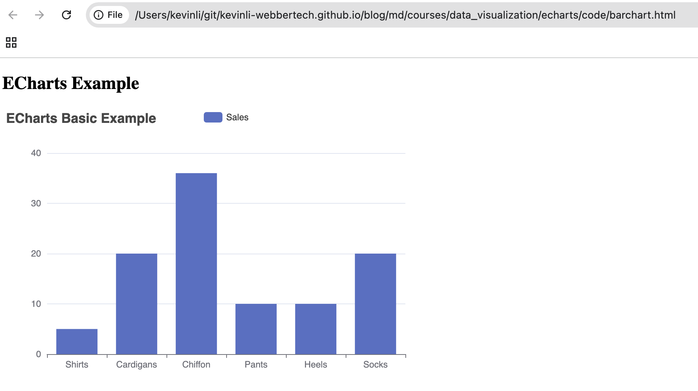

# Introduction to Apache ECharts

## What is Echarts

**Apache ECharts**

Apache ECharts is an open-source, powerful, and interactive data visualization library developed by the Apache Software Foundation. It is written in JavaScript and provides a highly customizable way to create a variety of charts and graphs.


## Features

**Rich Chart Types** – Supports bar charts, line charts, pie charts, scatter plots, maps, radar charts, heatmaps, and more.

**High Performance** – Built on canvas (instead of SVG), making it efficient for large datasets.

**Responsive & Interactive** – Supports zooming, tooltips, data highlighting, and real-time updates.

**Extensible** – Allows customization with themes and plugins.
Works with Multiple Frameworks – Supports Vanilla JavaScript, React, Vue, and Angular.

**Cross-platform** – Works in browsers and Node.js environments.




## ECharts: A Declarative Framework for Rapid Construction of Web-based Visualization


[ECharts: A Declarative Framework for Rapid Construction of Web-based Visualization](https://www.sciencedirect.com/science/article/pii/S2468502X18300068)



Examples of ECharts chart types. From top to down, left to right: scatterplot, line chart, candle-stick charts, geomap, radar chart, node-link graph, heatmap, tree diagram, sankey diagram, parallel coordinates, gauge chart, treemap.


## Who uses ECharts


## Powerful Visualization Capabilities

Here are some examples that you can see the richess of the chart types it offered,

### Radar charts


### GEO MAP


### Candle Stick


### Boxplot


### Heatmap


### Graph


### Lines


### Tree


### Treemap


### Sunburst



### Parallel


### Sankey


### Funnel


### Gauge


### PictorialBar


### Calendar


### Dataset



### 3D Bar



### 3D Scatter


### 3D Surface



### 3D Map



### Flow GL



## Let us run some code

* Save the following into `barchart.html`

```html
<!DOCTYPE html>
<html lang="en">
<head>
  <meta charset="UTF-8">
  <meta name="viewport" content="width=device-width, initial-scale=1.0">
  <title>ECharts Example with Vanilla JS</title>
  <script src="https://cdn.jsdelivr.net/npm/echarts@5.4.1/dist/echarts.min.js"></script>
  <style>
    #main {
      width: 600px;
      height: 400px;
    }
  </style>
</head>
<body>
  <h2>ECharts Example</h2>
  <div id="main"></div>

  <script>
    // Initialize the chart
    var chart = echarts.init(document.getElementById('main'));

    // Chart options
    var option = {
      title: {
        text: 'ECharts Basic Example'
      },
      tooltip: {},
      legend: {
        data: ['Sales']
      },
      xAxis: {
        data: ['Shirts', 'Cardigans', 'Chiffon', 'Pants', 'Heels', 'Socks']
      },
      yAxis: {},
      series: [
        {
          name: 'Sales',
          type: 'bar',
          data: [5, 20, 36, 10, 10, 20]
        }
      ]
    };

    // Set the options
    chart.setOption(option);
  </script>
</body>
</html>
```

* Open it with your browser (Chrome or firefox).



* The html will be rendered in the broswer like the following.



**This code:**

* Loads ECharts from a CDN.
* Creates a div element as a container.
* Initializes an ECharts instance and configures a basic bar chart.
* Renders the chart inside the container.

>Hint: For doing any future works, we could,
* modify the above html to fit our need.
* just use the cdn url for the js library of the echarts for the rest of the tutorials.

### Ref

- https://echarts.apache.org/en/index.html