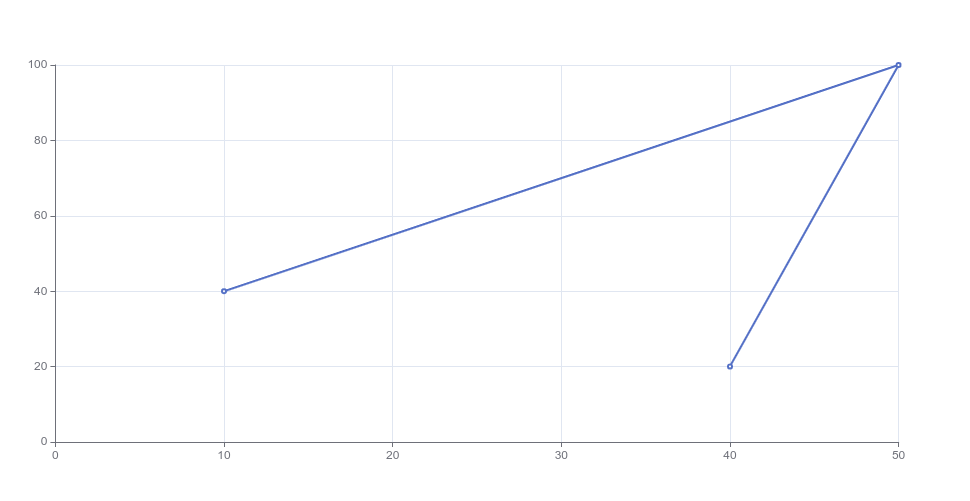
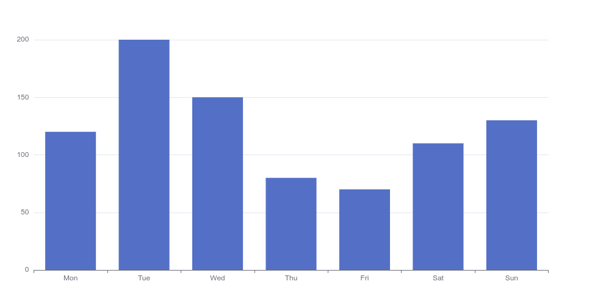
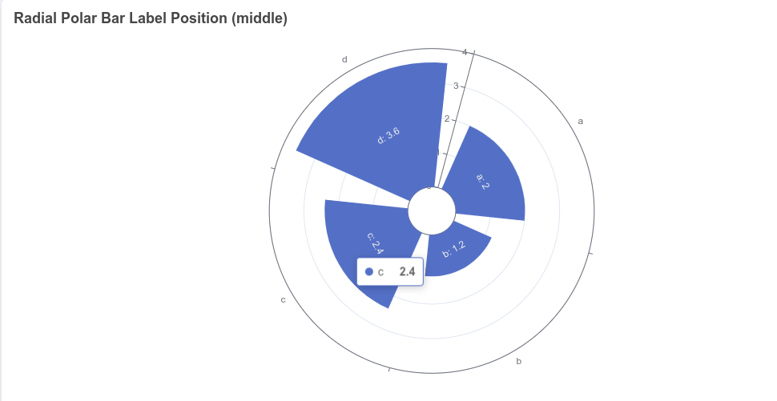
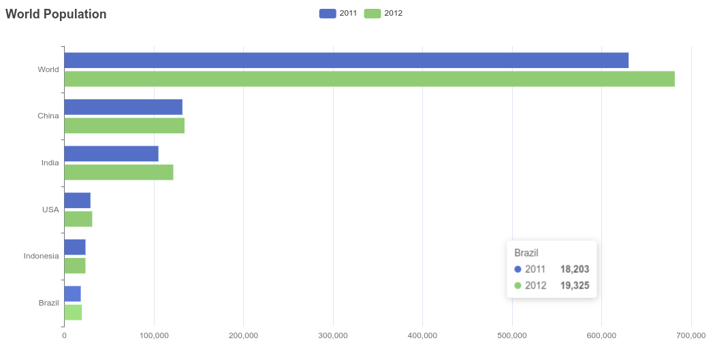
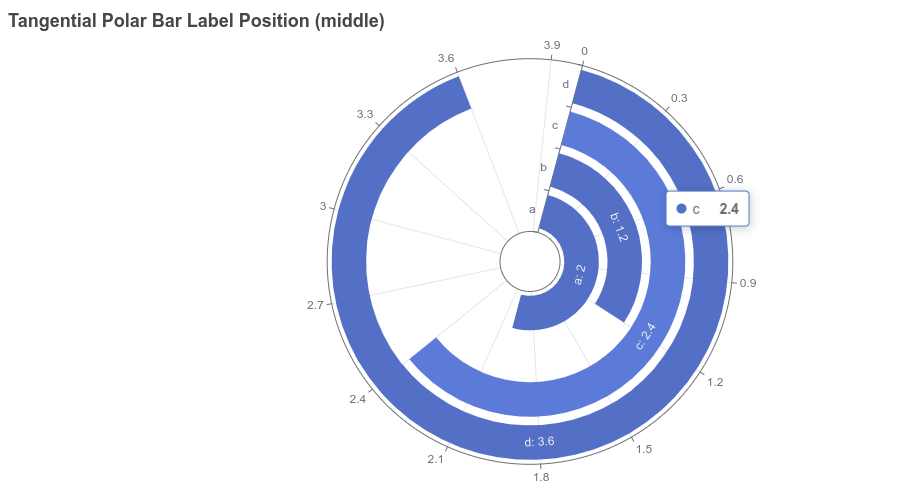
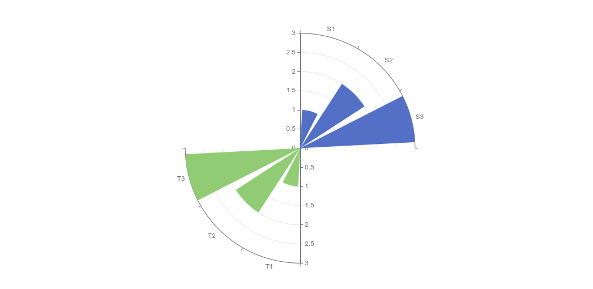

# Visualization with ECharts

In this tutorial, I would like to introduce you some javascript code to call ECharts to draw a couple of most commonly used chart tyeps.

After today's class, you will learn and be more confident about both Javascript and web visualization.

Remember this is the foundation of the implementation of a lot of commercial web systems.

## Takeaway

* Line Chart
  * Basic line chart
  * Smoothed Line Chart
  * Stacked Line Chart
  * Line Gradient
  * Function Plot
  * Line Race
  * Step Line
  * line-in-cartesian-coordinate-system

* Bar Chart
  * Basic Bar
  * bar-polar-label-radial
  * bar-y-category
  * bar-polar-label-tangential
  * polar-endAngle

## Line Chart

### Basic line chart

### Smoothed Line Chart

### Stacked Line Chart

### Line Gradient

### Function Plot

### Line Race

### Step Line

### line-in-cartesian-coordinate-system

```html
option = {
  xAxis: {},
  yAxis: {},
  series: [
    {
      data: [
        [10, 40],
        [50, 100],
        [40, 20]
      ],
      type: 'line'
    }
  ]
};
```



## Bar Chart

### Basic Bar

```html
<!DOCTYPE html>
<html lang="en">
<head>
  <meta charset="UTF-8">
  <meta name="viewport" content="width=device-width, initial-scale=1.0">
  <title>ECharts Example with Vanilla JS</title>
  <script src="https://cdn.jsdelivr.net/npm/echarts@5.4.1/dist/echarts.min.js"></script>
  <style>
    #main {
      width: 600px;
      height: 400px;
    }
  </style>
</head>
<body>
  <h2>ECharts Example</h2>
  <div id="main"></div>

  <script>
    // Initialize the chart
    var chart = echarts.init(document.getElementById('main'));

    option = {
  xAxis: {
    type: 'category',
    data: ['Mon', 'Tue', 'Wed', 'Thu', 'Fri', 'Sat', 'Sun']
  },
  yAxis: {
    type: 'value'
  },
  series: [
    {
      data: [120, 200, 150, 80, 70, 110, 130],
      type: 'bar'
    }
  ]
};

    // Set the options
    chart.setOption(option);
  </script>
</body>
</html>
```



### bar-polar-label-radial

```html
<!DOCTYPE html>
<html lang="en">
<head>
  <meta charset="utf-8">
  <title>Polar endAngle - Apache ECharts Demo</title>

  <style>
    * {
      margin: 0;
      padding: 0;
    }
    #chart-container {
      position: relative;
      height: 100vh;
      overflow: hidden;
    }

  </style>
</head>
<body>
  <div id="chart-container"></div>
  <script src="https://echarts.apache.org/en/js/vendors/echarts/dist/echarts.min.js"></script>

  <script>
    var dom = document.getElementById('chart-container');
    var myChart = echarts.init(dom, null, {
      renderer: 'canvas',
      useDirtyRect: false
    });
      var app = {};

      var option;

      option = {
        title: [
          {
            text: 'Radial Polar Bar Label Position (middle)'
          }
        ],
        polar: {
          radius: [30, '80%']
        },
        radiusAxis: {
          max: 4
        },
        angleAxis: {
          type: 'category',
          data: ['a', 'b', 'c', 'd'],
          startAngle: 75
        },
        tooltip: {},
        series: {
          type: 'bar',
          data: [2, 1.2, 2.4, 3.6],
          coordinateSystem: 'polar',
          label: {
            show: true,
            position: 'middle',
            formatter: '{b}: {c}'
          }
        },
        animation: false
      };


      if (option && typeof option === 'object') {
        myChart.setOption(option);
      }

      window.addEventListener('resize', myChart.resize);
</script>
</body>
</html>
```



### bar-y-category

```html
<!DOCTYPE html>
<html lang="en">
<head>
  <meta charset="utf-8">
  <title>Polar endAngle - Apache ECharts Demo</title>

  <style>
    * {
      margin: 0;
      padding: 0;
    }
    #chart-container {
      position: relative;
      height: 100vh;
      overflow: hidden;
    }

  </style>
</head>
<body>
  <div id="chart-container"></div>
  <script src="https://echarts.apache.org/en/js/vendors/echarts/dist/echarts.min.js"></script>

  <script>
    var dom = document.getElementById('chart-container');
    var myChart = echarts.init(dom, null, {
      renderer: 'canvas',
      useDirtyRect: false
    });
      var app = {};

      var option;

      option = {
      title: {
        text: 'World Population'
      },
      tooltip: {
        trigger: 'axis',
        axisPointer: {
          type: 'shadow'
        }
      },
      legend: {},
      grid: {
        left: '3%',
        right: '4%',
        bottom: '3%',
        containLabel: true
      },
      xAxis: {
        type: 'value',
        boundaryGap: [0, 0.01]
      },
      yAxis: {
        type: 'category',
        data: ['Brazil', 'Indonesia', 'USA', 'India', 'China', 'World']
      },
      series: [
        {
          name: '2011',
          type: 'bar',
          data: [18203, 23489, 29034, 104970, 131744, 630230]
        },
        {
          name: '2012',
          type: 'bar',
          data: [19325, 23438, 31000, 121594, 134141, 681807]
        }
      ]
      };

      if (option && typeof option === 'object') {
        myChart.setOption(option);
      }

      window.addEventListener('resize', myChart.resize);
</script>
</body>
</html>
```



### bar-polar-label-tangential

```html
<!DOCTYPE html>
<html lang="en">
<head>
  <meta charset="utf-8">
  <title>Polar endAngle - Apache ECharts Demo</title>

  <style>
    * {
      margin: 0;
      padding: 0;
    }
    #chart-container {
      position: relative;
      height: 100vh;
      overflow: hidden;
    }

  </style>
</head>
<body>
  <div id="chart-container"></div>
  <script src="https://echarts.apache.org/en/js/vendors/echarts/dist/echarts.min.js"></script>

  <script>
    var dom = document.getElementById('chart-container');
    var myChart = echarts.init(dom, null, {
      renderer: 'canvas',
      useDirtyRect: false
    });
      var app = {};

      var option;

      option = {
  title: [
    {
      text: 'Tangential Polar Bar Label Position (middle)'
    }
  ],
  polar: {
    radius: [30, '80%']
  },
  angleAxis: {
    max: 4,
    startAngle: 75
  },
  radiusAxis: {
    type: 'category',
    data: ['a', 'b', 'c', 'd']
  },
  tooltip: {},
  series: {
    type: 'bar',
    data: [2, 1.2, 2.4, 3.6],
    coordinateSystem: 'polar',
    label: {
      show: true,
      position: 'middle',
      formatter: '{b}: {c}'
    }
  }
};


      if (option && typeof option === 'object') {
        myChart.setOption(option);
      }

      window.addEventListener('resize', myChart.resize);
</script>
</body>
</html>
```



### polar-endAngle

```html
<!DOCTYPE html>
<html lang="en">
<head>
  <meta charset="utf-8">
  <title>Polar endAngle - Apache ECharts Demo</title>

  <style>
    * {
      margin: 0;
      padding: 0;
    }
    #chart-container {
      position: relative;
      height: 100vh;
      overflow: hidden;
    }

  </style>
</head>
<body>
  <div id="chart-container"></div>
  <script src="https://echarts.apache.org/en/js/vendors/echarts/dist/echarts.min.js"></script>

  <script>
    var dom = document.getElementById('chart-container');
    var myChart = echarts.init(dom, null, {
      renderer: 'canvas',
      useDirtyRect: false
    });
      var app = {};

      var option;

      option = {
        tooltip: {},
        angleAxis: [
          {
            type: 'category',
            polarIndex: 0,
            startAngle: 90,
            endAngle: 0,
            data: ['S1', 'S2', 'S3']
          },
          {
            type: 'category',
            polarIndex: 1,
            startAngle: -90,
            endAngle: -180,
            data: ['T1', 'T2', 'T3']
          }
        ],
        radiusAxis: [{ polarIndex: 0 }, { polarIndex: 1 }],
        polar: [{}, {}],
        series: [
          {
            type: 'bar',
            polarIndex: 0,
            data: [1, 2, 3],
            coordinateSystem: 'polar'
          },
          {
            type: 'bar',
            polarIndex: 1,
            data: [1, 2, 3],
            coordinateSystem: 'polar'
          }
        ]
      };


      if (option && typeof option === 'object') {
        myChart.setOption(option);
      }

      window.addEventListener('resize', myChart.resize);
</script>
</body>
</html>

```



## Ref

https://echarts.apache.org/examples/en/index.html#chart-type-bar