# Visualization with Matplotlib

## Simple Scatter Plots

Another commonly used plot type is the simple scatter plot, a close cousin of the line plot. Instead of points being joined by line segments, here the points are represented individually with a dot, circle, or other shape. We’ll start by setting up the notebook for plotting and importing the functions we will use:

```python
In[1]: %matplotlib inline
import matplotlib.pyplot as plt
plt.style.use('seaborn-whitegrid')
import numpy as np
```

## Scatter Plots with plt.plot

In the previous section, we looked at plt.plot/ax.plot to produce line plots. It turns out that this same function can produce scatter plots as well:

```python
In[2]: x = np.linspace(0, 10, 30)
y = np.sin(x)
plt.plot(x, y, 'o', color='black');
```

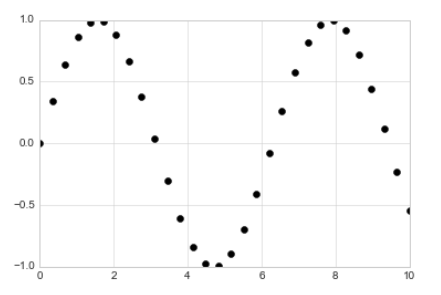

The third argument in the function call is a character that represents the type of symbol used for the plotting. Just as you can specify options such as '-' and '--' to control the line style, the marker style has its own set of short string codes. The full list of available symbols can be seen in the documentation of plt.plot, or in Matplotlib’s online documentation. Most of the possibilities are fairly intuitive, and we’ll show a number of the more common ones here:

```python
In[3]: rng = np.random.RandomState(0)
for marker in ['o', '.', ',', 'x', '+', 'v', '^', '<', '>', 's', 'd']:
plt.plot(rng.rand(5), rng.rand(5), marker,
label="marker='{0}'".format(marker))
plt.legend(numpoints=1)
plt.xlim(0, 1.8);
```

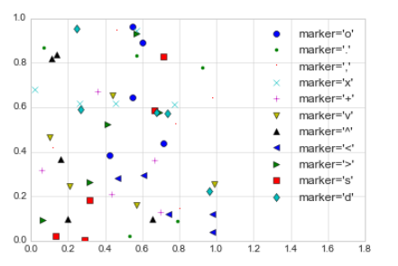

For even more possibilities, these character codes can be used together with line and color codes to plot points along with a line connecting them:

`In[4]: plt.plot(x, y, '-ok');`

### line (-), circle marker (o), black (k)

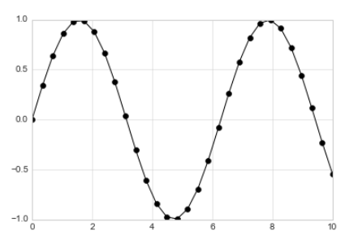

Additional keyword arguments to plt.plot specify a wide range of properties of the lines and markers:

```python
In[5]: plt.plot(x, y, '-p', color='gray',
markersize=15, linewidth=4,
markerfacecolor='white',
markeredgecolor='gray',
markeredgewidth=2)
plt.ylim(-1.2, 1.2);
```

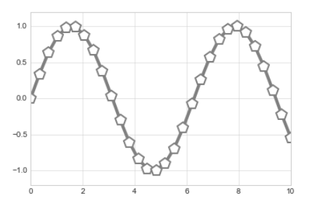

This type of flexibility in the plt.plot function allows for a wide variety of possible visualization options. For a full description of the options available, refer to the plt.plot documentation.

### Scatter Plots with plt.scatter

A second, more powerful method of creating scatter plots is the plt.scatter function, which can be used very similarly to the plt.plot function :

`In[6]: plt.scatter(x, y, marker='o');`

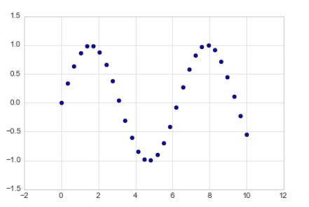

The primary difference of plt.scatter from plt.plot is that it can be used to create scatter plots where the properties of each individual point (size, face color, edge color, etc.) can be individually controlled or mapped to data.

Let’s show this by creating a random scatter plot with points of many colors and sizes.

In order to better see the overlapping results, we’ll also use the alpha keyword to adjust the transparency level:

```python
In[7]: rng = np.random.RandomState(0)
x = rng.randn(100)
y = rng.randn(100)
colors = rng.rand(100)
sizes = 1000 * rng.rand(100)
plt.scatter(x, y, c=colors, s=sizes, alpha=0.3,
cmap='viridis')
plt.colorbar(); # show color scale
```

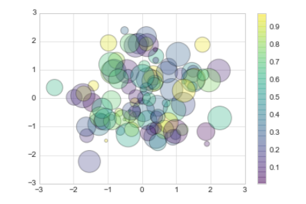

Notice that the color argument is automatically mapped to a color scale (shown here by the colorbar() command), and the size argument is given in pixels. In this way, the color and size of points can be used to convey information in the visualization, in order to illustrate multidimensional data.

For example, we might use the Iris data from Scikit-Learn, where each sample is one of three types of flowers that has had the size of its petals and sepals carefully measured:

```python
In[8]: from sklearn.datasets import load_iris
iris = load_iris()
features = iris.data.T
plt.scatter(features[0], features[1], alpha=0.2,
s=100*features[3], c=iris.target, cmap='viridis')
plt.xlabel(iris.feature_names[0])
plt.ylabel(iris.feature_names[1]);
```

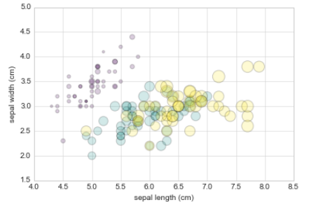

We can see that this scatter plot has given us the ability to simultaneously explore four different dimensions of the data: the (x, y) location of each point corresponds to the sepal length and width, the size of the point is related to the petal width, and the color is related to the particular species of flower. Multicolor and multifeature scatter plots like this can be useful for both exploration and presentation of data.

### plot Versus scatter: A Note on Efficiency 

Aside from the different features available in plt.plot and plt.scatter, why might you choose to use one over the other? While it doesn’t matter as much for small amounts of data, as datasets get larger than a few thousand points, plt.plot can be noticeably more efficient than plt.scatter. The reason is that plt.scatter has the capability to render a different size and/or color for each point, so the renderer must do the extra work of constructing each point individually. In plt.plot, on the other hand, the points are always essentially clones of each other, so the work of determining the appearance of the points is done only once for the entire set of data. For large datasets, the difference between these two can lead to vastly different performance, and for this reason, plt.plot should be preferred over plt.scatter for large datasets.

## Visualizing Errors

For any scientific measurement, accurate accounting for errors is nearly as important, if not more important, than accurate reporting of the number itself. For example, imagine that I am using some astrophysical observations to estimate the Hubble Constant, the local measurement of the expansion rate of the universe. I know that the current literature suggests a value of around 71 (km/s)/Mpc, and I measure a value of 74 (km/s)/Mpc with my method. Are the values consistent? The only correct answer, given this information, is this: there is no way to know.

Suppose I augment this information with reported uncertainties: the current literature suggests a value of around 71 ± 2.5 (km/s)/Mpc, and my method has measured a value of 74 ± 5 (km/s)/Mpc. Now are the values consistent? That is a question that can be quantitatively answered.

In visualization of data and results, showing these errors effectively can make a plot convey much more complete information.

## Basic Errorbars

A basic errorbar can be created with a single Matplotlib function call:

```python
In[1]: %matplotlib inline
import matplotlib.pyplot as plt
plt.style.use('seaborn-whitegrid')
import numpy as np

In[2]: x = np.linspace(0, 10, 50)
dy = 0.8
y = np.sin(x) + dy * np.random.randn(50)
plt.errorbar(x, y, yerr=dy, fmt='.k');
```

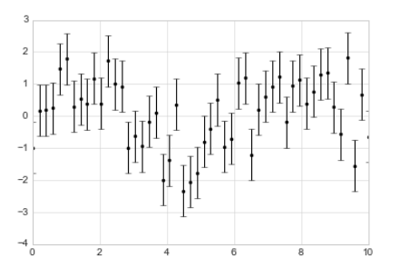

Here the fmt is a format code controlling the appearance of lines and points, and has the same syntax as the shorthand used in plt.plot, outlined in “Simple Line Plots”.

In addition to these basic options, the errorbar function has many options to fine-tune the outputs. Using these additional options you can easily customize the aesthetics of your errorbar plot. I often find it helpful, especially in crowded plots, to make the errorbars lighter than the points themselves:

```python
In[3]: plt.errorbar(x, y, yerr=dy, fmt='o', color='black',
ecolor='lightgray', elinewidth=3, capsize=0);
```

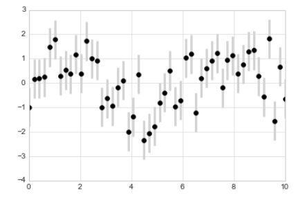

In addition to these options, you can also specify horizontal errorbars (xerr), one sided errorbars, and many other variants. For more information on the options available, refer to the docstring of plt.errorbar.

## Continuous Errors

In some situations it is desirable to show errorbars on continuous quantities. Though Matplotlib does not have a built-in convenience routine for this type of application, it’s relatively easy to combine primitives like plt.plot and plt.fill_between for a useful result.

Here we’ll perform a simple Gaussian process regression (GPR), using the Scikit-Learn API (see “Introducing Scikit-Learn” on page 343 for details). This is a method of fitting a very flexible nonparametric function to data with a continuous measure of the uncertainty. We won’t delve into the details of Gaussian process regression at this point, but will focus instead on how you might visualize such a continuous error measurement:

`In[4]: from sklearn.gaussian_process import GaussianProcess`

### define the model and draw some data

```python
model = lambda x: x * np.sin(x)
xdata = np.array([1, 3, 5, 6, 8])
ydata = model(xdata)
```

### Compute the Gaussian process fit

```python
gp = GaussianProcess(corr='cubic', theta0=1e-2, thetaL=1e-4, thetaU=1E-1,
random_start=100)
gp.fit(xdata[:, np.newaxis], ydata)
xfit = np.linspace(0, 10, 1000)
yfit, MSE = gp.predict(xfit[:, np.newaxis], eval_MSE=True)
dyfit = 2 * np.sqrt(MSE) # 2*sigma ~ 95% confidence region
```

We now have xfit, yfit, and dyfit, which sample the continuous fit to our data. We could pass these to the plt.errorbar function as above, but we don’t really want to plot 1,000 points with 1,000 errorbars. Instead, we can use the plt.fill_between function with a light color to visualize this continuous error:

```python
In[5]: # Visualize the result
plt.plot(xdata, ydata, 'or')
plt.plot(xfit, yfit, '-', color='gray')
plt.fill_between(xfit, yfit - dyfit, yfit + dyfit,
color='gray', alpha=0.2)
plt.xlim(0, 10);
```

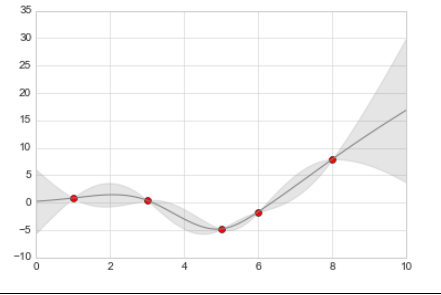

Note what we’ve done here with the fill_between function: we pass an x value, then the lower y-bound, then the upper y-bound, and the result is that the area between these regions is filled.

The resulting figure gives a very intuitive view into what the Gaussian process regression algorithm is doing: in regions near a measured data point, the model is strongly constrained and this is reflected in the small model errors. In regions far from a measured data point, the model is not strongly constrained, and the model errors increase.

For more information on the options available in plt.fill_between() (and the closely related plt.fill() function), see the function docstring or the Matplotlib documentation.

## Density and Contour Plots

Sometimes it is useful to display three-dimensional data in two dimensions using contours or color-coded regions. There are three Matplotlib functions that can be helpful for this task: plt.contour for contour plots, plt.contourf for filled contour plots, and plt.imshow for showing images. This section looks at several examples of using these. We’ll start by setting up the notebook for plotting and importing the functions we will use:

```python
In[1]: %matplotlib inline
import matplotlib.pyplot as plt
plt.style.use('seaborn-white')
import numpy as np
```

## Visualizing a Three-Dimensional Function

We’ll start by demonstrating a contour plot using a function z = f x, y , using the following particular choice for f (we’ve seen this before in “Computation on Arrays: Broadcasting” , when we used it as a motivating example for array broadcasting):

```python
In[2]: def f(x, y):
          return np.sin(x) ** 10 + np.cos(10 + y * x) * np.cos(x)
```

A contour plot can be created with the plt.contour function. It takes three arguments: a grid of x values, a grid of y values, and a grid of z values. The x and y values represent positions on the plot, and the z values will be represented by the contour levels. Perhaps the most straightforward way to prepare such data is to use the np.meshgrid function, which builds two-dimensional grids from one-dimensional
arrays:

```python
In[3]: x = np.linspace(0, 5, 50)
y = np.linspace(0, 5, 40)
X, Y = np.meshgrid(x, y)
Z = f(X, Y)
```

Now let’s look at this with a standard line-only contour plot:

`In[4]: plt.contour(X, Y, Z, colors='black');`

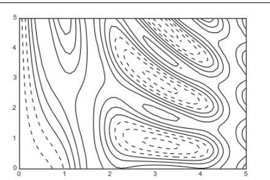

Notice that by default when a single color is used, negative values are represented by dashed lines, and positive values by solid lines. Alternatively, you can color-code the lines by specifying a colormap with the cmap argument. Here, we’ll also specify that we want more lines to be drawn—20 equally spaced intervals within the data range:

`In[5]: plt.contour(X, Y, Z, 20, cmap='RdGy');`

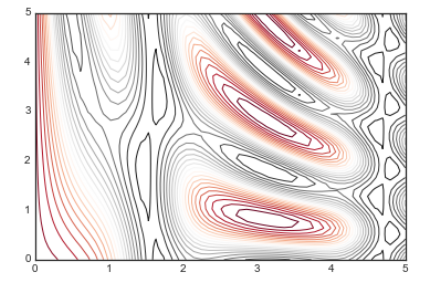

Here we chose the RdGy (short for Red-Gray) colormap, which is a good choice for centered data. Matplotlib has a wide range of colormaps available, which you can easily browse in IPython by doing a tab completion on the plt.cm module: plt.cm.<TAB>

Our plot is looking nicer, but the spaces between the lines may be a bit distracting.

We can change this by switching to a filled contour plot using the `plt.contourf()` function (notice the f at the end), which uses largely the same syntax as `plt.contour()`.

Additionally, we’ll add a plt.colorbar() command, which automatically creates an additional axis with labeled color information for the plot:

```python
In[6]: plt.contourf(X, Y, Z, 20, cmap='RdGy')
plt.colorbar();
```

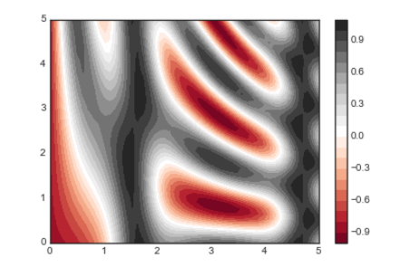

The colorbar makes it clear that the black regions are “peaks,” while the red regions are “valleys.”

One potential issue with this plot is that it is a bit “splotchy.” That is, the color steps are discrete rather than continuous, which is not always what is desired. You could remedy this by setting the number of contours to a very high number, but this results in a rather inefficient plot: Matplotlib must render a new polygon for each step in the level. A better way to handle this is to use the plt.imshow() function, which interprets a two-dimensional grid of data as an image.

```python
In[7]: plt.imshow(Z, extent=[0, 5, 0, 5], origin='lower',
cmap='RdGy')
plt.colorbar()
plt.axis(aspect='image');
```

There are a few potential gotchas with imshow(), however:

* plt.imshow() doesn’t accept an x and y grid, so you must manually specify the extent [xmin, xmax, ymin, ymax] of the image on the plot.

* plt.imshow() by default follows the standard image array definition where the origin is in the upper left, not in the lower left as in most contour plots. This must be changed when showing gridded data.

* plt.imshow() will automatically adjust the axis aspect ratio to match the input data; you can change this by setting, for example, plt.axis(aspect='image') to make x and y units match.

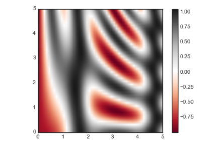

Finally, it can sometimes be useful to combine contour plots and image plots. For example, to create the effect shown in Figure 4-34, we’ll use a partially transparent background image (with transparency set via the alpha parameter) and over-plot contours with labels on the contours themselves (using the plt.clabel() function):

```python
In[8]: contours = plt.contour(X, Y, Z, 3, colors='black')
plt.clabel(contours, inline=True, fontsize=8)
plt.imshow(Z, extent=[0, 5, 0, 5], origin='lower',
cmap='RdGy', alpha=0.5)
plt.colorbar();
```

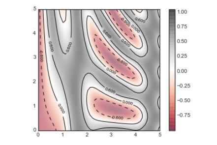

The combination of these three functions—plt.contour, plt.contourf, and
plt.imshow—gives nearly limitless possibilities for displaying this sort of three-dimensional data within a two-dimensional plot. For more information on the options available in these functions, refer to their docstrings.
