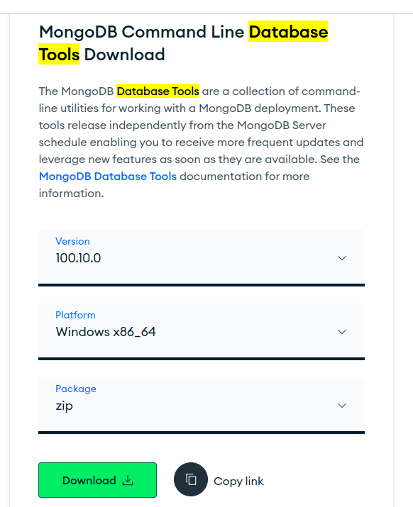
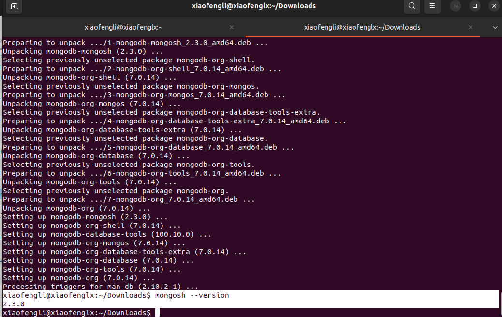
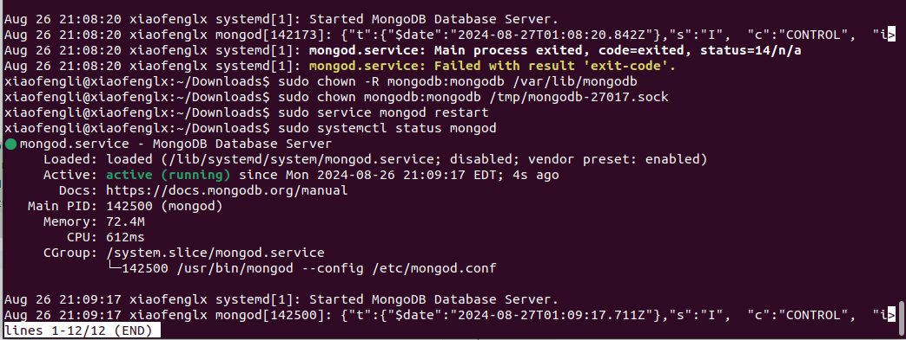
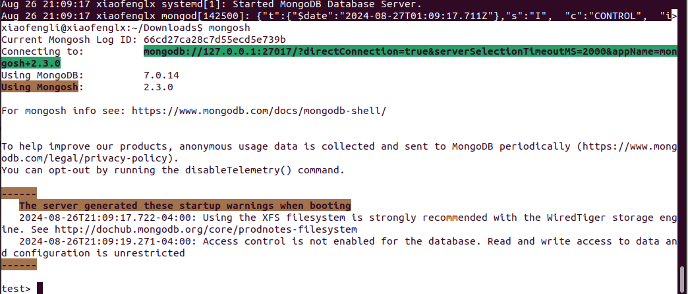
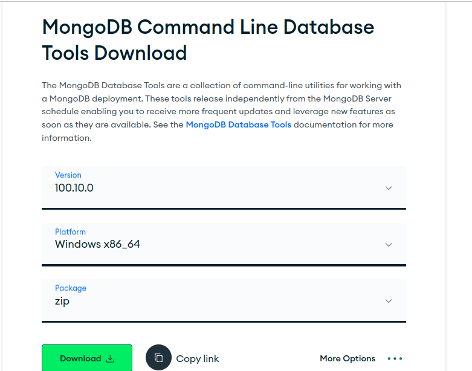
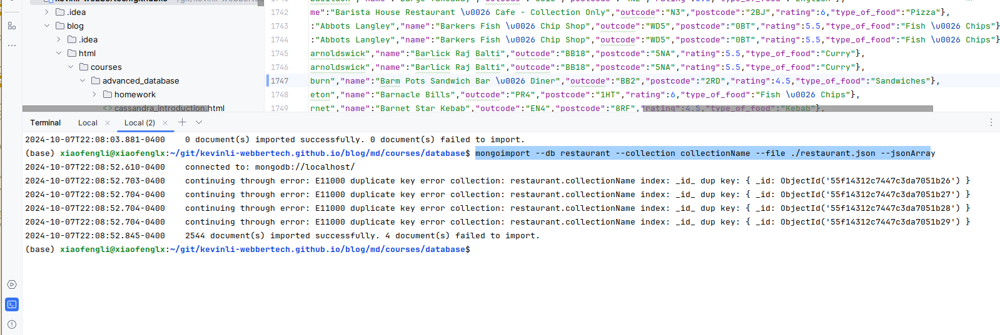

# MongoDB - Literature and Installation

## What is MongoDB?

MongoDB is a popular NoSQL database known for its flexibility, scalability, and ease of use. Unlike traditional relational databases, MongoDB stores data in a flexible, JSON-like format, allowing for more dynamic schemas. In this guide, we'll explore the core concepts, methods, operations, and advanced features you need to know to work effectively with MongoDB.

MongoDB provides a document-oriented data model, meaning data is stored in BSON (Binary JSON) format. It allows for the storage of complex data types, making it highly suitable for modern applications that require flexible and scalable data storage solutions.

## Installation of Mongo

> Please install MongoDB Community Edition not Atlas version.

* Windows

**Download and Install mongodb**

[Windows installation](https://www.mongodb.com/docs/manual/tutorial/install-mongodb-on-windows/)

or this link,

https://www.mongodb.com/try/download/community

Select your windows type,

and the download button should show you something like the following,

https://fastdl.mongodb.org/windows/mongodb-windows-x86_64-8.0.3-signed.msi

**Install database tools**

Go to the following link, choose windows,

https://www.mongodb.com/try/download/database-tools

And download this zip,

https://downloads.mongodb.com/compass/mongosh-2.3.3-win32-x64.zip

**Install database shell**

Go to the following link, choose Windows,

https://www.mongodb.com/try/download/shell

and download this zip,

https://downloads.mongodb.com/compass/mongosh-2.3.3-win32-x64.zip

>Hint: This is only needed by windows user. Not for Mac or Linux users.



https://fastdl.mongodb.org/tools/db/mongodb-database-tools-windows-x86_64-100.10.0.zip

**To Start your service in Windows**

  * To start the server, go to `C:\Program Files\MongoDB\Server\3.2\bin>`,
    enter command `mongod`
  * By default, mongodb server will start at port `27017`


* Mac

[Mac installation](https://www.mongodb.com/docs/manual/tutorial/install-mongodb-on-os-x/)

```shell
$ brew install mongodb-atlas
$ atlas setup
```

**Start your mongodb**

https://www.mongodb.com/docs/manual/tutorial/install-mongodb-on-os-x/


**Troubleshooting**

* brew services stop mongodb
* brew uninstall homebrew/core/mongodb

* brew tap mongodb/brew
* brew install mongodb-community
* brew services start mongodb-community

**To connect to your mongodb using `Mongosh.exe`**

When you finished the download and unzipping the `mongosh-2.3.3-win32-x64.zip`.
You will need to go to the Windows Ternimal and `cd` into the right directory, and run the `mongosh.exe`.

And also make sure that your mongodb service is running in the background.

## Linux

From a terminal, install gnupg and curl if they are not already available:

`sudo apt-get install gnupg curl`

To import the MongoDB public GPG key, run the following command:

`curl -fsSL https://www.mongodb.org/static/pgp/server-7.0.asc | \
sudo gpg -o /usr/share/keyrings/mongodb-server-7.0.gpg \
--dearmor`

* Create a list file for MongoDB

* Create the list file /etc/apt/sources.list.d/mongodb-org-7.0.list for your version of Ubuntu.

```
echo "deb [ arch=amd64,arm64 signed-by=/usr/share/keyrings/mongodb-server-7.0.gpg ] https://repo.mongodb.org/apt/ubuntu jammy/mongodb-org/7.0 multiverse" | sudo tee /etc/apt/sources.list.d/mongodb-org-7.0.list
```
* Reload local package database

`sudo apt-get update`

* Install the MongoDB packages

`sudo apt-get install -y mongodb-org`



- https://www.mongodb.com/docs/manual/tutorial/install-mongodb-on-ubuntu/


## Installation of Rot 3T

https://robomongo.org/

## Start Mongo Server (This is in ubuntu)

For windows and Mac, you would need to follow instruction to start it.

```shell
xiaofengli@xiaofenglx:~/Downloads$ sudo chown -R mongodb:mongodb /var/lib/mongodb
xiaofengli@xiaofenglx:~/Downloads$ sudo chown mongodb:mongodb /tmp/mongodb-27017.sock
xiaofengli@xiaofenglx:~/Downloads$ sudo service mongod restart
xiaofengli@xiaofenglx:~/Downloads$ sudo systemctl status mongod
```

In linux, it will look like this,



Once we start the server like above, then we type,

`mongosh`

to connect to your MongoDB. Once you successfully connect to MongoDB,
you will see the following terminal,



## Import data into mongo database

For Windows user, you will have to install this tool from the link below,

https://www.mongodb.com/try/download/database-tools



Download database file, a json file from here, ["restaurant.json"](https://kevinli-webbertech.github.io/blog/md/courses/database/restaurant.json)

`mongoimport --db restaurant --collection collectionName --file ./restaurant.json --jsonArray`



## Takeaway

* `Mongod` is the server side service of linux, windows or Mac. We will have to start it with root account.
* `Mongosh` is a client side CLI tools to connect to the MongoDB server.
  And this is where we write query code to manage data.
* https://www.mongodb.com/try/download/shell

## Ref

- https://www.mongodb.com/docs/manual/tutorial/
- https://www.w3schools.com/mongodb/
- https://www.tutorialspoint.com/mongodb/index.htm