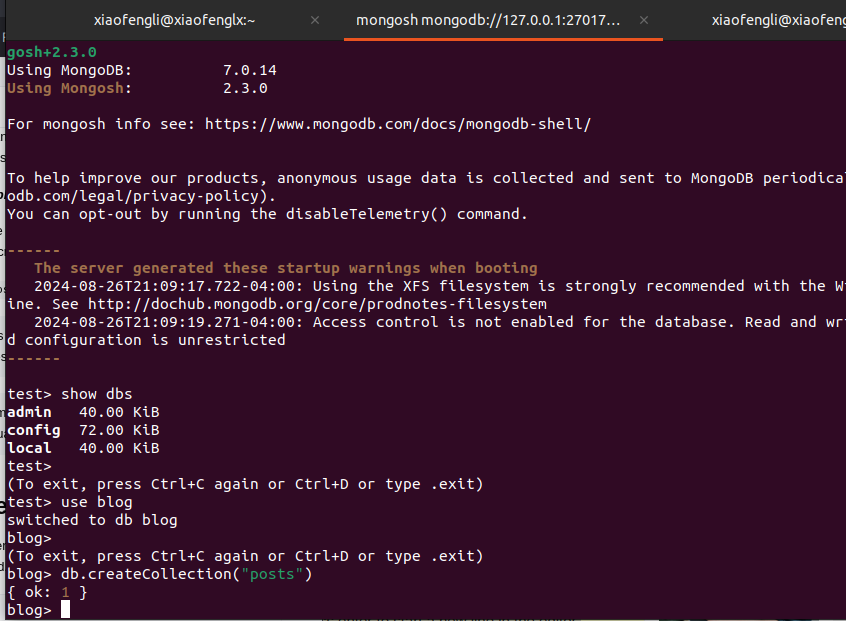
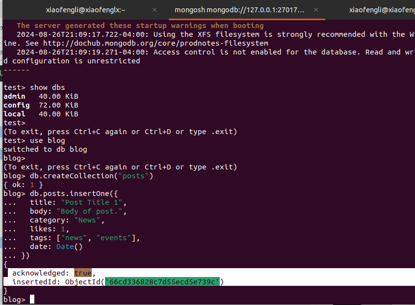
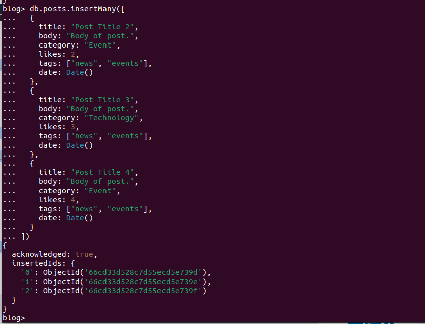
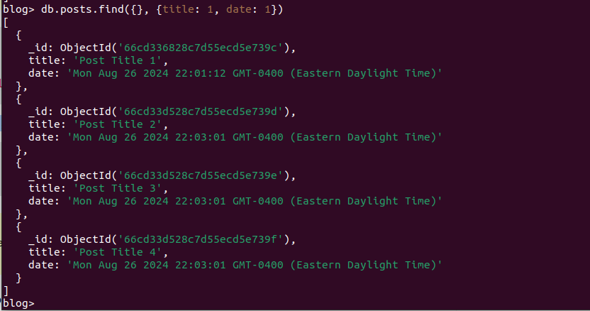
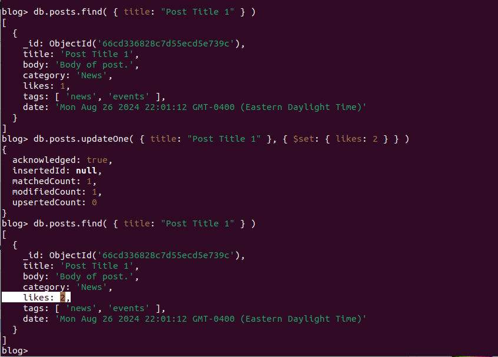

# MongoDB Programming - Basic MongoDB Programming 

## Outline
 * Show Databases
 * Insert Document
 * Find Document
 * Update Document
 * Delete Document
 * Index

## Show all databases
To see all available databases, in your terminal type,

`show dbs`

***Output***

```shell
test> show dbs
admin   40.00 KiB
config  72.00 KiB
local   40.00 KiB
```

## Change or Create a Database

To change or create a database, you type,

`use blog`

***Output***

```shell
test> use blog
switched to db blog
blog> 
(To exit, press Ctrl+C again or Ctrl+D or type .exit)
```

## Create Collection using mongosh

* Method 1

You can create a collection using the createCollection() database method.

***Example***

`db.createCollection("posts")`

* Method 2

You can also create a collection during the insert process.

***Example***

We are here assuming object is a valid JavaScript object containing post data:

`db.posts.insertOne(object)`

>This will create the "posts" collection if it does not already exist.

> Remember: In MongoDB, a collection is not actually created until it gets content!

To see how the commands work, you can reference the following image,



## Insert Documents

### insertOne()

To insert a single document, use the insertOne() method.

This method inserts a single object into the database.

```shell
db.posts.insertOne({
title: "Post Title 1",
body: "Body of post.",
category: "News",
likes: 1,
tags: ["news", "events"],
date: Date()
})
```

> Note: When typing in the shell, after opening an object with curly braces "{" you can press enter to start a new line in the editor without executing the command. The command will execute when you press enter after closing the braces.
> Note: If you try to insert documents into a collection that does not exist, MongoDB will create the collection automatically.



### insertMany()

```
db.posts.insertMany([
... {
...   title: "post title 2",
...   body: "Body of post.",
...   category: "Event",
...   likes: 2,
...   tags: ["news","events"],
...  date: Date()},
... {title: "Post title 3", body: "body of post3", category: "Technology", }
... ]
... )
```



## Find Documents

### Find()

This method accepts a query object. If left empty, all documents will be returned.

`db.posts.find()`

### FindOne()

This method accepts a query object. If left empty, it will return the first document it finds.
> Note: This method only returns the first match it finds.

`db.posts.findOne()`

***Example***

`db.posts.find( {category: "News"} )`


## Projection

Both find methods accept a second parameter called projection.

This parameter is an object that describes which fields to include in the results.

his example will only display the title and date fields in the results.

`db.posts.find({}, {title: 1, date: 1})`

> Note: This parameter is optional. If omitted, all fields will be included in the results.

 

> Notice that the _id field is also included. This field is always included unless specifically excluded.

We use a 1 to include a field and 0 to exclude a field. This time, let's exclude the _id field.

`db.posts.find({}, {_id: 0, title: 1, date: 1})`


>Note: You cannot use both 0 and 1 in the same object. The only exception is the _id field. You should either specify the fields you would like to include or the fields you would like to exclude. 

For instance, you can do the following,

`db.posts.find({}, {category: 0})`,

but you cannot do the following,

`db.posts.find({}, {title: 1, date: 0})`

## Update Document

To update an existing document we can use the `updateOne()` or `updateMany()` methods.

* The first parameter is a query object to define which document or documents should be updated.

* The second parameter is an object defining the updated data.

### updateOne()

The updateOne() method will update the first document that is found matching the provided query.

Let's see what the "like" count for the post with the title of "Post Title 1":

`db.posts.find( { title: "Post Title 1" })`

Now let's update the "likes" on this post to 2. To do this, we need to use the $set operator.

`db.posts.updateOne( { title: "Post Title 1" }, { $set: { likes: 2 }})`

To check your execution, please check this image,




### Insert if not found

If you would like to insert the document if it is not found, you can use the upsert option.

```shell
db.posts.updateOne( 
  { title: "Post Title 5" }, 
  {
    $set: 
      {
        title: "Post Title 5",
        body: "Body of post.",
        category: "Event",
        likes: 5,
        tags: ["news", "events"],
        date: Date()
      }
  }, 
  { upsert: true }
)
```

### updateMany()
The updateMany() method will update all documents that match the provided query.

Update likes on all documents by 1. For this we will use the $inc (increment) operator:

`db.posts.updateMany({}, { $inc: { likes: 1 } })`

The following image will see all the `likes` are incremented.


## Delete Documents

We can delete documents by using the methods deleteOne() or deleteMany().

### deleteOne()

The deleteOne() method will delete the first document that matches the query provided.

`db.posts.deleteOne({ title: "Post Title 5" })`

### deleteMany()

The deleteMany() method will delete all documents that match the query provided.

`db.posts.deleteMany({ category: "Technology" })`

### Indexing

Indexes are used to improve the performance of queries by allowing MongoDB to quickly locate data.Without indexes, MongoDB must scan every document in a collection to find the ones that match the query criteria.

Here are some common indexing methods:

* createIndex(): Creates a new index on a field or a set of fields.

`db.users.createIndex({ name: 1 });`

`db.users.createIndex({ age: 1, name: 1 });`

Here, 1 indicates ascending order, and -1 would indicate descending order.

* dropIndex(): Drops an existing index.

* getIndex()

```
blog1> db.posts.createIndex({title:1})
title_1
blog1> db.posts.createIndex({title:1, tags:1})
title_1_tags_1
blog1> db.posts.createIndex({title:1, category:1})
title_1_category_1
blog1> db.posts.createIndex({title:1, category:1, tags:1})
title_1_category_1_tags_1
blog1> db.posts.getIndexes()
[
  { v: 2, key: { _id: 1 }, name: '_id_' },
  { v: 2, key: { title: 1 }, name: 'title_1' },
  { v: 2, key: { title: 1, tags: 1 }, name: 'title_1_tags_1' },
  { v: 2, key: { title: 1, category: 1 }, name: 'title_1_category_1' },
  {
    v: 2,
    key: { title: 1, category: 1, tags: 1 },
    name: 'title_1_category_1_tags_1'
  }
]
```