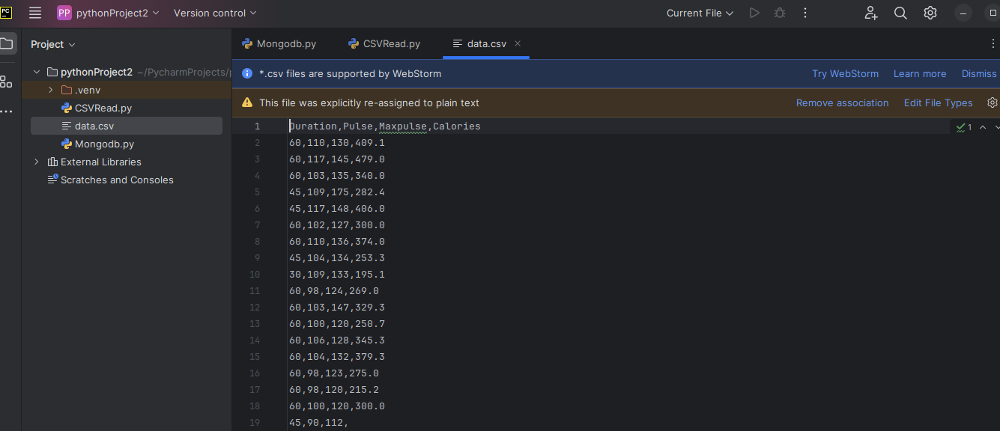
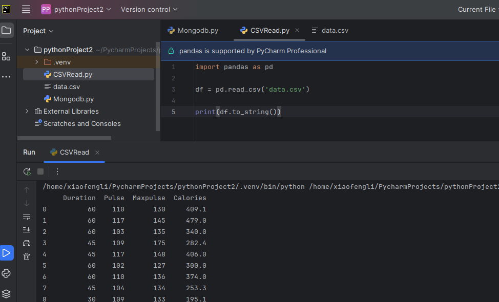

# Python Data Programming - CSV and TSV file

## Get to know Data file format

* **CSV file**, is the most commonly seen data file format. It is comma seperated file. It is an ASCII file. While on the other hand,
 Excel file is a binary file although Excel sheet can be exported to CSV format.

* **TSV**, tab or whitespace separated file.

> Hint: CSV and TSV are type of similar files, so we only introduce how to read/write csv file in the following sections.

## Multiple ways to read/write CSV file

**Using csv read and writer**

The following example is to read from CSV,

```python
import csv
with open('eggs.csv', 'w', newline='') as csvfile:
  spamwriter = csv.writer(csvfile, delimiter=' ', quotechar='|', quoting=csv.QUOTE_MINIMAL)
  spamwriter.writerow(['Spam'] * 5 + ['Baked Beans'])
  spamwriter.writerow(['Spam', 'Lovely Spam', 'Wonderful Spam'])
```
The following example is to write to a CSV,

```python
import csv
with open('eggs.csv', 'w', newline='') as csvfile:
    spamwriter = csv.writer(csvfile, delimiter=' ', quotechar='|', quoting=csv.QUOTE_MINIMAL)
    spamwriter.writerow(['Spam'] * 5 + ['Baked Beans'])
    spamwriter.writerow(['Spam', 'Lovely Spam', 'Wonderful Spam'])
```

Another read example,

```python
import csv
with open('some.csv', newline='') as f:
    reader = csv.reader(f)
    for row in reader:
        print(row)
```

If your csv file is delimited by ":", you can use the following example,

```python
import csv
with open('passwd', newline='') as f:
    reader = csv.reader(f, delimiter=':', quoting=csv.QUOTE_NONE)
    for row in reader:
        print(row)
```

**Using DictReader to read/write**

The following example is to read from CSV,

```python
import csv
with open('names.csv', newline='') as csvfile:
  reader = csv.DictReader(csvfile)

for row in reader:
  print(row['first_name'], row['last_name'])
```

The following example is to write to a CSV,

```python
import csv

with open('students.csv', 'w', newline='') as csvfile:
    writer = csv.writer(csvfile, dialect='unix')
```

**Using Pandas to read/write**

The following example is to read a csv file,

```python
import pandas as pd
df = pd.read_csv('data.csv')
print(df.to_string()) 
```

## Programming Lab

* Download the data.csv file from here [data.csv]("kevinli-webbertech.github.io/blog/md/courses/database/data.csv").

* Open PyCharm Community Version,



* Create a python file called PandasRead.py,


* Install the missing package by hover your mouse on the 'red' package, click on "install the package"


Click to install the package,


Then in the bottom of the IDE, you will see the progress bar is showing to install the package.


Done installation of package.


Click Run button to run the file,


Check the result,

