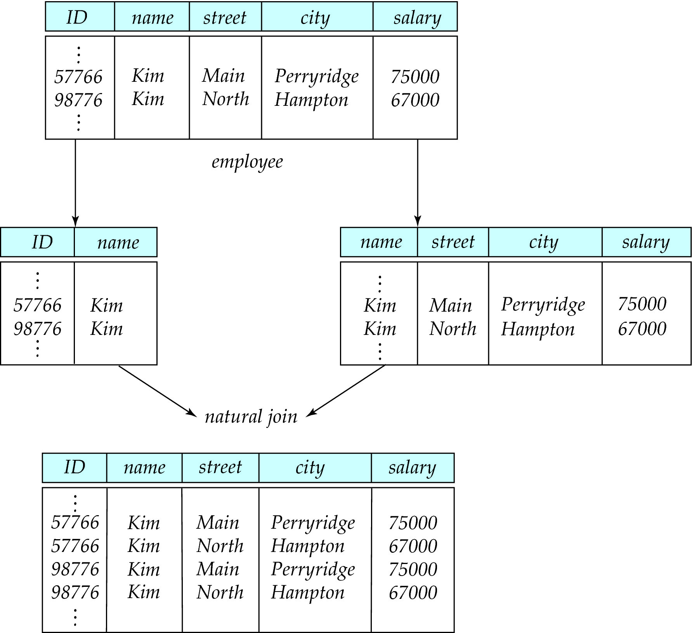
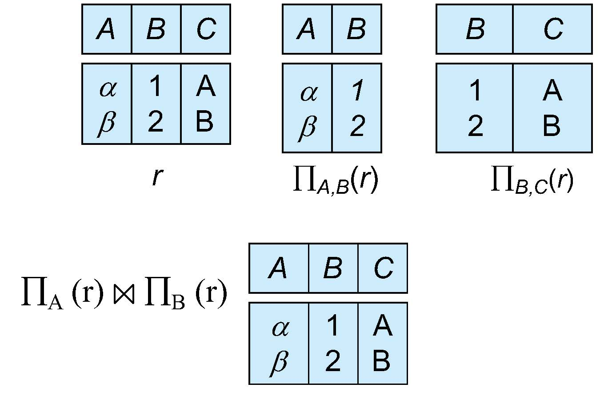
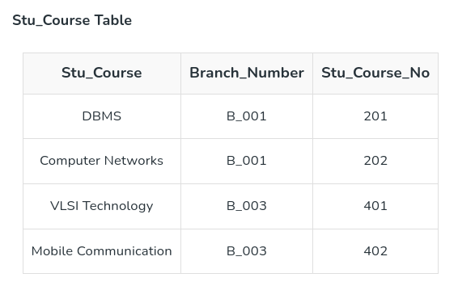

# Relational Database Normalization 

## Outline

* Features of Good Relational Design
* Decomposition Using Multivalued Dependencies
* Functional Dependencie
* Normal Forms
* Database-Design Process

## Duplication of data (Bad Database Design)

Suppose we combine instructor and department into in_dep, which represents the natural join on the relations instructor and department

 

* There is repetition of information, for example note the "building" and "dept_name" columns in the above big table.
* Need to use null values (if we add a new department with no instructors). `null` is like holes in this big flat table.

while in the other case when we combine two tables into one, there is no repetition.

Not all combined schemas result in repetition of information,

* Consider combining relations
  * sec_class(sec_id, building, room_number) and
  * section(course_id, sec_id, semester, year)

   into one relation

  * section(course_id, sec_id, semester, year, building, room_number)
* No repetition in this case

## Decomposition

The only way to avoid the repetition-of-information problem in the in_dep schema is to decompose it into two schemas – instructor and department schemas.
Not all decompositions are good.  Suppose we decompose

`employee(ID, name, street, city, salary)`

 into

```sql
employee1 (ID, name)
employee2 (name, street, city, salary)
```

The problem arises when we have two employees with the same name.

The next slide shows how we lose information 

* -- we cannot reconstruct the original employee relation 
* -- and so, this is a **lossy decomposition**.

## A Lossy Decomposition

  

## Lossless Decomposition

* Let R be a relation schema and let R1 and R2 form a decomposition of R . That is R = R1  U R2
* We say that the decomposition is a lossless decomposition.
if there is no loss of information by replacing R with the two relation schemas R1 U R2. 

**Example of Lossless Decomposition** 

Decomposition of R = (A, B, C)
R1 = (A, B)	
R2 = (B, C)

Here the $\pi$ and $\Pi$ is the same symbol of projection.
? is the join|merge symbol.



## Normalization Theory

* Decide whether a particular relation R is in “good” form.
* In the case that a relation R is not in “good” form, decompose it into  set of relations {R1, R2, ..., Rn} such that
  * Each relation is in good form
  * The decomposition is a lossless decomposition
* Our theory is based on:
  * Functional dependencies
  * Multivalued dependencies
  
## Functional dependencies  [TODO]

## Normalizations

Normalization is the process of minimizing redundancy from a relation or set of relations. Redundancy in relation may cause insertion, deletion and update anomalies. So, it helps to minimize the redundancy in relations. Normal forms are used to eliminate or reduce redundancy in database tables.

If a table has data redundancy and is not properly normalized, then it will be difficult to handle and update the database, without facing data loss. It will also eat up extra memory space and Insertion, Update and Deletion Anomalies are very frequent if database is not normalized.

There are various level of normalization. These are some of them:
1. First Normal Form (1NF)
2. Second Normal Form (2NF)
3. Third Normal Form (3NF)
4. Boyce-Codd Normal Form (BCNF)
5. Fourth Normal Form (4NF)
6. Fifth Normal Form (5NF)

### First Normal Form (1NF)

If a relation contains a composite or multivalued attribute, it violates the first normal form, or the relation is in first normal form if it does not contain any composite or multivalued attribute.

A table is in 1NF if:
1. There are only Single Valued Attributes.
2. Attribute Domain does not change.
3. There is a unique name for every Attribute/Column.
4. The order in which data is stored does not matter.


In the above table, Course is a multivalued attribute so it is not 1NF.

Below table is in 1NF as there is no multivalued attribute:


First Normal Form (1NF) does not eliminate redundancy, but rather, it’s that it eliminates repeating groups. 
Instead of having multiple columns of the same kind of data in a record, (0NF or Unnormalized form) you remove the repeated information into a separate relation and represent them as rows. 
This is what constitutes 1NF.

### Second Normal Form (2NF)

A relation that is in First Normal Form and every non-primary-key attribute is fully functionally dependent on the primary key, then the relation is in Second Normal Form (2NF).

**partial dependency**

If the proper subset of candidate key determines non-prime attribute, it is called partial dependency.

The normalization of 1NF relations to 2NF involves the removal of partial dependencies. If a partial dependency exists, we remove the partially dependent attribute(s) from the relation by placing them in a new relation along with a copy of their determinant.


The above table should be partitioned into the following two tables,


The above table should be partitioned into the following two tables. 2NF tries to reduce the redundant data getting stored in memory. For instance, if there are 100 students taking C1 course, we dont need to store its Fee as 1000 for all the 100 records, instead once we can store it in the second table as the course fee for C1 is 1000.

Although Second Normal Form (2NF) relations have less redundancy than those in 1NF, they may still suffer from update anomalies. If we update only one tuple and not the other, the database would be in an inconsistent state. This update anomaly is caused by a transitive dependency. We need to remove such dependencies by progressing to Third Normal Form (3NF).

### Third Normal Form (3NF)

A relation is in third normal form, if there is no transitive dependency for non-prime attributes as well as it is in second normal form. 
A relation that is in First and Second Normal Form and in which no non-primary-key attribute is transitively dependent on the primary key, then it is in Third Normal Form (3NF).

A relation is in 3NF if at least one of the following condition holds in every non-trivial function dependency X –> Y:
1. X is a super key.
2. Y is a prime attribute (each element of Y is part of some candidate key).

**Transitive dependency**

FD: stands for functional dependencies.

If A->B and B->C are two FDs then A->C is called transitive dependency.

** Example 1**

`FD set:`

{STUD_NO -> STUD_NAME, STUD_NO -> STUD_STATE, STUD_STATE -> STUD_COUNTRY, STUD_NO -> STUD_AGE}

`Candidate Key:`

{STUD_NO}

For this relation, STUD_NO -> STUD_STATE and STUD_STATE -> STUD_COUNTRY are true. So STUD_COUNTRY is transitively dependent on STUD_NO. 
It violates the third normal form. To convert it in third normal form,
we will decompose the relation

`STUDENT (STUD_NO, STUD_NAME, STUD_PHONE, STUD_STATE, STUD_COUNTRY_STUD_AGE)` as:

`STUDENT (STUD_NO, STUD_NAME, STUD_PHONE, STUD_STATE, STUD_AGE)`

and 

`STATE_COUNTRY (STATE, COUNTRY)`

**Note –**
Third Normal Form (3NF) is considered adequate for normal relational database design because most of the 3NF tables are free of insertion, update, and deletion anomalies. Moreover, 3NF always ensures functional dependency preserving and lossless.

## Boyce-Codd Normal Form (BCNF)

**Boyce-Codd Normal Form (Codd, 1974)**

Although, 3NF is an adequate normal form for relational databases, still, this (3NF) normal form may not remove 100% redundancy because of X−>Y functional dependency if X is not a candidate key of the given relation. This can be solved by Boyce-Codd Normal Form (BCNF).

Rules for BCNF,

* Rule 1: The table should be in the 3rd Normal Form.
* Rule 2: X should be a superkey for every functional dependency (FD) X−>Y in a given relation.

Note: To test whether a relation is in BCNF, we identify all the determinants and make sure that they are candidate keys.

* The 1NF has the least restrictive constraint – it only requires a relation R to have atomic values in each tuple.
* The 2NF has a slightly more restrictive constraint.
* The 3NF has a more restrictive constraint than the first two normal forms but is less restrictive than the BCNF. In this manner, the restriction increases as we traverse down the hierarchy.

**Example**

Functional Dependency of the above as mentioned should be the following relations:

```
Stu_ID −> Stu_Branch
{Branch_Number, Stu_Course_No} −> Stu_Course 
```


It is not BCNF, reasons,

* the {Branch_Number, Stu_Course_No} are super key to define Stu_Course
* Stu_ID should decide Stu_Branch, so Stu_ID should be a super key

But the above flat table does not indicate the X -> Y, X is the super key.

However, the following partitions of the above table into the following will be BCNF.


Candidate Key for this table: Stu_ID.



Candidate Key for this table: Stu_Course.


Candidate Key for this table: {Stu_ID, Stu_Course_No}.

## Keys of Databases

Super Key: 
Candidate Key:
Prime attributes:
Non-prime attributes:

[https://www.geeksforgeeks.org/types-of-keys-in-relational-model-candidate-super-primary-alternate-and-foreign/]

## Quick Cheatsheet of Norm Rules

| Rule Name | What problem it solves              |
|-----------|-------------------------------------|
| 1NF       | Single value, no multiple values    |
| 2NF       | No transitive dependencies          |
| 3NF       | No partial dependencies             |
| BCNF      | same as 3NF, x->y, x is a super key |
