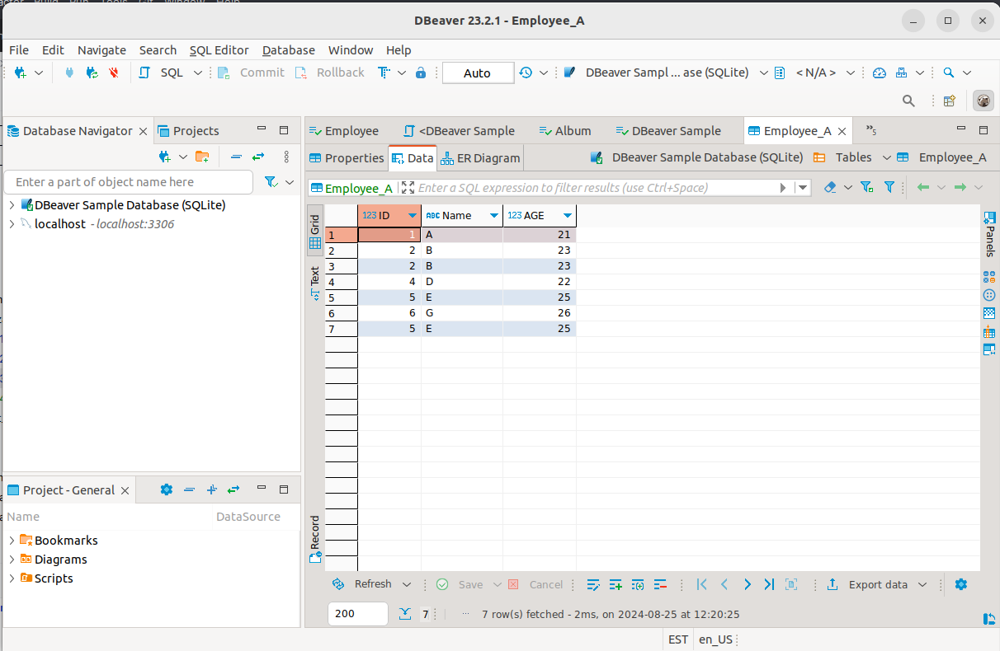
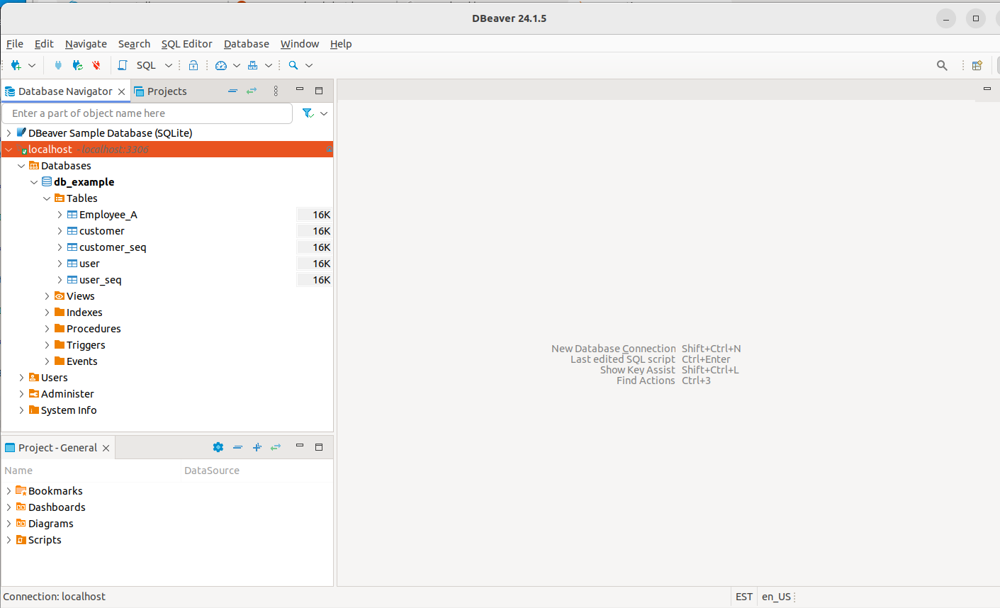
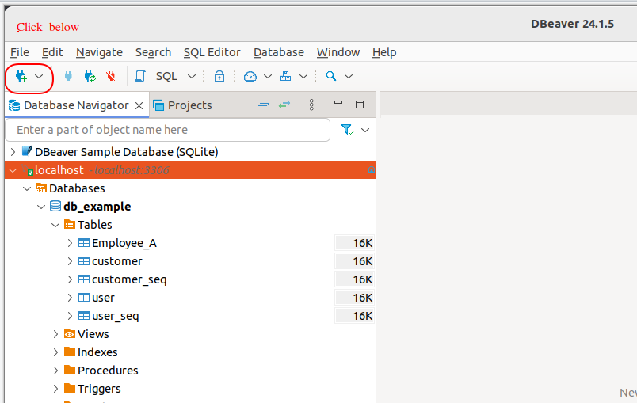
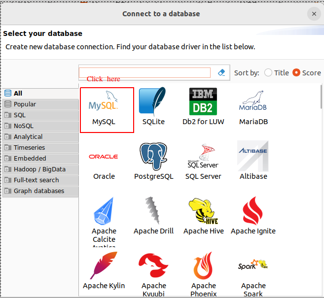
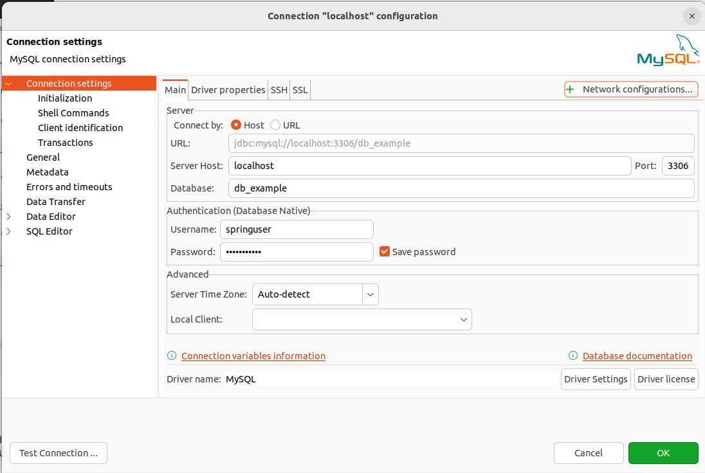
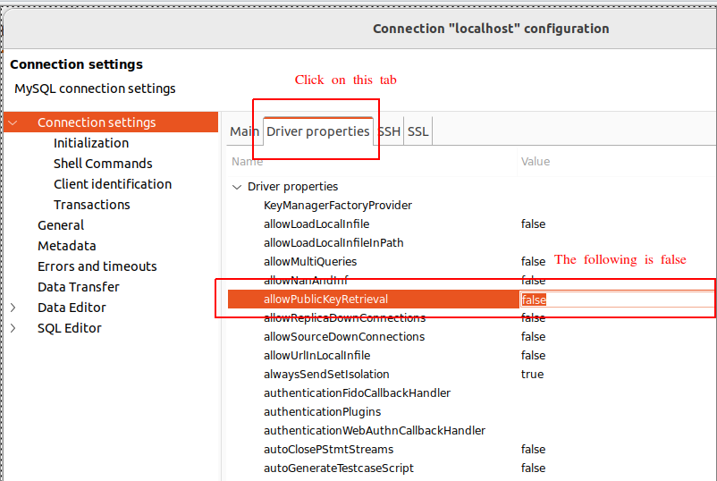
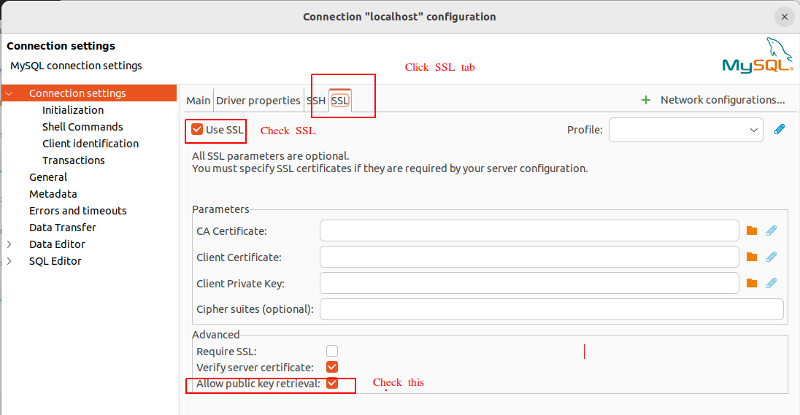
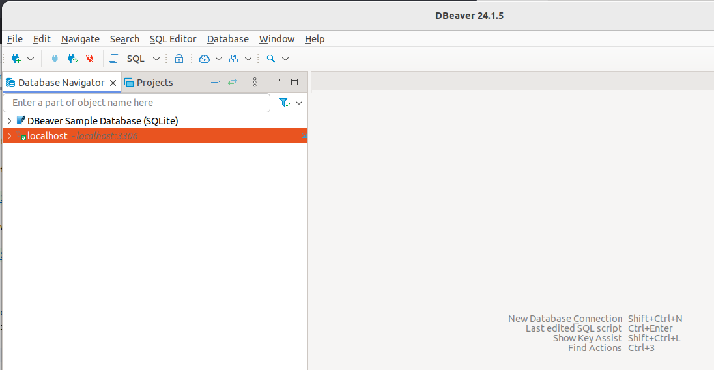
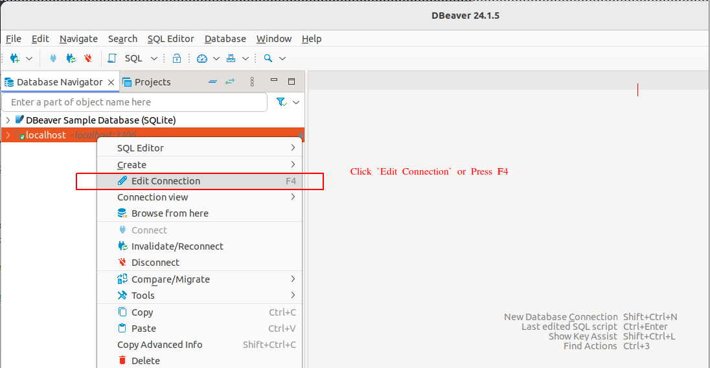

## SQL Basics - MYSQL Database and SQL Literature

## Prerequisite

* MySQL 8 and Workbench installation
* DBeaver installation

## Outline

Get familiarized with basic SQL Programming.

* **Part I** Introduction to SQL, history and Literature

* **Part II** Introduction to MySQL Database
  * Create database
  * Drop database
  * Create user account
  * Grant user permissions

## Part I SQL History and Literature

### SQL History

SQL (Structured Query Language) is a domain-specific programming language used for managing and manipulating relational databases. It has a rich history that dates back to the 1970s and has evolved significantly over the years. Here’s an overview of the history of SQL:

1. Early Development (1970-1973)
   Relational Model: SQL’s history begins with the development of the relational model of data by Edgar F. Codd, an IBM researcher, in 1970. He published a seminal paper titled "A Relational Model of Data for Large Shared Data Banks," which introduced the concept of organizing data in tables (relations).
   SEQUEL: In 1973, a team at IBM's San Jose Research Laboratory, led by Donald D. Chamberlin and Raymond F. Boyce, developed a language called SEQUEL (Structured English Query Language) to manipulate and retrieve data stored in IBM’s experimental relational database system, System R. SEQUEL was designed to be more user-friendly and accessible to people without deep programming knowledge.

2. Renaming and Standardization (1974-1986)
   SEQUEL to SQL: Due to trademark issues, SEQUEL was renamed SQL. IBM continued to refine SQL, and it became a standard interface for relational databases.
   SQL/86: In 1986, the American National Standards Institute (ANSI) and the International Organization for Standardization (ISO) adopted SQL as the standard language for relational database management systems (RDBMS). This first standard was known as SQL-86 or SQL-1.
   Commercial Adoption: During this period, several commercial database systems that supported SQL emerged, including Oracle (1979), IBM’s DB2 (1983), and Microsoft SQL Server (1989).

3. Growth and Evolution (1987-1999)
   SQL/89: A minor revision of the standard, SQL-89, was released in 1989, introducing some clarifications and enhancements to SQL-86.
   SQL/92: The SQL-92 standard (also known as SQL2) was a significant update, introducing features like more complex queries, new data types, and enhanced language features. SQL-92 provided greater consistency across different database systems and helped solidify SQL’s dominance.
   SQL/99: SQL-99 (also known as SQL3) was another major revision that introduced object-relational database management system (ORDBMS) features, including support for structured types, recursive queries, triggers, and more advanced data handling capabilities.

4. Modern Enhancements (2000-Present)
   SQL:2003: This revision added XML-related features, standardized sequences, and introduced the "MERGE" statement, which allowed for conditional update/inserts.
   SQL:2006: This update focused on better integration with XML, reflecting the growing importance of XML in data exchange and storage.
   SQL:2008: Introduced new features like the TRUNCATE statement, improved diagnostics, and enhanced data types.
   SQL:2011: Introduced temporal databases, which allow the storage and querying of historical data (time periods).
   SQL:2016: Added features for JSON (JavaScript Object Notation) data management, reflecting the increasing use of JSON in modern applications.
   SQL:2019: Focused on enhanced support for big data and internet-of-things (IoT) applications, including support for polymorphic table functions and enhancements to the JSON capabilities.

5. SQL in Modern Context
   NoSQL Movement: In the 2000s, the NoSQL movement emerged as a response to the needs of web-scale applications, focusing on non-relational databases. Despite this, SQL remains the dominant language for relational databases.
   Open Source Databases: Open-source relational databases like MySQL (launched in 1995) and PostgreSQL (started in 1986, with its SQL implementation released in 1995) gained widespread popularity and contributed to SQL’s continued relevance.
   Cloud and Big Data: SQL has been adapted for cloud databases and big data platforms. Many NoSQL databases now support SQL-like query languages to bridge the gap between relational and non-relational data management.
   
**Legacy and Impact**
   SQL has had a profound impact on the way data is stored, retrieved, and managed across various industries. Its declarative nature, which allows users to specify what they want rather than how to get it, has made it accessible to a broad range of users, from developers to business analysts. Despite the rise of alternative database technologies, SQL continues to be a cornerstone of data management in the digital age.

## Installation

## Log in to MySQL server

- Normal login to root of MySQL

`mysql -u root -p`

Then, enter your root password

## The MySQL CREATE DATABASE Statement
The CREATE DATABASE statement is used to create a new SQL database.

***Syntax***

`CREATE DATABASE databasename;`

***Example***

The following SQL statement creates a database called "testDB":

`CREATE DATABASE testDB;`

## CREATE Username and Password for the Database

After creating the database, the next step is to create a MySQL User:

`CREATE USER 'myUser'@'localhost' IDENTIFIED BY 'myPassword';`

***Note:***

* Replace myUser with your own username

* Replace myPassword with you own password

## Grant Privileges

`GRANT ALL PRIVILEGES ON databasename.* TO 'myUSER'@'localhost';`

***Note:***

* Replace database name with your own database name that you created

* Replace myUser with you own username

### Flush Privileges

`FLUSH PRIVILEGES;`

Once a database is created, you can check it in the list of databases with the following SQL command:

`SHOW DATABASES;`

## MySQL DROP DATABASE Statement
The DROP DATABASE statement is used to drop an existing SQL database.

***Syntax***

`DROP DATABASE databasename;`

***Example***

The following SQL statement drops the existing database "testDB":

`DROP DATABASE testDB;`

## DBeaver Installation

DBeaver is a GUI tool to connect to database without using terminal.

Once you download and install it, it will look like the following,

* Create a connection,

* Choose a driver,

* Edit connection,

You would need to fill out,

  1. `Server Host` which should be `localhost`, and port is default to `3306`
  2. `Database` If you have created one from terminal, then fill it. Or leave it empty.
  3. `Username` and `Password`

* Test connection

In the above image, in the left-bottom corner there is a `Test Connection` button.

Then you will see something like this,

 

**Troubleshooting**

If you get connection refuse or **Public Key Retrieval is not allowed**. 

Please make sure you configure the followings,

and also check the followings,

 

* Re-edit Configuration

If you close the above connection editing, and you would like to find your existing connection
and re-edit on it, here is how you will find it.

All your existing connections should be found in the left panel of Dbeaver like shown below,

 

For instance, the second entry is MySQL connection we just created, let us right-click on it,

