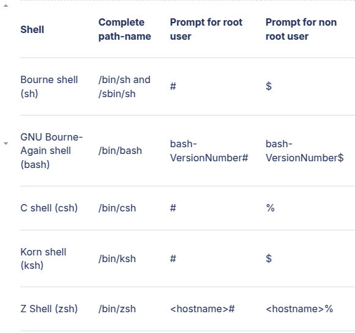

# Linux Shell

## Overview and takeaway

* Understand shell
* Why shell
* What are the shells
* What are the most important shells

>Hint: Long story short: bash, sh and zsh(used by Mac by default.)

## Different Types of Shells in Linux

If you now understand what a kernel is, what a shell is, and why a shell is so important for Linux systems, let’s move on to learning about the different types of shells that are available.

Each of these shells has properties that make them highly efficient for a specific type of use over other shells. So let us discuss the different types of shells in Linux along with their properties and features.

1. The Bourne Shell (sh)

Developed at AT&T Bell Labs by Steve Bourne, the Bourne shell is regarded as the first UNIX shell ever. It is denoted as sh. It gained popularity due to its compact nature and high speeds of operation.

This is what made it the default shell for Solaris OS. It is also used as the default shell for all Solaris system administration scripts. Start reading about shell scripting here.

However, the Bourne shell has some major drawbacks.

It doesn’t have in-built functionality to handle logical and arithmetic operations.
Also, unlike most different types of shells in Linux, the Bourne shell cannot recall previously used commands.
It also lacks comprehensive features to offer a proper interactive use.

The complete path-name for the Bourne shell is /bin/sh and /sbin/sh. By default, it uses the prompt # for the root user and $ for the non-root users.

2. The GNU Bourne-Again Shell (bash)

More popularly known as the Bash shell, the GNU Bourne-Again shell was designed to be compatible with the Bourne shell. It incorporates useful features from different types of shells in Linux such as Korn shell and C shell.

It allows us to automatically recall previously used commands and edit them with help of arrow keys, unlike the Bourne shell.

The complete path-name for the GNU Bourne-Again shell is /bin/bash. By default, it uses the prompt bash-VersionNumber# for the root user and bash-VersionNumber$ for the non-root users.

3. The C Shell (csh)

The C shell was created at the University of California by Bill Joy. It is denoted as csh. It was developed to include useful programming features like in-built support for arithmetic operations and a syntax similar to the C programming language.

Further, it incorporated command history which was missing in different types of shells in Linux like the Bourne shell. Another prominent feature of a C shell is “aliases”.

The complete path-name for the C shell is /bin/csh. By default, it uses the prompt hostname# for the root user and hostname% for the non-root users.

4. The Korn Shell (ksh)

The Korn shell was developed at AT&T Bell Labs by David Korn, to improve the Bourne shell. It is denoted as ksh. The Korn shell is essentially a superset of the Bourne shell.

Besides supporting everything that would be supported by the Bourne shell, it provides users with new functionalities. It allows in-built support for arithmetic operations while offereing interactive features which are similar to the C shell.

The Korn shell runs scripts made for the Bourne shell, while offering string, array and function manipulation similar to the C programming language. It also supports scripts which were written for the C shell. Further, it is faster than most different types of shells in Linux, including the C shell.

The complete path-name for the Korn shell is /bin/ksh. By default, it uses the prompt # for the root user and $ for the non-root users.

5. The Z Shell (zsh)

The Z Shell or zsh is a sh shell extension with tons of improvements for customization. If you want a modern shell that has all the features a much more, the zsh shell is what you’re looking for.

Some noteworthy features of the z shell include:

Generate filenames based on given conditions
Plugins and theming support
Index of built-in functions
Command completion
and many more…
Let us summarise the different shells in Linux which we discussed in this tutorial in the table below.

## Ref

- https://linuxcommand.org/lc3_learning_the_shell.php
- https://phoenixnap.com/kb/linux-shells
- https://linuxjourney.com/lesson/the-shell
- https://www.digitalocean.com/community/tutorials/different-types-of-shells-in-linux
- https://engrmosaic.charlotte.edu/mosaic-linux/linux-basics/linux-shell/
- https://www.cs.dartmouth.edu/~campbell/cs50/shell.html
- https://www.cs.dartmouth.edu/~campbell/cs50/shell.html

