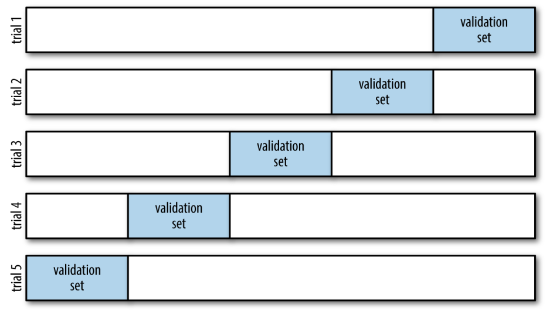

# Hyperparameters and Model Validation

## Work Process

In the previous section, we saw the basic recipe for applying a supervised machine
learning model:

1. Choose a class of model
2. Choose model hyperparameters
3. Fit the model to the training data
4. Use the model to predict labels for new data

The first two pieces of this—the choice of model and choice of hyperparameters—are
perhaps the most important part of using these tools and techniques effectively. In
order to make an informed choice, we need a way to validate that our model and our
hyperparameters are a good fit to the data.

## Model Validation

In principle, model validation is very simple: after choosing a model and its hyper‐
parameters, we can estimate how effective it is by applying it to some of the training
data and comparing the prediction to the known value.

**Model validation the wrong way

```python
In[1]: from sklearn.datasets import load_iris
iris = load_iris()
X = iris.data
y = iris.target
```

Next we choose a model and hyperparameters. Here we’ll use a k-neighbors classifier
with n_neighbors=1. This is a very simple and intuitive model that says “the label of
an unknown point is the same as the label of its closest training point”:

In[2]: from sklearn.neighbors import KNeighborsClassifier
model = KNeighborsClassifier(n_neighbors=1)

Then we train the model, and use it to predict labels for data we already know:

```python
In[3]: model.fit(X, y)
y_model = model.predict(X)
```

Finally, we compute the fraction of correctly labeled points:

```python
In[4]: from sklearn.metrics import accuracy_score
accuracy_score(y, y_model)
Out[4]: 1.0
```

We see an accuracy score of 1.0, which indicates that 100% of points were correctly
labeled by our model! But is this truly measuring the expected accuracy? Have we
really come upon a model that we expect to be correct 100% of the time?

As you may have gathered, the answer is no. In fact, this approach contains a funda‐
mental flaw: it trains and evaluates the model on the same data. Furthermore, the
nearest neighbor model is an instance-based estimator that simply stores the training
data, and predicts labels by comparing new data to these stored points.

**Model validation the right way: Holdout sets**

So what can be done? We can get a better sense of a model’s performance using what’s
known as a holdout set; that is, we hold back some subset of the data from the training
of the model, and then use this holdout set to check the model performance. We can
do this splitting using the train_test_split utility in Scikit-Learn:

```python
In[5]: from sklearn.cross_validation import train_test_split
# split the data with 50% in each set
X1, X2, y1, y2 = train_test_split(X, y, random_state=0, train_size=0.5)
# fit the model on one set of data
model.fit(X1, y1)
# evaluate the model on the second set of data
y2_model = model.predict(X2)
accuracy_score(y2, y2_model)
Out[5]: 0.90666666666666662
```

## Model validation via cross-validation

One disadvantage of using a holdout set for model validation is that we have lost a
portion of our data to the model training. In the previous case, half the dataset does
not contribute to the training of the model! This is not optimal, and can cause prob‐
lems—especially if the initial set of training data is small.

One way to address this is to use cross-validation—that is, to do a sequence of fits
where each subset of the data is used both as a training set and as a validation set.


```python
In[6]: y2_model = model.fit(X1, y1).predict(X2)
y1_model = model.fit(X2, y2).predict(X1)
accuracy_score(y1, y1_model), accuracy_score(y2, y2_model)

Out[6]: (0.95999999999999996, 0.90666666666666662)
```

