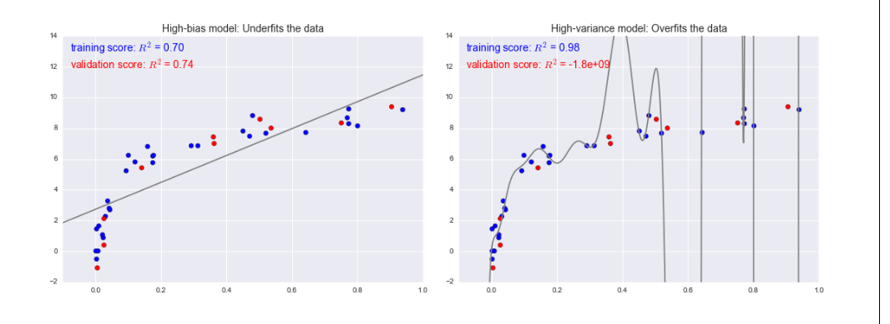
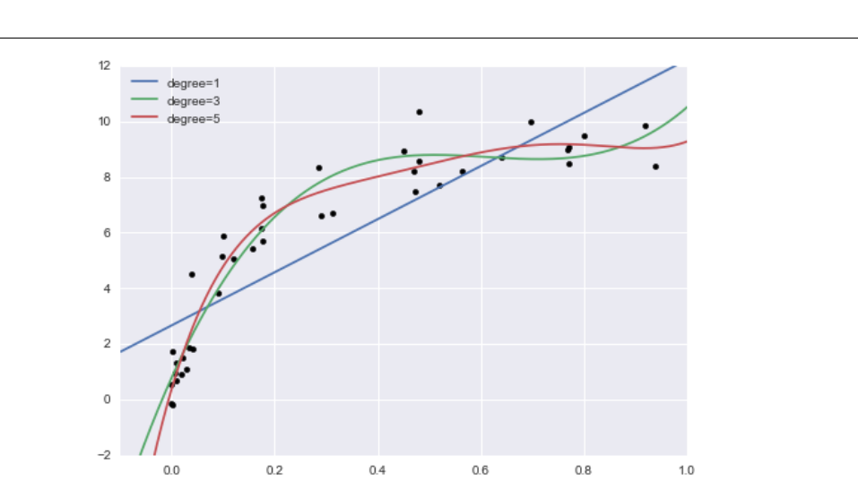
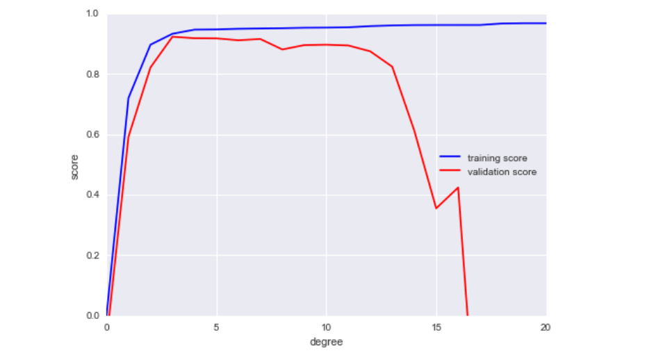
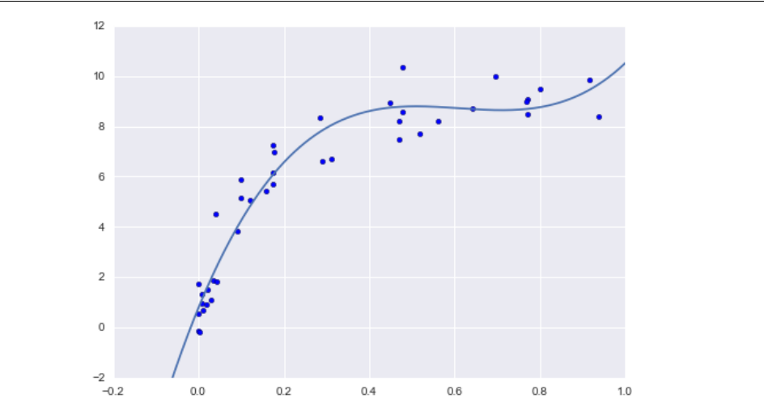
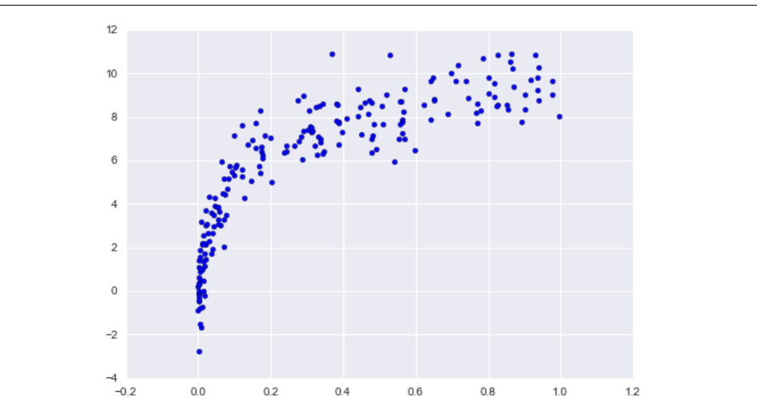
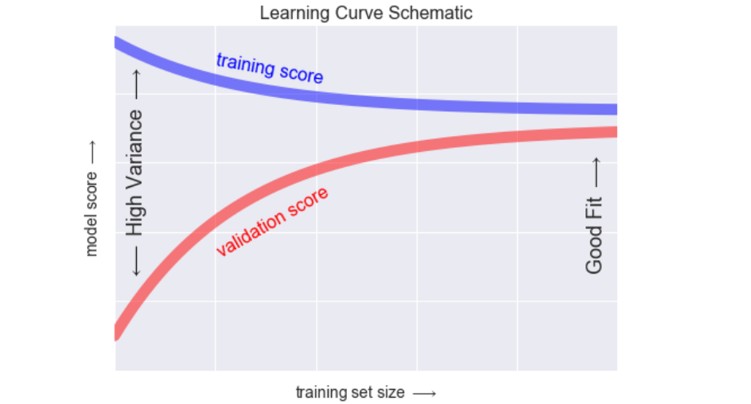

# Hyperparameters and Model Validation

## Outline

* ML Work Process Review
* Model Selection and validation
* Cross-validation and its schemas
* Underfit and overfit issues
* Validation curve (Help model selection)
* Learning curve

## Work Process

In the previous section, we saw the basic recipe for applying a supervised machine
learning model:

1. Choose a class of model
2. Choose model hyperparameters
3. Fit the model to the training data
4. Use the model to predict labels for new data

The first two pieces of this—the choice of model and choice of hyperparameters—are
perhaps the most important part of using these tools and techniques effectively. In
order to make an informed choice, we need a way to validate that our model and our
hyperparameters are a good fit to the data.

## Model Validation

In principle, model validation is very simple: after choosing a model and its hyper‐
parameters, we can estimate how effective it is by applying it to some of the training
data and comparing the prediction to the known value.

**Model validation the wrong way

```python
In[1]: from sklearn.datasets import load_iris
iris = load_iris()
X = iris.data
y = iris.target
```

Next we choose a model and hyperparameters. Here we’ll use a k-neighbors classifier
with n_neighbors=1. This is a very simple and intuitive model that says “the label of
an unknown point is the same as the label of its closest training point”:

In[2]: from sklearn.neighbors import KNeighborsClassifier
model = KNeighborsClassifier(n_neighbors=1)

Then we train the model, and use it to predict labels for data we already know:

```python
In[3]: model.fit(X, y)
y_model = model.predict(X)
```

Finally, we compute the fraction of correctly labeled points:

```python
In[4]: from sklearn.metrics import accuracy_score
accuracy_score(y, y_model)
Out[4]: 1.0
```

We see an accuracy score of 1.0, which indicates that 100% of points were correctly
labeled by our model! But is this truly measuring the expected accuracy? Have we
really come upon a model that we expect to be correct 100% of the time?

As you may have gathered, the answer is no. In fact, this approach contains a funda‐
mental flaw: it trains and evaluates the model on the same data. Furthermore, the
nearest neighbor model is an instance-based estimator that simply stores the training
data, and predicts labels by comparing new data to these stored points.

**Model validation the right way: Holdout sets**

So what can be done? We can get a better sense of a model’s performance using what’s
known as a holdout set; that is, we hold back some subset of the data from the training
of the model, and then use this holdout set to check the model performance. We can
do this splitting using the train_test_split utility in Scikit-Learn:

```python
In[5]: from sklearn.cross_validation import train_test_split
# split the data with 50% in each set
X1, X2, y1, y2 = train_test_split(X, y, random_state=0, train_size=0.5)
# fit the model on one set of data
model.fit(X1, y1)
# evaluate the model on the second set of data
y2_model = model.predict(X2)
accuracy_score(y2, y2_model)
Out[5]: 0.90666666666666662
```

## Model validation via cross-validation

One disadvantage of using a holdout set for model validation is that we have lost a
portion of our data to the model training. In the previous case, half the dataset does
not contribute to the training of the model! This is not optimal, and can cause prob‐
lems—especially if the initial set of training data is small.

One way to address this is to use cross-validation—that is, to do a sequence of fits
where each subset of the data is used both as a training set and as a validation set.


```python
In[6]: y2_model = model.fit(X1, y1).predict(X2)
y1_model = model.fit(X2, y2).predict(X1)
accuracy_score(y1, y1_model), accuracy_score(y2, y2_model)

Out[6]: (0.95999999999999996, 0.90666666666666662)
```


Here we split the data into five groups, and use each of them in turn to evaluate the
model fit on the other 4/5 of the data. This would be rather tedious to do by hand,
and so we can use Scikit-Learn’s cross_val_score convenience routine to do it
succinctly:

```python
In[7]: from sklearn.cross_validation import cross_val_score
cross_val_score(model, X, y, cv=5)

Out[7]: array([ 0.96666667, 0.96666667, 0.93333333, 0.93333333, 1.])
```

Repeating the validation across different subsets of the data gives us an even better
idea of the performance of the algorithm.

**A lot more cross-validation schemes

This type of cross-validation is known as leave-one-out cross-validation,
and can be used as follows:

```python
In[8]: from sklearn.cross_validation import LeaveOneOut
scores = cross_val_score(model, X, y, cv=LeaveOneOut(len(X)))
scores
```


Because we have 150 samples, the leave-one-out cross-validation yields scores for 150
trials, and the score indicates either successful (1.0) or unsuccessful (0.0) prediction.
Taking the mean of these gives an estimate of the error rate:

```python
In[9]: scores.mean()
Out[9]: 0.95999999999999996
```

Other cross-validation schemes can be used similarly. For a description of what is
available in Scikit-Learn, use IPython to explore the sklearn.cross_validation sub‐
module.

> http://scikit-learn.org/stable/modules/cross_validation.html

## Selecting the Best Model

Now that we’ve seen the basics of validation and cross-validation, we will go into a
little more depth regarding model selection and selection of hyperparameters.

Now that we’ve seen the basics of validation and cross-validation, we will go into a
little more depth regarding model selection and selection of hyperparameters. These
issues are some of the most important aspects of the practice of machine learning,
and I find that this information is often glossed over in introductory machine learn‐
ing tutorials.

Of core importance is the following question: if our estimator is underperforming, how
should we move forward? There are several possible answers:

* Use a more complicated/more flexible model

* Use a less complicated/less flexible model

* Gather more training samples

* Gather more data to add features to each sample

The answer to this question is often counterintuitive. In particular, sometimes using a more complicated model will give worse results, and adding more training samples may not improve your results! The ability to determine what steps will improve your model is what separates the successful machine learning practitioners from the unsuccessful.

**The bias–variance trade-off**

Fundamentally, the question of “the best model” is about finding a sweet spot in the trade-off between bias and variance.


It is clear that neither of these models is a particularly good fit to the data, but they fail in different ways.

The model on the left attempts to find a straight-line fit through the data. Because the data are intrinsically more complicated than a straight line, the straight-line model will never be able to describe this dataset well. Such a model is said to `underfit` the data; that is, it does not have enough model flexibility to suitably account for all the features in the data. Another way of saying this is that the model has `high bias`.

The model on the right attempts to fit a high-order polynomial through the data. Here the model fit has enough flexibility to nearly perfectly account for the fine features in the data, but even though it very accurately describes the training data, its precise form seems to be more reflective of the particular noise properties of the data rather than the intrinsic properties of whatever process generated that data. Such a model is said to overfit the data; that is, it has so much model flexibility that the model ends up accounting for random errors as well as the underlying data distribution. Another way of saying this is that the model has `high variance`.

**Errors**

If we use these two models to predict the y-value for some new data. In diagrams in Figure 5-25, the red/lighter points indicate data that is omitted from the training set.



Training and validation scores in high-bias and high-variance models.

The score here is the R2 score, or coefficient of determination, which measures how well a model performs relative to a simple mean of the target values. R2 = 1 indicates a perfect match, R2 = 0 indicates the model does no better than simply taking the mean of the data, and negative values mean even worse models. From the scores associated with these two models, we can make an observation that holds more generally:

* For high-bias models, the performance of the model on the validation set is similar to the performance on the training set.

* For high-variance models, the performance of the model on the validation set is far worse than the performance on the training set.

**validation curve**

we see the following essential features from the above,

• The training score is everywhere higher than the validation score. This is gener‐
ally the case: the model will be a better fit to data it has seen than to data it has
not seen.

• For very low model complexity (a high-bias model), the training data is underfit,
which means that the model is a poor predictor both for the training data and for
any previously unseen data.

• For very high model complexity (a high-variance model), the training data is
overfit, which means that the model predicts the training data very well, but fails
for any previously unseen data.

• For some intermediate value, the validation curve has a maximum. This level of
complexity indicates a suitable trade-off between bias and variance.


## Validation curves in Scikit-Learn

We will take a look at the curves for a class of models, `polynomial regression` model.

A degree-1 polynomial fits a straight line to the data; for model parameters a and b:

`y = ax + b`

A degree-3 polynomial fits a cubic curve to the data; for model parameters a, b, c, d:

`y = ax3 + bx2 + cx + d`

We can generalize this to any number of polynomial features. In Scikit-Learn, we can
implement this with a simple linear regression combined with the polynomial pre‐
processor.

```python
In[10]: from sklearn.preprocessing import PolynomialFeatures
from sklearn.linear_model import LinearRegression
from sklearn.pipeline import make_pipeline
def PolynomialRegression(degree=2, **kwargs):
return make_pipeline(PolynomialFeatures(degree),
LinearRegression(**kwargs))
```

Now let’s create some data to which we will fit our model:

```python
In[11]: import numpy as np
def make_data(N, err=1.0, rseed=1):
# randomly sample the data
rng = np.random.RandomState(rseed)
X = rng.rand(N, 1) ** 2
y = 10 - 1. / (X.ravel() + 0.1)
if err > 0:
y += err * rng.randn(N)
return X, y
X, y = make_data(40)
```

We can now visualize our data, along with polynomial fits of several degrees,

```python
In[12]: %matplotlib inline
import matplotlib.pyplot as plt
import seaborn; seaborn.set() # plot formatting
X_test = np.linspace(-0.1, 1.1, 500)[:, None]
plt.scatter(X.ravel(), y, color='black')
axis = plt.axis()
for degree in [1, 3, 5]:
y_test = PolynomialRegression(degree).fit(X, y).predict(X_test)
plt.plot(X_test.ravel(), y_test, label='degree={0}'.format(degree))
plt.xlim(-0.1, 1.0)
plt.ylim(-2, 12)
plt.legend(loc='best');
```

The knob controlling model complexity in this case is the degree of the polynomial,
which can be any non-negative integer. A useful question to answer is this: what
degree of polynomial provides a suitable trade-off between bias (underfitting) and
variance (overfitting)?

**Three different polynomial models fit to a dataset.**



**The validation curves for the data**

Now with all the above thing, scikit-lean can do it for you with the following lines of code.

Given a model, data, parameter name, and a range to explore, this function will automatically compute both the training score and validation score across the range,

```python
In[13]:
from sklearn.learning_curve import validation_curve
degree = np.arange(0, 21)
train_score, val_score = validation_curve(PolynomialRegression(), X, y,
'polynomialfeatures__degree',
degree, cv=7)
plt.plot(degree, np.median(train_score, 1), color='blue', label='training score')
plt.plot(degree, np.median(val_score, 1), color='red', label='validation score')
plt.legend(loc='best')
plt.ylim(0, 1)
plt.xlabel('degree')
plt.ylabel('score')
```

This shows precisely the qualitative behavior we expect:

* the training score is everywhere higher than the validation score;

* the training score is monotonically improving with increased model complexity; and the validation score reaches a maximum before dropping off as the model becomes overfit.



From the validation curve, we can read off that the optimal trade-off between bias and variance is found for a **hird-order polynomial**; we can compute and display this fit over the original data as follows,

**The cross-validated optimal model for the data**

```python
In[14]: plt.scatter(X.ravel(), y)
lim = plt.axis()
y_test = PolynomialRegression(3).fit(X, y).predict(X_test)
plt.plot(X_test.ravel(), y_test);
plt.axis(lim);
```



> Hint: Examining the relationship between the training score and validation score can give us useful insight into the performance of the model.

## Learning Curves

One important aspect of model complexity is that the optimal model will generally
depend on the size of your training data. Let us make 200 instead of 40,

```python
In[15]: X2, y2 = make_data(200)
plt.scatter(X2.ravel(), y2);
```



We will duplicate the preceding code to plot the validation curve for this larger dataset; for reference let’s over-plot the previous results as well,

```python
In[16]:
degree = np.arange(21)
train_score2, val_score2 = validation_curve(PolynomialRegression(), X2, y2, 'polynomialfeatures__degree degree, cv=7)

plt.plot(degree, np.median(train_score2, 1), color='blue', label='training score')
plt.plot(degree, np.median(val_score2, 1), color='red', label='validation score')
plt.plot(degree, np.median(train_score, 1), color='blue', alpha=0.3, linestyle='dashed')
plt.plot(degree, np.median(val_score, 1), color='red', alpha=0.3, linestyle='dashed')
plt.legend(loc='lower center')
plt.ylim(0, 1)
plt.xlabel('degree')
plt.ylabel('score');
```


The solid lines show the new results, while the fainter dashed lines show the results of the previous smaller dataset. It is clear from the validation curve that the larger dataset can support a much more complicated model: the peak here is probably around a degree of 6, but even a degree-20 model is not seriously overfitting the data—the validation and training scores remain very close.

**learning curve**:

A plot of the training/validation score with respect to the size of the training set is known as a `learning curve`.

* A model of a given complexity will overfit a small dataset: this means the training score will be relatively high, while the validation score will be relatively low.

* A model of a given complexity will underfit a large dataset: this means that the training score will decrease, but the validation score will increase.

* A model will never, except by chance, give a better score to the validation set than the training set: this means the curves should keep getting closer together bu never cross.

With these features in mind, we would expect a learning curve to look qualitatively
like that shown below,



Schematic showing the typical interpretation of learning curves.