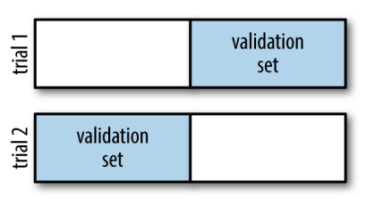

# Hyperparameters and Model Validation

## Work Process

In the previous section, we saw the basic recipe for applying a supervised machine
learning model:

1. Choose a class of model
2. Choose model hyperparameters
3. Fit the model to the training data
4. Use the model to predict labels for new data

The first two pieces of this—the choice of model and choice of hyperparameters—are
perhaps the most important part of using these tools and techniques effectively. In
order to make an informed choice, we need a way to validate that our model and our
hyperparameters are a good fit to the data.

## Model Validation

In principle, model validation is very simple: after choosing a model and its hyper‐
parameters, we can estimate how effective it is by applying it to some of the training
data and comparing the prediction to the known value.

**Model validation the wrong way

```python
In[1]: from sklearn.datasets import load_iris
iris = load_iris()
X = iris.data
y = iris.target
```

Next we choose a model and hyperparameters. Here we’ll use a k-neighbors classifier
with n_neighbors=1. This is a very simple and intuitive model that says “the label of
an unknown point is the same as the label of its closest training point”:

In[2]: from sklearn.neighbors import KNeighborsClassifier
model = KNeighborsClassifier(n_neighbors=1)

Then we train the model, and use it to predict labels for data we already know:

```python
In[3]: model.fit(X, y)
y_model = model.predict(X)
```

Finally, we compute the fraction of correctly labeled points:

```python
In[4]: from sklearn.metrics import accuracy_score
accuracy_score(y, y_model)
Out[4]: 1.0
```

We see an accuracy score of 1.0, which indicates that 100% of points were correctly
labeled by our model! But is this truly measuring the expected accuracy? Have we
really come upon a model that we expect to be correct 100% of the time?

As you may have gathered, the answer is no. In fact, this approach contains a funda‐
mental flaw: it trains and evaluates the model on the same data. Furthermore, the
nearest neighbor model is an instance-based estimator that simply stores the training
data, and predicts labels by comparing new data to these stored points.

**Model validation the right way: Holdout sets**

So what can be done? We can get a better sense of a model’s performance using what’s
known as a holdout set; that is, we hold back some subset of the data from the training
of the model, and then use this holdout set to check the model performance. We can
do this splitting using the train_test_split utility in Scikit-Learn:

```python
In[5]: from sklearn.cross_validation import train_test_split
# split the data with 50% in each set
X1, X2, y1, y2 = train_test_split(X, y, random_state=0, train_size=0.5)
# fit the model on one set of data
model.fit(X1, y1)
# evaluate the model on the second set of data
y2_model = model.predict(X2)
accuracy_score(y2, y2_model)
Out[5]: 0.90666666666666662
```

## Model validation via cross-validation

One disadvantage of using a holdout set for model validation is that we have lost a
portion of our data to the model training. In the previous case, half the dataset does
not contribute to the training of the model! This is not optimal, and can cause prob‐
lems—especially if the initial set of training data is small.

One way to address this is to use cross-validation—that is, to do a sequence of fits
where each subset of the data is used both as a training set and as a validation set.



```python
In[6]: y2_model = model.fit(X1, y1).predict(X2)
y1_model = model.fit(X2, y2).predict(X1)
accuracy_score(y1, y1_model), accuracy_score(y2, y2_model)

Out[6]: (0.95999999999999996, 0.90666666666666662)
```


Here we split the data into five groups, and use each of them in turn to evaluate the
model fit on the other 4/5 of the data. This would be rather tedious to do by hand,
and so we can use Scikit-Learn’s cross_val_score convenience routine to do it
succinctly:

```python
In[7]: from sklearn.cross_validation import cross_val_score
cross_val_score(model, X, y, cv=5)

Out[7]: array([ 0.96666667, 0.96666667, 0.93333333, 0.93333333, 1.])
```

Repeating the validation across different subsets of the data gives us an even better
idea of the performance of the algorithm.

**A lot more cross-validation schemes

This type of cross-validation is known as leave-one-out cross-validation,
and can be used as follows:

```python
In[8]: from sklearn.cross_validation import LeaveOneOut
scores = cross_val_score(model, X, y, cv=LeaveOneOut(len(X)))
scores
```


Because we have 150 samples, the leave-one-out cross-validation yields scores for 150
trials, and the score indicates either successful (1.0) or unsuccessful (0.0) prediction.
Taking the mean of these gives an estimate of the error rate:

```python
In[9]: scores.mean()
Out[9]: 0.95999999999999996
```

Other cross-validation schemes can be used similarly. For a description of what is
available in Scikit-Learn, use IPython to explore the sklearn.cross_validation sub‐
module.

> http://scikit-learn.org/stable/modules/cross_validation.html

## Selecting the Best Model

Now that we’ve seen the basics of validation and cross-validation, we will go into a
little more depth regarding model selection and selection of hyperparameters.

Now that we’ve seen the basics of validation and cross-validation, we will go into a
little more depth regarding model selection and selection of hyperparameters. These
issues are some of the most important aspects of the practice of machine learning,
and I find that this information is often glossed over in introductory machine learn‐
ing tutorials.

Of core importance is the following question: if our estimator is underperforming, how
should we move forward? There are several possible answers:

• Use a more complicated/more flexible model

• Use a less complicated/less flexible model

• Gather more training samples

• Gather more data to add features to each sample

The answer to this question is often counterintuitive. In particular, sometimes using a
more complicated model will give worse results, and adding more training samples
may not improve your results! The ability to determine what steps will improve your
model is what separates the successful machine learning practitioners from the
unsuccessful.

**The bias–variance trade-off**

Fundamentally, the question of “the best model” is about finding a sweet spot in the
trade-off between bias and variance.


