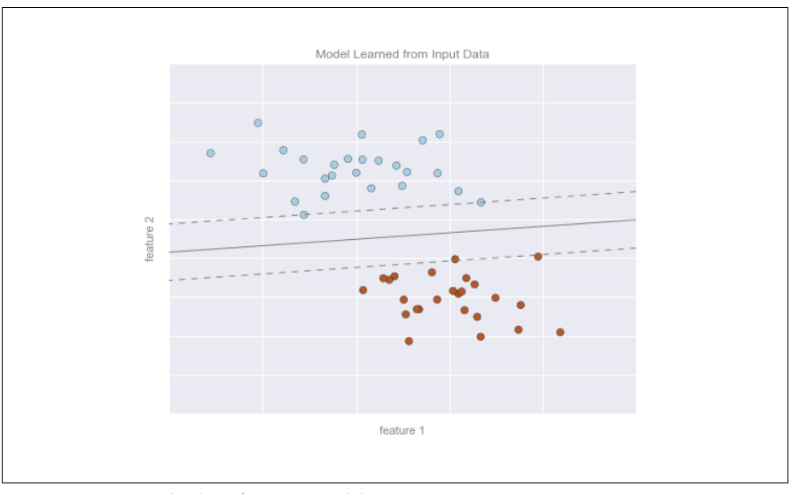
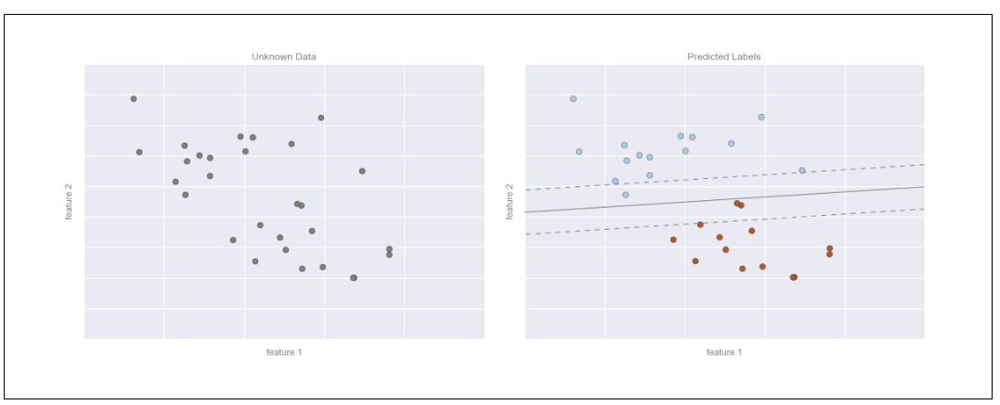

# Introduction to Classic Machine Learning

## What is Machine Learning

Machine learning is often categorized as a subfield of artificial intelligence,it’s more helpful to think of machine learning as a means of building models of data.

* Build and choose a model

Fundamentally, machine learning involves building mathematical models to help understand data. “Learning” enters the fray when we give these models tunable parameters that can be adapted to observed data; in this way the program can be considered to be “learning” from the data.

* Prediction

Once these models have been fit to previously seen data, they can be used to predict and understand aspects of newly observed data.

Understanding the problem setting in machine learning is essential to using these tools effectively, and so we will start with some broad categorizations of the types of approaches we’ll discuss here.

## Categories of Machine Learning

The most fundamental categorization,

* supervised learning

Supervised learning involves somehow modeling the relationship between measured features of data and some label associated with the data; once this model is determined, it can be used to apply labels to new, unknown data.

    * classification
      
      In classification, the labels are discrete categories.
    
    * regression

      In regression, the labels are continuous quantities.

* unsupervised learning

Unsupervised learning involves modeling the features of a dataset without reference to any label, and is often described as “letting the dataset speak for itself.

     * clustering

     Clustering algorithms identify distinct groups of data

     * dimensionality reduction

     Dimensionality reduction algorithms search for more succinct representations of the data.

## Classification: Predicting discrete labels

Here we have two-dimensional data; that is, we have two features for each point, represented by the (x,y) positions of the points on the plane. In addition, we have one of two class labels for each point, here represented by the colors of the points. From these features and labels, we would like to create a model that will let us decide
whether a new point should be labeled “blue” or “red.”

Here the model is a quantitative version of the statement “a straight line separates the classes,” while the model param‐
eters are the particular numbers describing the location and orientation of that line for our data. The optimal values for these model parameters are learned from the data (this is the “learning” in machine learning), which is often called training the
model.

Then we apply the model to new data,

## classification application in real life

For example, this is similar to the task of automated spam detection for email; in this case, we might use the following features and labels:

• feature 1, feature 2, etc -> normalized counts of important words or phrases (“Viagra,” “Nigerian prince,” etc.)
• label -> “spam” or “not spam”.

Some important classification algorithms will be discussed in details.

* Naive Bayes Classification”

* Support Vector Machines”

* Decision tree random forest classification