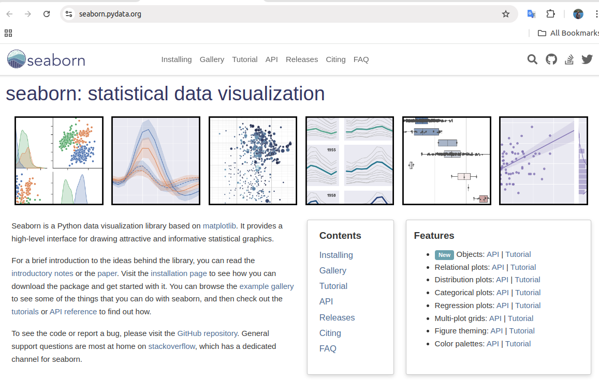

# Introduction to Scikit-learn

There are several Python libraries that provide solid implementations of a range of machine learning algorithms.

A benefit of this uniformity is that once you understand the basic use and syntax of Scikit-Learn for one type of model, switching to a new model or algorithm is very straightforward.

This section provides an overview of the Scikit-Learn API; a solid understanding of these API elements will form the foundation for understanding the deeper practical discussion of machine learning algorithms and approaches in the following chapters.

## Overview

* Data Representation in Scikit-Learn
* Scikit-Learn's Estimator API
* Application: Exploring Handwritten Digits

## Data Representation in Scikit-Learn

**Data as table**

For example, consider the Iris dataset, famously analyzed by Ronald
Fisher in 1936. We can download this dataset in the form of a Pandas DataFrame using the Seaborn library:

> Hint: https://seaborn.pydata.org/



```python
import seaborn as sns
iris = sns.load_dataset('iris')
iris.head()
```

*What is the data?*

Here each row of the data refers to a single observed flower, and the number of rows is the total number of flowers in the dataset.

*How to perceive the data?*

In general, we will refer to the rows of
the matrix as samples, and the number of rows as n_samples.

Likewise, each column of the data refers to a particular quantitative piece of information that describes each sample. In general, we will refer to the columns of the matrix as features, and the number of columns as n_features.

*Features matrix*

a two-dimensional numerical array or matrix, which we will call the features matrix. By convention, this features matrix is often stored in a variable named X.

The features matrix is assumed to be two-dimensional, with shape [n_samples, n_features], and is most often contained in a NumPy array or a Pandas DataFrame, though some Scikit-Learn models also accept SciPy sparse matrices.

* *Samples*

`Rows`

For example, the sample might be a flower, a person, a document, an image, a sound
file, a video, an astronomical object, or anything else you can describe with a set of quantitative measurements.

* *Features*

The features (i.e., columns) always refer to the distinct observations that describe
each sample in a quantitative manner.

Features are generally real-valued, but may be Boolean or discrete-valued in some cases.

* *Target array*

In addition to the feature matrix X,
we also generally work with a label or target array, which by convention we will usually call y.

> Hint: What is X and what is y?

The target array is usually one dimen‐
sional, with length n_samples, and is generally contained in a NumPy array or Pandas Series. The target array may have continuous numerical values, or discrete
classes/labels.

```python
%matplotlib inline
import seaborn as sns; sns.set()
sns.pairplot(iris, hue='species', size=1.5);
```


* How the target array works?*


*Data layout*


## Estimator API

Scikit-Learn is very easy to use, once the basic principles are understood. Every machine learning algorithm in Scikit-Learn is implemented via the Estimator API, which provides a consistent interface for a wide range of machine learning applications.

**Consistency**

All objects share a common interface drawn from a limited set of methods, with
consistent documentation.

**Inspection**

All specified parameter values are exposed as public attributes.

**Limited object hierarchy**

Only algorithms are represented by Python classes; datasets are represented in standard formats (NumPy arrays, Pandas DataFrames, SciPy sparse matrices) and
parameter names use standard Python strings.

**Composition**

Many machine learning tasks can be expressed as sequences of more fundamental algorithms, and Scikit-Learn makes use of this wherever possible.

**Sensible defaults**

When models require user-specified parameters, the library defines an appropri‐ate default value.

## How to use API and model?

The following are the steps that are used in Scikit-Learn but in deep learning it is also similar,

1. Choose a class of model by importing the appropriate estimator class from Scikit-Learn.

2. Choose model hyperparameters by instantiating this class with desired values.

3. Arrange data into a features matrix and target vector following the discussion from before.

4. Fit the model to your data by calling the fit() method of the model instance.

5. Apply the model to new data:

  • For supervised learning, often we predict labels for unknown data using the predict() method.

  • For unsupervised learning, we often transform or infer properties of the data using the transform() or predict() method.

## Application: Exploring Handwritten Digits

