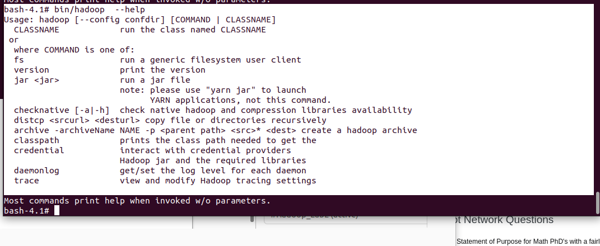
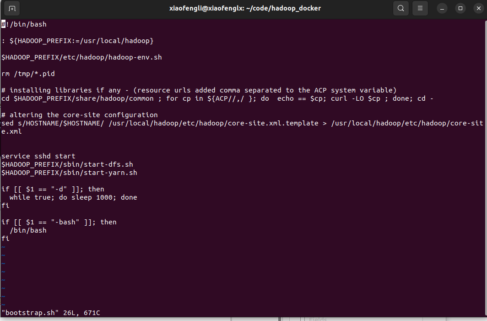
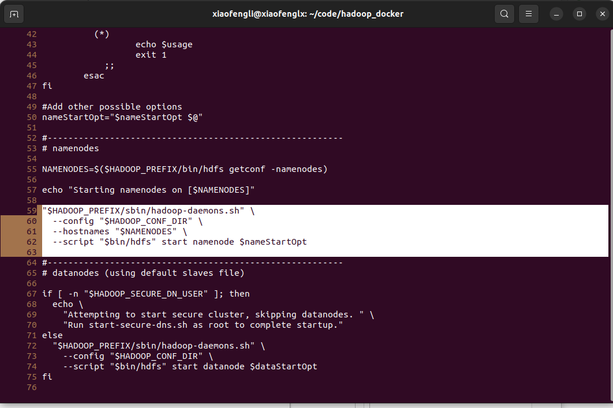

# Hadoop Lab

## Lab 1 Get hadoop Container

**Start a container**

`docker run -it sequenceiq/hadoop-docker:2.7.0 /etc/bootstrap.sh -bash`

**Testing**

`cd $HADOOP_PREFIX`

`echo $HADOOP_PREFIX`


Once you are in $HADOOP_PREFIX directory, do the following,

`file hadoop`

**run the mapreduce**

`bin/hadoop jar share/hadoop/mapreduce/hadoop-mapreduce-examples-2.7.0.jar grep input output 'dfs[a-z.]+'`

**check the output**

`bin/hdfs dfs -cat output/*`

## Lab 2 How to use Hadoop

```bash
$ mkdir input2 
$ cp *.txt input2
$ ls -l input 
```


It will give the following files in your input directory −

```bash
total 24 
-rw-r--r-- 1 root root 15164 Feb 21 10:14 LICENSE.txt 
-rw-r--r-- 1 root root   101 Feb 21 10:14 NOTICE.txt
-rw-r--r-- 1 root root  1366 Feb 21 10:14 README.txt 
```

If output exists, then do the following,

```bash
bash-4.1# bin/hadoop fs -rm -r output
23/11/28 00:35:24 INFO fs.TrashPolicyDefault: Namenode trash configuration: Deletion interval = 0 minutes, Emptier interval = 0 minutes.
Deleted output
```

Run the following example,

`bin/hadoop jar share/hadoop/mapreduce/hadoop-mapreduce-examples-2.7.0.jar wordcount input output`


Check output,

`bash-4.1# bin/hadoop dfs -cat output/*`


Check `–help` option for usage,



## Architecture


HDFS follows the master-slave architecture and it has the following elements.

**Namenode**

The namenode is the commodity hardware that contains the GNU/Linux operating system and the namenode software. It is a software that can be run on commodity hardware. The system having the namenode acts as the master server and it does the following tasks −
    • Manages the file system namespace.
    • Regulates client’s access to files.
    • It also executes file system operations such as renaming, closing, and opening files and directories.

**Datanode**

The datanode is a commodity hardware having the GNU/Linux operating system and datanode software. For every node (Commodity hardware/System) in a cluster, there will be a datanode. These nodes manage the data storage of their system.
    • Datanodes perform read-write operations on the file systems, as per client request.
    • They also perform operations such as block creation, deletion, and replication according to the instructions of the namenode.

Block
Generally the user data is stored in the files of HDFS. The file in a file system will be divided into one or more segments and/or stored in individual data nodes. These file segments are called as blocks. In other words, the minimum amount of data that HDFS can read or write is called a Block. The default block size is 64MB, but it can be increased as per the need to change in HDFS configuration.


**Goals of HDFS**
Fault detection and recovery− Since HDFS includes a large number of commodity hardware, failure of components is frequent. Therefore HDFS should have mechanisms for quick and automatic fault detection and recovery.

Huge datasets− HDFS should have hundreds of nodes per cluster to manage the applications having huge datasets.

Hardware at data− A requested task can be done efficiently, when the computation takes place near the data. Especially where huge datasets are involved, it reduces the network traffic and increases the throughput.

## Hadoop - HDFS Operations

**Starting HDFS**

Initially you have to format the configured HDFS file system, open namenode (HDFS server), and execute the following command.

`$ hadoop namenode -format`

After formatting the HDFS, start the distributed file system. The following command will start the namenode as well as the data nodes as cluster.

`$ start-dfs.sh`

In our docker image, we did not have to do that,




check the start-dfs.sh


Check other core startup scripts


**Listing Files in HDFS**

```bash
bash-4.1# bin/hadoop fs -mkdir /user/input 
bash-4.1# bin/hadoop fs -mkdir /user/output
bash-4.1# bin/hadoop fs -rm -r /user/output
23/11/28 00:57:39 INFO fs.TrashPolicyDefault: Namenode trash configuration: Deletion interval = 0 minutes, Emptier interval = 0 minutes.
Deleted /user/output
``

Make a file, and put contents in it,


Then you run the following command,

`bin/hadoop fs -put file.txt /user/input `

Then you will check the file.txt, as it is moved to user/input/ in the DFS/distributed file system by running the following command,

`bash-4.1# bin/hadoop fs -ls /user/input`


Then we will be checking the file content, 

```bash
bash-4.1# bin/hadoop fs -cat /user/input/file.txt 
helloworld
```

Then you can also get the file from the DFS into your local file system,
`mkdir tmp/`

`bin/hadoop fs -get /user/input/ tmp/`


**Shutting Down the HDFS**

You can shut down the HDFS by using the following command.

`$ stop-dfs.sh`

### Ref

- https://hub.docker.com/r/sequenceiq/hadoop-docker/

- https://www.tutorialspoint.com/hadoop/hadoop_command_reference.htm

- https://www.tutorialspoint.com/hadoop/hadoop_mapreduce.htm

- https://www.tutorialspoint.com/hadoop/hadoop_streaming.htm