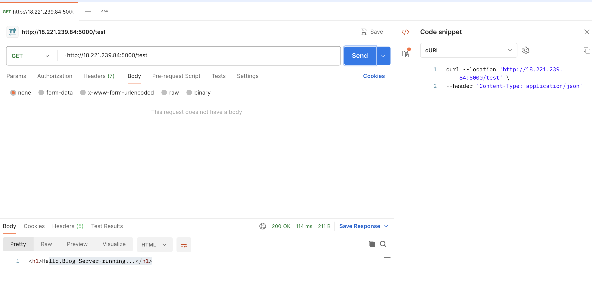
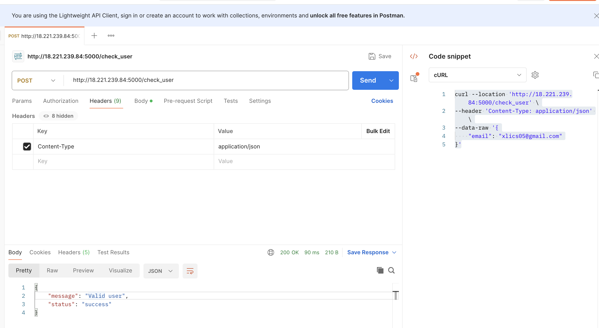

# How to deploy a service in EC2

## check the pem file and the public key of your working computer

* Make sure you have the pem file in the right computer where the public key is correct.
Otherwise the connection will be rejected.

```
MacBookPro:~ kevinli$ cd .ssh/
MacBookPro:.ssh kevinli$ ls
config		id_rsa		id_rsa.pub	known_hosts	known_hosts.old
```

Open the known_hosts,


## use scp or rsyc to copy the code to EC2

* Assuming that you have everything like .py and *.json in your current directory and you can run the following command to copy to the home dir of the ubuntu user in EC2,

`scp -i "kltutor.com.pem" ./* ubuntu@ec2-18-221-239-84.us-east-2.compute.amazonaws.com:/home/ubuntu`

Once you finish copying, you will have to ssh to EC2 instance and start the flask server.

`ssh -i "kltutor.com.pem" ubuntu@ec2-18-221-239-84.us-east-2.compute.amazonaws.com`

## Deployment

After you login to EC2 shell, you will do the following,

`nohup python3 course_authentication.py > output.log &`

And if you want to debug, you can do this,

`tail -f output.log`

It will dynalically show you the logs while the above process is running
headlessly in the background.

To make sure everything is working we have to do the following,

## IP binding

```python
from flask import Flask, request, jsonify
import json

app = Flask(__name__)

@app.route("/test")
def hello():
    return "<h1>Hello,Blog Server running...</h1>"

# Load the students.json file
with open('students.json', 'r') as f:
    students_data = json.load(f)

# Extract emails from the loaded students_data
students = students_data['emails']

# API to check if the email exists in students.json
@app.route('/check_user', methods=['POST'])
def check_user():
    try:
        # Get the email data from request
        data = request.json
        email = data.get('email')

        # Check if email is in the students list
        if email in students:
            return jsonify({"message": "Valid user", "status": "success"})
        else:
            return jsonify({"message": "Invalid user", "status": "failure"}), 404
    except Exception as e:
        return jsonify({"message": "An error occurred", "error": str(e), "status": "failure"}), 500

if __name__ == '__main__':
    app.run(host='0.0.0.0', port=5000)
```

make sure that the host='0.0.0.0' is done like above, so it will bind to EC2's private IP.
And just 127.0.0.1 might work, but if you omit any of these, it will not bind to its private IP properly.

Without binding to the private IP properly, it will not bind to public IP properly.
Because AWS EC2 will take care of the binding between the private IP to the public IP.

This is something that you can not install or rely on NGINX reverse proxy to control because AWS has a lot of controlls over the EC2 and you can't break the security constraints to overwrite permissions on some TCP or UDP ports. 

## Add a firewall rule in AWS

Add a rule for TCP port 5000, this is the port you can specify in the flask app.


## Deployment Automation

* cd to root/sitelock_service dir,
* run `deploy_api.sh`
* when ssh to EC2 instance, cd to `encryption` folder
* run `run.sh`
* ctrl+c to terminal and exit from EC2
* test the api using the following section

## Test restful api

### Test HTTP Get call to the endpoint of url/test

```shell
curl --location 'http://18.221.239.84:5000/test' \
--header 'Content-Type: application/json'
```



### Test HTTP Post Call to the endpoint url/check_user

```shell
curl --location 'http://18.221.239.84:5000/check_user' \
--header 'Content-Type: application/json' \
--data-raw '{
    "email": "xlics05@gmail.com"
}'

```



### get_hash API

`@app.route('/get_hash', methods=['get'])`

```shell
curl --location 'http://18.221.239.84:5000/get_hash' \
--header 'Content-Type: application/json'
```